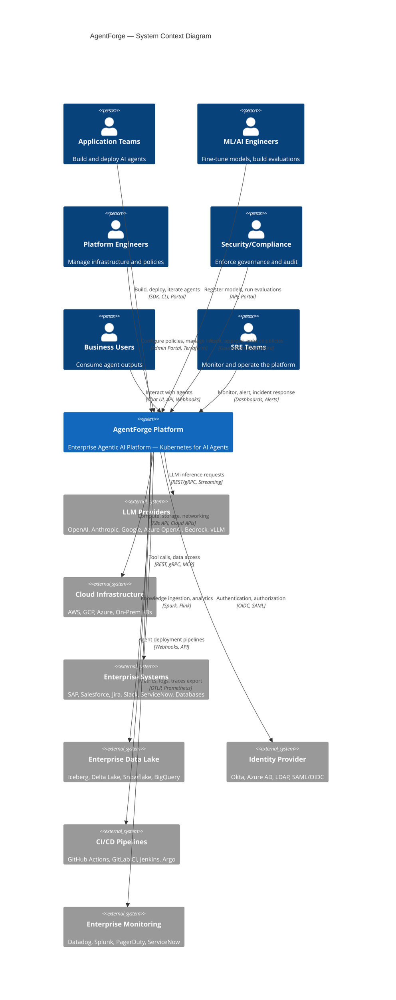
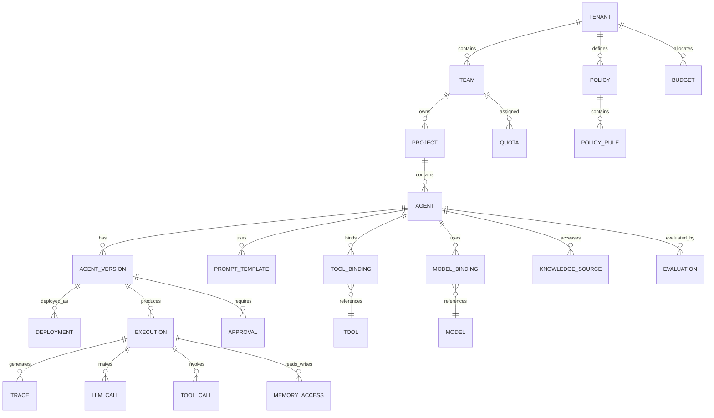
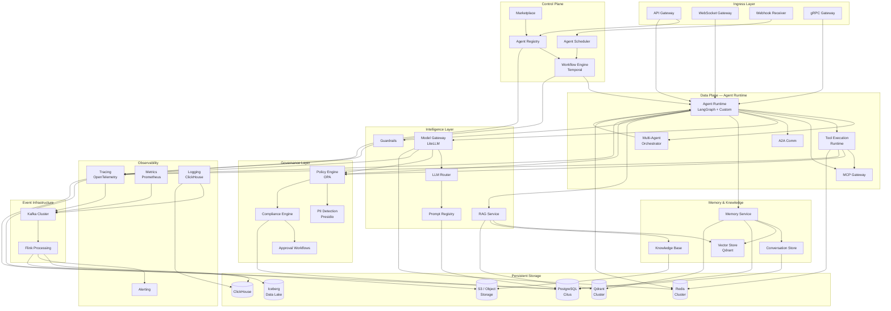
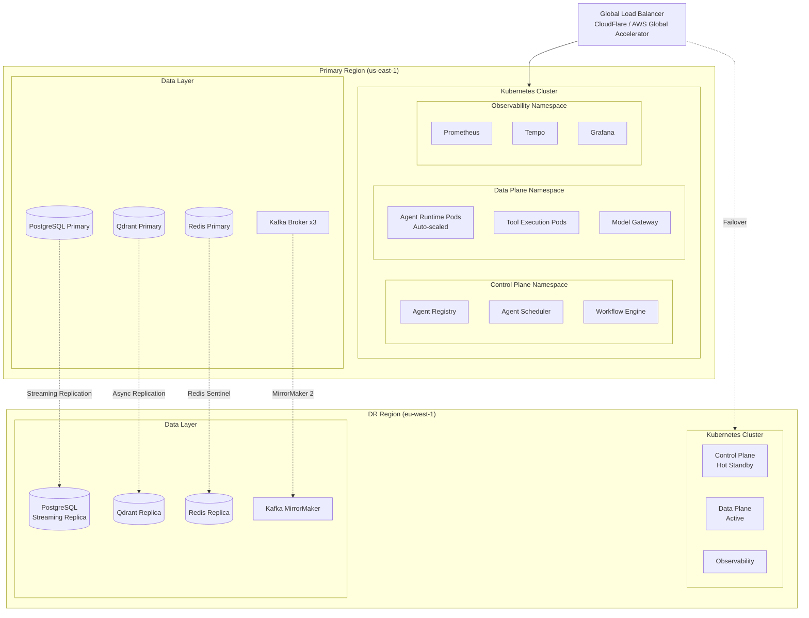

# AgentForge — High-Level Architecture

> **Version**: 1.0.0  
> **Status**: Architecture Design  
> **Classification**: Enterprise Confidential  
> **Target**: Fortune 500 Organizations  

---

## 1. Executive Summary

AgentForge is an enterprise-grade Agentic AI Platform — the **Kubernetes for AI Agents**. It provides a complete control plane and data plane for building, deploying, governing, and operating AI agents at scale across an entire enterprise.

Just as Kubernetes abstracts infrastructure for containers, AgentForge abstracts the complexity of LLM orchestration, tool calling, memory management, compliance, and multi-agent coordination — enabling thousands of developers to ship production AI agents with the same confidence they deploy microservices today.

### Scale Targets

| Dimension | Target |
|---|---|
| Concurrent Agents | 10,000+ |
| Teams | 500+ |
| Daily Executions | 10M+ |
| Tenants | 100+ |
| LLM Calls/day | 50M+ |
| Tools Registered | 5,000+ |
| Knowledge Sources | 10,000+ |

---

## 2. Core Philosophy

```
┌─────────────────────────────────────────────────────────────┐
│                    AGENTFORGE MANIFESTO                      │
├─────────────────────────────────────────────────────────────┤
│                                                             │
│  1. Agents are first-class citizens, not scripts            │
│  2. Every agent is observable, governable, auditable        │
│  3. Infrastructure is invisible to agent developers         │
│  4. Multi-tenancy and isolation are non-negotiable          │
│  5. LLM providers are interchangeable commodities           │
│  6. Memory is a managed service, not an afterthought        │
│  7. Evaluation is continuous, not a one-time gate           │
│  8. Cost is a first-class metric alongside latency          │
│  9. Human oversight is built-in, not bolted on              │
│ 10. The platform evolves; agents declare intent, not impl   │
│                                                             │
└─────────────────────────────────────────────────────────────┘
```

---

## 3. C4 Context Diagram



---

## 4. Domain Model



---

## 5. High-Level Architecture — Platform Layers

```
┌─────────────────────────────────────────────────────────────────────────┐
│                        DEVELOPER EXPERIENCE LAYER                       │
│  ┌──────────┐ ┌──────────┐ ┌──────────┐ ┌──────────┐ ┌──────────────┐ │
│  │ Dev Portal│ │   CLI    │ │   SDK    │ │ REST API │ │  gRPC API    │ │
│  └──────────┘ └──────────┘ └──────────┘ └──────────┘ └──────────────┘ │
├─────────────────────────────────────────────────────────────────────────┤
│                        API GATEWAY & MESH LAYER                         │
│  ┌─────────────┐ ┌────────────┐ ┌──────────────┐ ┌──────────────────┐ │
│  │ API Gateway  │ │ Rate Limit │ │ AuthN/AuthZ  │ │  Tenant Router   │ │
│  └─────────────┘ └────────────┘ └──────────────┘ └──────────────────┘ │
├─────────────────────────────────────────────────────────────────────────┤
│                     AGENT CONTROL PLANE                                 │
│  ┌──────────┐ ┌──────────┐ ┌──────────┐ ┌──────────┐ ┌──────────────┐ │
│  │  Agent    │ │  Agent   │ │ Workflow │ │ Agent    │ │   Agent      │ │
│  │ Registry  │ │ Builder  │ │ Engine   │ │Scheduler │ │ Marketplace  │ │
│  └──────────┘ └──────────┘ └──────────┘ └──────────┘ └──────────────┘ │
├─────────────────────────────────────────────────────────────────────────┤
│                     AGENT DATA PLANE (RUNTIME)                          │
│  ┌──────────┐ ┌──────────┐ ┌──────────┐ ┌──────────┐ ┌──────────────┐ │
│  │  Agent   │ │  Multi-  │ │  Tool    │ │  MCP     │ │   A2A        │ │
│  │ Runtime  │ │  Agent   │ │Execution │ │ Gateway  │ │Communication │ │
│  │          │ │  Orch    │ │ Runtime  │ │          │ │              │ │
│  └──────────┘ └──────────┘ └──────────┘ └──────────┘ └──────────────┘ │
├─────────────────────────────────────────────────────────────────────────┤
│                     INTELLIGENCE LAYER                                  │
│  ┌──────────┐ ┌──────────┐ ┌──────────┐ ┌──────────┐ ┌──────────────┐ │
│  │  Model   │ │  LLM     │ │ Prompt   │ │  RAG     │ │  Guardrails  │ │
│  │ Gateway  │ │ Router   │ │ Registry │ │ Service  │ │              │ │
│  └──────────┘ └──────────┘ └──────────┘ └──────────┘ └──────────────┘ │
├─────────────────────────────────────────────────────────────────────────┤
│                     MEMORY & KNOWLEDGE LAYER                            │
│  ┌──────────┐ ┌──────────┐ ┌──────────┐ ┌──────────┐ ┌──────────────┐ │
│  │  Memory  │ │  Convo   │ │  Vector  │ │Knowledge │ │  Shared Team │ │
│  │ Service  │ │  Store   │ │  Store   │ │  Base    │ │  Memory      │ │
│  └──────────┘ └──────────┘ └──────────┘ └──────────┘ └──────────────┘ │
├─────────────────────────────────────────────────────────────────────────┤
│                     GOVERNANCE & SECURITY LAYER                         │
│  ┌──────────┐ ┌──────────┐ ┌──────────┐ ┌──────────┐ ┌──────────────┐ │
│  │  Policy  │ │   PII    │ │Compliance│ │ Approval │ │   Secrets    │ │
│  │ Engine   │ │Detection │ │ Engine   │ │ Workflow │ │  Management  │ │
│  └──────────┘ └──────────┘ └──────────┘ └──────────┘ └──────────────┘ │
├─────────────────────────────────────────────────────────────────────────┤
│                     OBSERVABILITY LAYER                                 │
│  ┌──────────┐ ┌──────────┐ ┌──────────┐ ┌──────────┐ ┌──────────────┐ │
│  │ Tracing  │ │ Metrics  │ │ Logging  │ │ Alerting │ │  SLO Mon     │ │
│  │(OTel)    │ │(Prom)    │ │(Click)   │ │          │ │              │ │
│  └──────────┘ └──────────┘ └──────────┘ └──────────┘ └──────────────┘ │
├─────────────────────────────────────────────────────────────────────────┤
│                     EVALUATION & ANALYTICS LAYER                        │
│  ┌──────────┐ ┌──────────┐ ┌──────────┐ ┌──────────┐ ┌──────────────┐ │
│  │ Eval     │ │Experiment│ │ Business │ │  Human   │ │  Agent       │ │
│  │Framework │ │ Tracking │ │  KPI     │ │ Feedback │ │ Benchmarking │ │
│  └──────────┘ └──────────┘ └──────────┘ └──────────┘ └──────────────┘ │
├─────────────────────────────────────────────────────────────────────────┤
│                     INFRASTRUCTURE LAYER                                │
│  ┌──────────┐ ┌──────────┐ ┌──────────┐ ┌──────────┐ ┌──────────────┐ │
│  │Kubernetes│ │  Event   │ │  Object  │ │ Database │ │  Cache       │ │
│  │ Cluster  │ │  Bus     │ │  Store   │ │ Cluster  │ │  Cluster     │ │
│  │          │ │ (Kafka)  │ │  (S3)    │ │ (Postgres│ │  (Redis)     │ │
│  │          │ │          │ │          │ │ +Qdrant) │ │              │ │
│  └──────────┘ └──────────┘ └──────────┘ └──────────┘ └──────────────┘ │
└─────────────────────────────────────────────────────────────────────────┘
```

---

## 6. Technology Stack

### 6.1 Core Platform

| Layer | Technology | Justification |
|---|---|---|
| **Languages** | Python 3.12+, Go (infra services) | Python for AI/ML ecosystem; Go for high-perf control plane |
| **API Framework** | FastAPI | Async, high-perf, OpenAPI auto-docs, production-proven |
| **Workflow Engine** | Temporal | Durable execution, exactly-once, built-in retries, saga pattern |
| **Agent Framework** | LangGraph + custom runtime | State machines for agents, extended with enterprise features |
| **Async Processing** | Kafka (Confluent) | Event-driven backbone, exactly-once semantics, multi-DC |
| **Caching** | Redis Cluster | Sub-ms latency, pub/sub, rate limiting, session storage |
| **Primary DB** | PostgreSQL 16+ (Citus) | ACID, JSONB, partitioning, row-level security for tenancy |
| **Vector DB** | Qdrant (clustered) | HNSW, filtering, sharding, multi-tenancy, payload indexing |
| **Analytics DB** | ClickHouse | Column-oriented, sub-second aggregations on billions of rows |
| **Local Analytics** | DuckDB | In-process OLAP for CLI/SDK analytics, evaluation pipelines |
| **Object Storage** | S3 / GCS / Azure Blob | Artifacts, checkpoints, documents, model weights |
| **Data Lake** | Apache Iceberg | Time-travel, schema evolution, ACID on object storage |
| **Stream Processing** | Apache Flink | Real-time metrics, anomaly detection, cost aggregation |
| **Batch Processing** | Apache Spark | Large-scale evaluation, offline analytics, ETL |

### 6.2 AI/ML Stack

| Component | Technology | Justification |
|---|---|---|
| **LLM Gateway** | LiteLLM + custom proxy | 100+ provider support, unified interface, fallback chains |
| **Self-hosted Inference** | vLLM on Ray | PagedAttention, continuous batching, tensor parallelism |
| **Experiment Tracking** | MLflow | Model versioning, artifact tracking, model registry |
| **Embedding Models** | sentence-transformers, Cohere, OpenAI | Multi-provider embedding support |

### 6.3 Infrastructure

| Component | Technology | Justification |
|---|---|---|
| **Container Orchestration** | Kubernetes (EKS/GKE/AKS) | Industry standard, auto-scaling, service mesh |
| **IaC** | Terraform + Pulumi | Multi-cloud, state management, drift detection |
| **Service Mesh** | Istio / Linkerd | mTLS, traffic management, observability |
| **CI/CD** | GitHub Actions + Argo CD | GitOps, progressive delivery, rollbacks |
| **Workflow Orchestration** | Argo Workflows | DAG-based batch jobs, evaluation pipelines |

### 6.4 Observability

| Component | Technology | Justification |
|---|---|---|
| **Tracing** | OpenTelemetry + Jaeger/Tempo | Vendor-neutral, W3C trace context, auto-instrumentation |
| **Metrics** | Prometheus + Thanos | Pull-based, PromQL, long-term storage, multi-cluster |
| **Logging** | ClickHouse (structured logs) | Columnar compression, fast search, cost-effective at scale |
| **Dashboards** | Grafana | Unified dashboards, alerting, data source federation |
| **Alerting** | Prometheus Alertmanager + PagerDuty | Multi-channel, escalation, silencing, grouping |

### 6.5 Security & Governance

| Component | Technology | Justification |
|---|---|---|
| **Identity** | Keycloak | OIDC/SAML, federation, multi-tenancy, fine-grained AuthN |
| **Policy Engine** | Open Policy Agent (OPA) | Rego policies, decoupled from services, auditable |
| **Secrets** | HashiCorp Vault | Dynamic secrets, encryption-as-a-service, audit logging |
| **PII Detection** | Presidio + custom NER | Microsoft-backed, extensible, multiple languages |
| **Certificate Mgmt** | cert-manager | Automated TLS certificate lifecycle on K8s |

---

## 7. Platform Principles

### 7.1 Multi-Tenancy Model

```
┌──────────────────────────────────────────────────────────┐
│                    AGENTFORGE CLUSTER                      │
│                                                           │
│  ┌─────────────┐  ┌─────────────┐  ┌─────────────┐      │
│  │  Tenant A   │  │  Tenant B   │  │  Tenant C   │      │
│  │ (BU: Risk)  │  │ (BU: Sales) │  │ (BU: Ops)   │      │
│  │             │  │             │  │             │      │
│  │ ┌─────────┐ │  │ ┌─────────┐ │  │ ┌─────────┐ │      │
│  │ │ Team 1  │ │  │ │ Team 1  │ │  │ │ Team 1  │ │      │
│  │ │ Agents  │ │  │ │ Agents  │ │  │ │ Agents  │ │      │
│  │ │ Quotas  │ │  │ │ Quotas  │ │  │ │ Quotas  │ │      │
│  │ │ Policies│ │  │ │ Policies│ │  │ │ Policies│ │      │
│  │ └─────────┘ │  │ └─────────┘ │  │ └─────────┘ │      │
│  │ ┌─────────┐ │  │ ┌─────────┐ │  │             │      │
│  │ │ Team 2  │ │  │ │ Team 2  │ │  │             │      │
│  │ └─────────┘ │  │ └─────────┘ │  │             │      │
│  │             │  │             │  │             │      │
│  │ Namespace:  │  │ Namespace:  │  │ Namespace:  │      │
│  │ af-tenant-a │  │ af-tenant-b │  │ af-tenant-c │      │
│  │             │  │             │  │             │      │
│  │ DB Schema:  │  │ DB Schema:  │  │ DB Schema:  │      │
│  │ tenant_a    │  │ tenant_b    │  │ tenant_c    │      │
│  └─────────────┘  └─────────────┘  └─────────────┘      │
│                                                           │
│  Shared Services: Model Gateway, Event Bus, Observability │
└──────────────────────────────────────────────────────────┘
```

**Isolation Strategy**: Hybrid approach
- **Compute**: Kubernetes namespace isolation with NetworkPolicies + ResourceQuotas
- **Data**: PostgreSQL Row-Level Security (RLS) with `tenant_id` on every table
- **Vector Store**: Qdrant collection-per-tenant with API key isolation
- **Cache**: Redis key prefixing with ACLs (`tenant:{id}:*`)
- **Events**: Kafka topic-per-tenant with ACLs
- **Secrets**: Vault namespace-per-tenant
- **Object Store**: S3 prefix-per-tenant with IAM policies

### 7.2 Design Principles

| Principle | Implementation |
|---|---|
| **API-First** | Every capability exposed via versioned REST + gRPC APIs |
| **Event-Driven** | All state changes emit domain events to Kafka |
| **Declarative** | Agents defined as YAML manifests (like K8s resources) |
| **GitOps** | Agent definitions stored in Git, deployed via CI/CD |
| **Defense in Depth** | OPA policies at API Gateway, service, and data layers |
| **Eventual Consistency** | CQRS for read-heavy paths; strong consistency for writes |
| **Bulkhead Isolation** | Per-tenant thread pools, connection pools, rate limits |
| **Circuit Breaker** | Resilience4j patterns on all external calls |
| **Idempotency** | All mutations are idempotent with client-generated request IDs |
| **Immutable Deployments** | Agent versions are immutable; new version = new deployment |

---

## 8. Agent Manifest (Declarative Specification)

```yaml
# agentforge.yaml — Agent Custom Resource Definition
apiVersion: agentforge.io/v1
kind: Agent
metadata:
  name: customer-support-agent
  namespace: af-tenant-acme
  labels:
    team: customer-success
    tier: production
    domain: support
  annotations:
    agentforge.io/owner: "cs-team@acme.com"
    agentforge.io/cost-center: "CC-4521"
    agentforge.io/data-classification: "internal"
spec:
  # Agent Identity
  displayName: "Customer Support Agent"
  description: "Handles tier-1 customer support queries with tool access"
  version: "2.4.0"
  
  # Runtime Configuration
  runtime:
    type: stateful                    # stateful | stateless | workflow
    concurrency: 50                   # max concurrent executions
    timeout: 300s                     # max execution time
    checkpointing: true               # enable state checkpointing
    humanInTheLoop:
      enabled: true
      escalationPolicy: "cs-managers"
      autoApproveAfter: 30m
  
  # Model Configuration
  model:
    primary:
      provider: openai
      model: gpt-4o
      temperature: 0.3
      maxTokens: 4096
    fallback:
      provider: anthropic
      model: claude-sonnet-4-20250514
    routing:
      strategy: cost-optimized        # cost-optimized | latency-optimized | quality-first
      maxCostPerExecution: 0.50
  
  # Memory
  memory:
    shortTerm:
      type: conversation
      maxTurns: 50
      summarizeAfter: 20
    longTerm:
      enabled: true
      store: semantic
      retentionDays: 365
    shared:
      enabled: true
      scope: team
  
  # Knowledge & RAG
  knowledge:
    sources:
      - name: product-docs
        type: knowledge-base
        ref: kb/product-documentation-v3
      - name: support-history
        type: vector-store
        ref: vs/support-tickets-2024
    rag:
      strategy: hybrid
      topK: 10
      reranker: cross-encoder
      minRelevanceScore: 0.7
  
  # Tools
  tools:
    - name: ticket-system
      ref: tools/jira-integration
      permissions: [read, create, update]
      rateLimit: 100/min
    - name: knowledge-search
      ref: tools/rag-search
      permissions: [read]
    - name: escalate
      ref: tools/pagerduty
      permissions: [create]
      requiresApproval: true
  
  # Prompts
  prompts:
    system: prompts/cs-agent-system-v5
    fewShot: prompts/cs-agent-examples-v3
  
  # Guardrails
  guardrails:
    input:
      - pii-detection
      - prompt-injection-detection
      - topic-restriction:
          allowedTopics: [support, billing, product]
    output:
      - pii-redaction
      - hallucination-check
      - brand-safety
      - factual-grounding:
          sources: [product-docs]
  
  # Governance
  governance:
    approvalRequired: true
    approvers: ["ai-governance@acme.com", "cs-lead@acme.com"]
    compliancePolicies:
      - gdpr-data-handling
      - sox-audit-trail
      - pci-dss-card-data
    budgetLimit:
      daily: 500.00
      monthly: 10000.00
      currency: USD
  
  # Evaluation
  evaluation:
    online:
      - metric: goal-completion
        threshold: 0.85
        window: 1h
      - metric: customer-satisfaction
        threshold: 4.0
        window: 24h
    offline:
      schedule: "0 2 * * *"           # daily at 2am
      datasets:
        - eval/cs-golden-set-v4
      metrics:
        - correctness
        - groundedness
        - latency-p99
  
  # Scaling
  scaling:
    minReplicas: 2
    maxReplicas: 20
    targetConcurrency: 30
    scaleDownDelay: 300s
  
  # Deployment
  deployment:
    strategy: canary
    canaryPercent: 10
    canaryDuration: 30m
    rollbackOnFailure: true
    regions: [us-east-1, eu-west-1]

---
# Associated resources defined alongside
apiVersion: agentforge.io/v1
kind: PromptTemplate
metadata:
  name: cs-agent-system-v5
  namespace: af-tenant-acme
spec:
  template: |
    You are a customer support agent for {{company_name}}.
    Current date: {{current_date}}
    Customer tier: {{customer_tier}}
    
    Guidelines:
    {{#each guidelines}}
    - {{this}}
    {{/each}}
    
    Always verify the customer's identity before making changes.
    Never share internal system information.
  variables:
    - name: company_name
      type: string
      required: true
    - name: customer_tier
      type: enum
      values: [standard, premium, enterprise]
  versioning:
    strategy: semantic
    currentVersion: "5.2.1"
```

---

## 9. Platform-Wide Data Flow



---

## 10. Cross-Cutting Concerns

### 10.1 Request Flow (Every API Call)

```
Client Request
    │
    ▼
┌─────────────┐
│ API Gateway  │──── Rate Limiting (Redis)
│ (Kong/Envoy) │──── Request ID Generation (UUID v7)
└──────┬──────┘
       │
       ▼
┌─────────────┐
│   AuthN     │──── JWT Validation (Keycloak)
│   Middleware│──── Token Introspection
└──────┬──────┘
       │
       ▼
┌─────────────┐
│   AuthZ     │──── OPA Policy Check
│   Middleware│──── RBAC + ABAC Evaluation
└──────┬──────┘
       │
       ▼
┌─────────────┐
│   Tenant    │──── Extract tenant_id from token
│   Context   │──── Set RLS context on DB connections
└──────┬──────┘
       │
       ▼
┌─────────────┐
│  Guardrails │──── Input validation
│  (Pre)      │──── PII detection
└──────┬──────┘
       │
       ▼
┌─────────────┐
│   Service   │──── Business Logic
│   Handler   │──── Domain Events → Kafka
└──────┬──────┘
       │
       ▼
┌─────────────┐
│  Guardrails │──── Output validation
│  (Post)     │──── PII redaction
└──────┬──────┘
       │
       ▼
┌─────────────┐
│ Audit Log   │──── Write to audit_logs table
│             │──── Emit audit event to Kafka
└──────┬──────┘
       │
       ▼
Response
```

### 10.2 Error Handling Strategy

| Error Type | Strategy | Implementation |
|---|---|---|
| Transient (5xx, timeout) | Retry with exponential backoff | Temporal retry policies, max 3 attempts |
| LLM Provider Down | Failover to secondary provider | LiteLLM fallback chain |
| Rate Limited (429) | Queue and retry | Redis-based token bucket + Kafka buffering |
| Business Logic Error | Return error, log, alert | Structured error codes, Sentry integration |
| Data Corruption | Compensating transaction | Temporal saga pattern |
| Agent Stuck | Timeout + DLQ | Temporal heartbeat timeout + dead letter topic |
| Catastrophic | Circuit breaker open | Resilience4j circuit breaker, graceful degradation |

---

## 11. Deployment Topology



---

*Next: [02-core-platform-subsystems.md](./02-core-platform-subsystems.md) — Detailed design of Agent Builder, SDK, Runtime, Scheduler, Workflow Engine, and Multi-Agent Orchestration*
