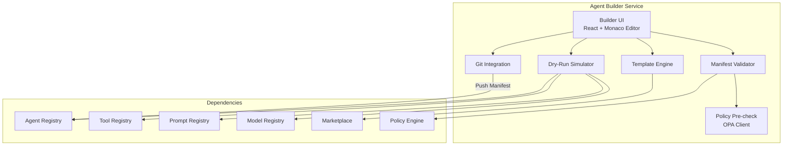
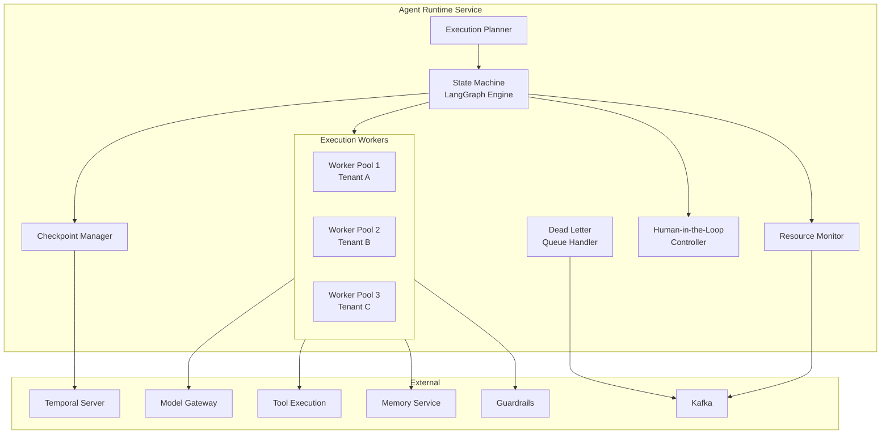
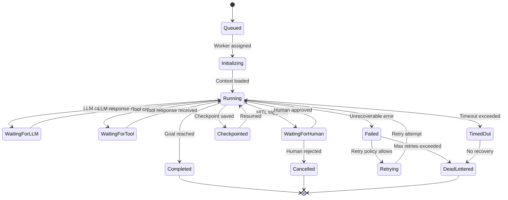
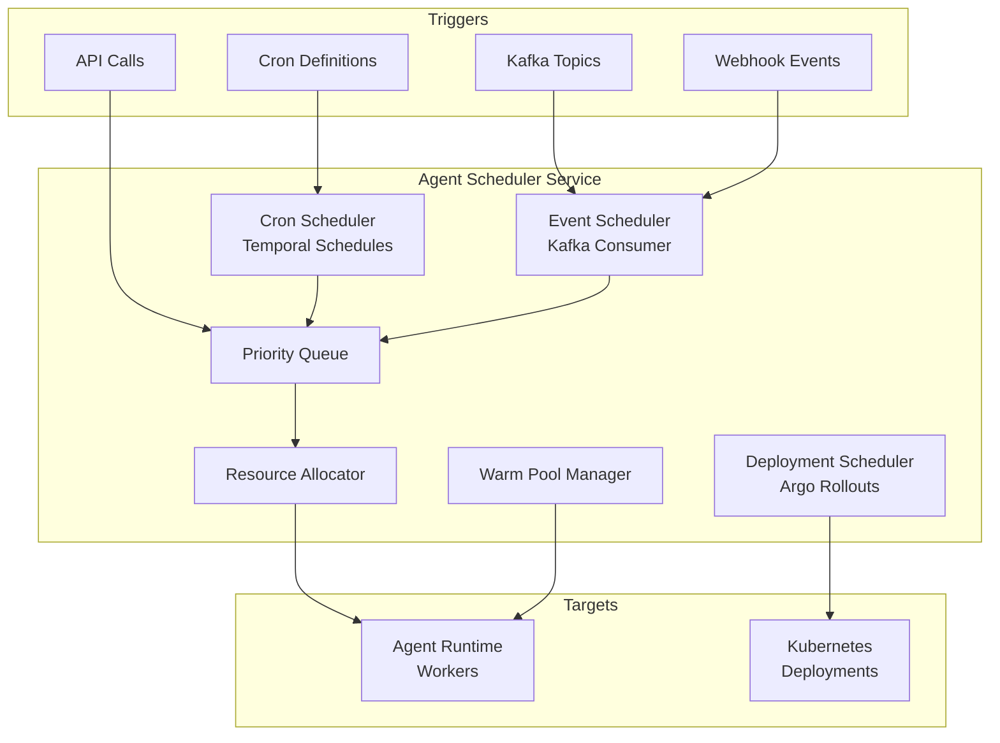
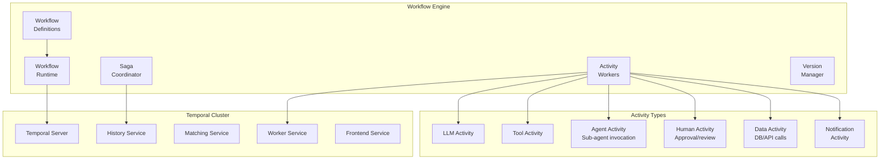
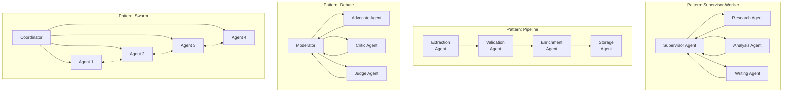

# AgentForge — Core Platform Subsystems

> **Part 2 of 10** — Agent Builder, SDK, Runtime, Scheduler, Workflow Engine, Multi-Agent Orchestration

---

## 1. Agent Builder

### 1.1 Purpose
The Agent Builder is the design-time environment where developers define, compose, and configure agents using a visual interface or declarative YAML. It is the "IDE" of AgentForge — abstracting the complexity of agent composition into a governed, self-service experience.

### 1.2 Responsibilities
- Visual agent composition (drag-and-drop state machines)
- YAML-based declarative agent definition
- Template instantiation from the marketplace
- Validation of agent manifests against schemas and policies
- Dry-run simulation before deployment
- Version management and diff visualization
- Integration with Git for version control

### 1.3 Architecture



### 1.4 API

```
POST   /api/v1/agents                    # Create agent from manifest
GET    /api/v1/agents/{id}               # Get agent definition
PUT    /api/v1/agents/{id}               # Update agent manifest
DELETE /api/v1/agents/{id}               # Soft-delete agent
POST   /api/v1/agents/{id}/validate      # Validate manifest
POST   /api/v1/agents/{id}/dry-run       # Simulate execution
POST   /api/v1/agents/from-template      # Instantiate from template
GET    /api/v1/agents/{id}/versions       # List versions
POST   /api/v1/agents/{id}/versions       # Create new version
GET    /api/v1/agents/{id}/diff/{v1}/{v2} # Diff two versions
POST   /api/v1/agents/{id}/export         # Export as YAML/JSON
POST   /api/v1/agents/import              # Import from YAML/JSON
```

### 1.5 Storage

| Data | Store | Rationale |
|---|---|---|
| Agent manifests | PostgreSQL (`agents` table) | Versioned JSONB, RLS by tenant |
| Agent versions | PostgreSQL (`agent_versions`) | Immutable records, semantic versioning |
| Visual layouts | PostgreSQL (JSONB) | UI graph positions, metadata |
| Git sync state | PostgreSQL | Last sync commit, branch mapping |
| Exported artifacts | S3 | YAML/JSON bundles, shareable |

### 1.6 Scaling Strategy
- **Stateless** service — horizontally scale behind a load balancer
- Validation and policy checks are CPU-bound → scale based on CPU utilization
- Dry-run simulator uses ephemeral containers → Kubernetes Jobs with resource limits
- Target: <500ms for manifest validation, <5s for dry-run simulation

### 1.7 Failure Handling
- Manifest validation is idempotent — safe to retry
- Git sync uses optimistic locking with conflict resolution
- Dry-run failures produce structured diagnostics (not stack traces)
- All mutations produce domain events for audit trail

### 1.8 Tradeoffs
| Decision | Tradeoff |
|---|---|
| YAML-first over UI-first | Higher learning curve, but better GitOps and automation |
| Embedded simulator vs. real runtime | Lower fidelity, but fast feedback without resource cost |
| Loose coupling to registries | Extra network calls, but independent deployability |

---

## 2. Agent SDK

### 2.1 Purpose
The Agent SDK is the primary developer interface for building agents programmatically. It provides a type-safe, Pythonic API that abstracts the platform's complexity while exposing the full power of the runtime.

### 2.2 Responsibilities
- Agent definition via Python decorators and classes
- Type-safe tool definition and binding
- Memory access abstractions
- LLM call abstractions with automatic tracing
- Local development mode with hot-reload
- Testing utilities and mocking frameworks
- CLI integration for build/deploy/test
- Code generation from YAML manifests

### 2.3 SDK Architecture

```python
# agentforge_sdk/core.py — SDK Surface Area

from agentforge import Agent, Tool, Memory, Prompt, Guardrail
from agentforge.runtime import AgentContext, ExecutionResult
from agentforge.memory import ShortTermMemory, LongTermMemory, SemanticMemory
from agentforge.models import ModelConfig, RoutingStrategy
from agentforge.eval import EvalSuite, Metric
from agentforge.testing import MockLLM, MockTool, AgentTestHarness

# ─── Agent Definition ───────────────────────────────────────────
@Agent(
    name="order-processing-agent",
    version="1.2.0",
    model=ModelConfig(
        provider="openai",
        model="gpt-4o",
        fallback="anthropic/claude-sonnet-4-20250514",
        routing=RoutingStrategy.COST_OPTIMIZED,
    ),
    guardrails=["pii-detection", "output-grounding"],
)
class OrderProcessingAgent:
    """Processes customer orders with verification and fulfillment."""

    def __init__(self, ctx: AgentContext):
        self.ctx = ctx
        self.memory = ctx.memory
        self.tools = ctx.tools

    @Agent.system_prompt
    def system_prompt(self) -> str:
        return self.ctx.prompts.render(
            "order-processing-system-v3",
            company=self.ctx.config.company_name,
            policies=self.ctx.knowledge.query("order-policies"),
        )

    @Agent.on_message
    async def handle_message(self, message: str) -> str:
        # Automatic tracing, guardrails, and memory management
        context = await self.memory.recall(
            query=message,
            sources=["conversation", "semantic"],
            top_k=5,
        )
        
        result = await self.ctx.llm.generate(
            messages=[
                {"role": "system", "content": self.system_prompt()},
                *context.messages,
                {"role": "user", "content": message},
            ],
            tools=[self.tools.lookup_order, self.tools.update_order],
        )
        
        await self.memory.store(message, result, tags=["order-processing"])
        return result

    @Agent.on_tool_call("lookup_order")
    async def handle_lookup(self, order_id: str) -> dict:
        return await self.tools.lookup_order(order_id=order_id)

    @Agent.on_escalation
    async def handle_escalation(self, reason: str):
        await self.ctx.escalate(
            to="order-managers",
            reason=reason,
            context=self.memory.summarize(),
        )

# ─── Tool Definition ────────────────────────────────────────────
@Tool(
    name="lookup_order",
    description="Look up order details by order ID",
    permissions=["orders:read"],
    rate_limit="100/min",
    timeout=10,
    retry_policy={"max_attempts": 3, "backoff": "exponential"},
)
async def lookup_order(order_id: str) -> dict:
    """
    Args:
        order_id: The order identifier (e.g., ORD-12345)
    Returns:
        Order details including status, items, and shipping info
    """
    async with httpx.AsyncClient() as client:
        response = await client.get(f"{ORDER_SERVICE_URL}/orders/{order_id}")
        return response.json()

# ─── Testing ────────────────────────────────────────────────────
class TestOrderAgent:
    async def test_order_lookup(self):
        harness = AgentTestHarness(OrderProcessingAgent)
        harness.mock_llm(MockLLM(responses=[
            "Let me look up that order for you.",
            "Your order ORD-12345 is currently being shipped.",
        ]))
        harness.mock_tool("lookup_order", return_value={
            "id": "ORD-12345",
            "status": "shipped",
        })
        
        result = await harness.send("What's the status of ORD-12345?")
        
        assert result.tool_calls == [("lookup_order", {"order_id": "ORD-12345"})]
        assert "shipped" in result.response
        assert result.cost < 0.05
        assert result.latency_ms < 5000

# ─── Evaluation ─────────────────────────────────────────────────
eval_suite = EvalSuite(
    name="order-agent-eval",
    agent=OrderProcessingAgent,
    dataset="eval/order-processing-golden-set",
    metrics=[
        Metric.CORRECTNESS,
        Metric.GROUNDEDNESS,
        Metric.TOOL_ACCURACY,
        Metric.LATENCY_P99,
        Metric.COST_PER_EXECUTION,
    ],
)
```

### 2.4 SDK Modules

```
agentforge-sdk/
├── agentforge/
│   ├── __init__.py              # Public API exports
│   ├── agent.py                 # @Agent decorator, AgentBase class
│   ├── tool.py                  # @Tool decorator, ToolBase class
│   ├── prompt.py                # Prompt template rendering
│   ├── guardrail.py             # Guardrail decorators
│   ├── models/
│   │   ├── config.py            # ModelConfig, RoutingStrategy
│   │   ├── llm.py               # LLM client abstraction
│   │   └── embeddings.py        # Embedding client
│   ├── memory/
│   │   ├── base.py              # MemoryInterface
│   │   ├── short_term.py        # ConversationMemory
│   │   ├── long_term.py         # PersistentMemory
│   │   ├── semantic.py          # VectorMemory
│   │   └── shared.py            # TeamMemory
│   ├── knowledge/
│   │   ├── base.py              # KnowledgeInterface
│   │   ├── rag.py               # RAG pipeline client
│   │   └── search.py            # Hybrid search
│   ├── runtime/
│   │   ├── context.py           # AgentContext
│   │   ├── execution.py         # ExecutionResult
│   │   ├── checkpoint.py        # Checkpointing
│   │   └── lifecycle.py         # Lifecycle hooks
│   ├── observability/
│   │   ├── tracing.py           # OpenTelemetry integration
│   │   ├── metrics.py           # Custom metrics
│   │   └── logging.py           # Structured logging
│   ├── governance/
│   │   ├── policies.py          # Policy client
│   │   └── audit.py             # Audit event emission
│   ├── testing/
│   │   ├── harness.py           # AgentTestHarness
│   │   ├── mocks.py             # MockLLM, MockTool, MockMemory
│   │   ├── assertions.py        # Custom assertions
│   │   └── fixtures.py          # Pytest fixtures
│   ├── eval/
│   │   ├── suite.py             # EvalSuite
│   │   ├── metrics.py           # Built-in metrics
│   │   ├── datasets.py          # Dataset loaders
│   │   └── reporters.py         # Report generation
│   └── cli/
│       ├── main.py              # CLI entrypoint
│       ├── init.py              # agentforge init
│       ├── build.py             # agentforge build
│       ├── deploy.py            # agentforge deploy
│       ├── test.py              # agentforge test
│       ├── eval.py              # agentforge eval
│       ├── logs.py              # agentforge logs
│       └── status.py            # agentforge status
├── pyproject.toml
├── README.md
└── examples/
    ├── simple_agent/
    ├── multi_agent/
    ├── rag_agent/
    └── workflow_agent/
```

### 2.5 CLI Commands

```bash
# Project scaffolding
agentforge init my-agent --template=conversational
agentforge init my-agent --from-marketplace=customer-support-v2

# Development
agentforge dev                          # Start local dev server with hot-reload
agentforge dev --mock-llm               # Use mock LLM for fast iteration
agentforge validate                     # Validate manifest and code

# Testing
agentforge test                         # Run unit tests
agentforge test --integration           # Run integration tests
agentforge test --smoke                 # Run smoke tests against staging

# Evaluation
agentforge eval run --dataset=golden-set-v3
agentforge eval compare v1.1.0 v1.2.0   # Compare versions
agentforge eval report --format=html

# Deployment
agentforge build                        # Build container image
agentforge deploy --env=staging         # Deploy to staging
agentforge deploy --env=production --strategy=canary --canary-percent=10
agentforge rollback                     # Rollback to previous version

# Operations
agentforge status                       # Agent health and metrics
agentforge logs --follow                # Stream agent logs
agentforge trace <execution-id>         # View execution trace
agentforge cost --period=7d             # Cost breakdown

# Governance
agentforge approve <agent-id> --version=1.2.0
agentforge policy check                 # Check policy compliance
```

### 2.6 Tradeoffs

| Decision | Tradeoff |
|---|---|
| Python-only SDK (initially) | Limits non-Python teams, but maximizes AI/ML ecosystem compatibility |
| Decorator-based API | Magic can obscure behavior, but dramatically reduces boilerplate |
| SDK embeds OpenTelemetry | Increases package size, but guarantees observability |
| Local dev mode uses Docker Compose | Requires Docker installed, but provides near-production parity |

---

## 3. Agent Runtime

### 3.1 Purpose
The Agent Runtime is the execution engine — the "kubelet" of AgentForge. It runs agent code, manages state transitions, coordinates LLM calls, tool executions, and memory operations, and enforces all runtime policies.

### 3.2 Responsibilities
- Execute agent state machines (LangGraph-based)
- Manage concurrent execution with isolation
- Checkpoint and resume long-running executions
- Enforce timeouts, retries, and circuit breakers
- Human-in-the-loop pause/resume
- Interruptibility and graceful shutdown
- Dead Letter Queue for failed executions
- Resource metering (tokens, compute, memory)

### 3.3 Architecture



### 3.4 Execution Model



### 3.5 API

```
POST   /api/v1/executions                      # Start new execution
GET    /api/v1/executions/{id}                  # Get execution status
POST   /api/v1/executions/{id}/cancel           # Cancel execution
POST   /api/v1/executions/{id}/pause            # Pause execution
POST   /api/v1/executions/{id}/resume           # Resume execution
POST   /api/v1/executions/{id}/checkpoint       # Force checkpoint
GET    /api/v1/executions/{id}/trace            # Get execution trace
GET    /api/v1/executions/{id}/timeline         # Get execution timeline
POST   /api/v1/executions/{id}/human-response   # Submit human response
GET    /api/v1/executions/{id}/state            # Get current state
WS     /api/v1/executions/{id}/stream           # Stream execution events
GET    /api/v1/executions/dlq                   # List dead-lettered executions
POST   /api/v1/executions/dlq/{id}/replay       # Replay from DLQ
```

### 3.6 Storage

| Data | Store | Rationale |
|---|---|---|
| Execution metadata | PostgreSQL | ACID, queryable, RLS |
| Execution state | Temporal (workflow state) | Durable, exactly-once, replayable |
| Checkpoints | S3 + PostgreSQL pointer | Large state snapshots, versioned |
| Execution traces | ClickHouse | High-volume append, fast aggregation |
| Real-time state | Redis | Sub-ms reads for status checks |
| Dead Letter Queue | Kafka topic (`af.dlq.*`) | Reliable, replayable, auditable |

### 3.7 Concurrent Execution

```
Per-Tenant Resource Isolation:

Tenant A: [Worker Pool] ──── CPU: 8 cores, Memory: 16GB, Max Concurrent: 100
Tenant B: [Worker Pool] ──── CPU: 4 cores, Memory: 8GB,  Max Concurrent: 50
Tenant C: [Worker Pool] ──── CPU: 16 cores, Memory: 32GB, Max Concurrent: 200

Implementation:
- Kubernetes: Separate Deployments per tenant tier with ResourceQuotas
- Python: asyncio event loops with semaphore-based concurrency limits
- Temporal: Per-tenant task queues with worker count limits
- Circuit Breakers: Per-tenant, per-tool, per-model circuit breakers
```

### 3.8 Checkpointing Design

```python
# Checkpoint structure
@dataclass
class AgentCheckpoint:
    execution_id: str
    agent_id: str
    version: str
    tenant_id: str
    state: dict                    # LangGraph state snapshot
    memory_snapshot: dict          # Memory state at checkpoint
    tool_call_history: list        # Completed tool calls
    llm_call_history: list         # Completed LLM calls
    pending_actions: list          # Actions awaiting completion
    metadata: dict                 # Cost, token count, timing
    created_at: datetime
    checkpoint_version: int        # For optimistic concurrency

# Checkpointing triggers:
# 1. After every LLM call (configurable)
# 2. After every tool call
# 3. Before human-in-the-loop pause
# 4. On graceful shutdown signal
# 5. Periodic (every N seconds, configurable)
# 6. On state transition
```

### 3.9 Scaling Strategy
- **Horizontal Pod Autoscaler** (HPA) based on:
  - Custom metric: `agentforge_active_executions / agentforge_max_concurrency`
  - Target utilization: 70%
- **KEDA** for event-driven scaling based on Kafka consumer lag
- **Temporal worker** auto-scaling based on task queue depth
- Scale-to-zero for low-traffic tenants (with 30s cold-start budget)
- **Vertical Pod Autoscaler** (VPA) for right-sizing worker memory

### 3.10 Failure Handling

| Failure | Detection | Response |
|---|---|---|
| LLM timeout | Context deadline exceeded | Retry with fallback model |
| LLM rate limit | 429 response | Exponential backoff, queue in Kafka |
| Tool failure | HTTP 5xx or timeout | Retry per policy, circuit breaker |
| Agent crash | Worker heartbeat missed | Temporal recovers from last checkpoint |
| Node failure | K8s pod eviction | Temporal re-schedules on healthy node |
| Memory overflow | OOM killer | Graceful checkpoint on SIGTERM, restart |
| Infinite loop | Token/step budget exceeded | Force termination, DLQ |

---

## 4. Agent Scheduler

### 4.1 Purpose
The Agent Scheduler manages the lifecycle of agent deployments and scheduled executions. It is the "scheduler" of AgentForge — deciding when, where, and how agents run, including cron-based, event-driven, and on-demand scheduling.

### 4.2 Responsibilities
- Schedule agents for periodic execution (cron)
- Trigger agents on events (Kafka, webhooks, API calls)
- Manage deployment rollouts (canary, blue-green, rolling)
- Resource allocation and bin-packing
- Priority-based scheduling with preemption
- Concurrency management across the platform
- Warm pool management for latency-sensitive agents

### 4.3 Architecture



### 4.4 API

```
POST   /api/v1/schedules                       # Create schedule
GET    /api/v1/schedules                        # List schedules
GET    /api/v1/schedules/{id}                   # Get schedule details
PUT    /api/v1/schedules/{id}                   # Update schedule
DELETE /api/v1/schedules/{id}                   # Delete schedule
POST   /api/v1/schedules/{id}/pause             # Pause schedule
POST   /api/v1/schedules/{id}/resume            # Resume schedule
GET    /api/v1/schedules/{id}/history           # Schedule execution history

POST   /api/v1/deployments                      # Create deployment
GET    /api/v1/deployments/{id}/status          # Deployment status
POST   /api/v1/deployments/{id}/promote         # Promote canary
POST   /api/v1/deployments/{id}/rollback        # Rollback deployment
```

### 4.5 Storage

| Data | Store | Rationale |
|---|---|---|
| Schedule definitions | PostgreSQL | Queryable, versioned |
| Schedule state | Temporal (schedule feature) | Durable, exactly-once |
| Deployment state | PostgreSQL + K8s (Argo) | Source of truth + K8s state |
| Execution queue | Kafka | High-throughput, ordered |
| Warm pool state | Redis | Fast reads/writes, ephemeral |

### 4.6 Scaling Strategy
- Scheduler itself is a singleton leader with hot standby (leader election via K8s Lease)
- Execution dispatching scales horizontally via Kafka partitions
- Warm pool scales based on predicted demand (time-series forecasting)

---

## 5. Workflow Engine

### 5.1 Purpose
The Workflow Engine provides durable, long-running workflow orchestration for complex agent interactions. Built on Temporal, it enables multi-step agent workflows with exactly-once execution guarantees, compensation logic, and human-in-the-loop integration.

### 5.2 Responsibilities
- Define and execute multi-step agent workflows
- Saga pattern for distributed transactions
- Timer-based delays and reminders
- Parallel and sequential step execution
- Conditional branching and routing
- Sub-workflow composition
- Long-running workflow support (hours/days)
- Workflow versioning and migration

### 5.3 Architecture



### 5.4 Workflow Definition DSL

```python
from agentforge.workflow import Workflow, Step, Parallel, Condition, Saga

@Workflow(
    name="customer-onboarding",
    version="2.0.0",
    timeout="24h",
    retry_policy={"max_attempts": 3},
)
class CustomerOnboarding:
    
    @Step(name="verify-identity", timeout="5m")
    async def verify_identity(self, customer_data: dict) -> dict:
        """Run identity verification agent."""
        return await self.ctx.invoke_agent(
            "identity-verification-agent",
            input=customer_data,
        )
    
    @Step(name="risk-assessment", timeout="10m")
    async def risk_assessment(self, verification: dict) -> dict:
        """Run risk assessment in parallel with compliance check."""
        async with Parallel() as p:
            risk = p.add(self.ctx.invoke_agent("risk-agent", verification))
            compliance = p.add(self.ctx.invoke_agent("compliance-agent", verification))
        return {"risk": await risk, "compliance": await compliance}
    
    @Step(name="human-review", timeout="4h")
    @Condition(lambda self, result: result["risk"]["score"] > 0.7)
    async def human_review(self, assessment: dict) -> dict:
        """Escalate high-risk cases for human review."""
        return await self.ctx.request_human_review(
            assignee="risk-team",
            payload=assessment,
            deadline="4h",
        )
    
    @Step(name="create-account", timeout="2m")
    async def create_account(self, approved_data: dict) -> dict:
        """Create account with compensation on failure."""
        async with Saga() as saga:
            account = await saga.step(
                action=self.tools.create_account(approved_data),
                compensate=self.tools.delete_account,
            )
            wallet = await saga.step(
                action=self.tools.create_wallet(account["id"]),
                compensate=self.tools.delete_wallet,
            )
        return {"account": account, "wallet": wallet}
    
    @Step(name="welcome", timeout="1m")
    async def send_welcome(self, account: dict) -> None:
        """Send welcome communication."""
        await self.tools.send_email(
            to=account["email"],
            template="welcome-v3",
        )
```

### 5.5 API

```
POST   /api/v1/workflows                        # Start workflow
GET    /api/v1/workflows/{id}                    # Get workflow status
POST   /api/v1/workflows/{id}/signal/{name}      # Send signal to workflow
POST   /api/v1/workflows/{id}/cancel             # Cancel workflow
POST   /api/v1/workflows/{id}/terminate          # Force terminate
GET    /api/v1/workflows/{id}/history            # Execution history
GET    /api/v1/workflow-definitions               # List definitions
POST   /api/v1/workflow-definitions               # Register definition
```

### 5.6 Tradeoffs

| Decision | Tradeoff |
|---|---|
| Temporal over custom engine | External dependency, but battle-tested durable execution |
| Python SDK over Temporal DSL | Loses some Temporal features, but unified developer experience |
| Saga over 2PC | Eventual consistency, but better availability and performance |
| Activity-per-agent-call | Higher overhead per call, but full isolation and retry control |

---

## 6. Multi-Agent Orchestration

### 6.1 Purpose
The Multi-Agent Orchestration (MAO) subsystem coordinates multiple agents working together on complex tasks. It implements patterns like supervisor-worker, debate, consensus, pipeline, and swarm — enabling emergent capabilities from composing specialized agents.

### 6.2 Orchestration Patterns



### 6.3 Orchestration Definition

```python
from agentforge.orchestration import (
    Orchestration, Supervisor, Pipeline, Debate, Swarm,
    RoutingPolicy, ConflictResolution
)

@Orchestration(
    name="quarterly-report-generation",
    pattern="supervisor",
    max_rounds=10,
    budget_limit=50.00,
)
class QuarterlyReportOrchestration:
    supervisor = Supervisor(
        agent="report-coordinator",
        routing=RoutingPolicy.CAPABILITY_BASED,
        conflict_resolution=ConflictResolution.SUPERVISOR_DECIDES,
    )
    
    workers = [
        {"agent": "financial-data-agent", "role": "data_collection"},
        {"agent": "market-analysis-agent", "role": "analysis"},
        {"agent": "report-writing-agent", "role": "writing"},
        {"agent": "compliance-review-agent", "role": "review"},
    ]
    
    shared_memory = True       # Workers share a memory space
    parallel_execution = True  # Workers can run concurrently
    checkpoint_after_round = True
```

### 6.4 API

```
POST   /api/v1/orchestrations                    # Start orchestration
GET    /api/v1/orchestrations/{id}               # Get orchestration status
GET    /api/v1/orchestrations/{id}/agents         # List participating agents
GET    /api/v1/orchestrations/{id}/messages       # Inter-agent message log
POST   /api/v1/orchestrations/{id}/inject         # Inject human message
POST   /api/v1/orchestrations/{id}/cancel         # Cancel orchestration
GET    /api/v1/orchestrations/{id}/graph          # Interaction graph
```

### 6.5 Storage

| Data | Store | Rationale |
|---|---|---|
| Orchestration definitions | PostgreSQL | Versioned, queryable |
| Orchestration state | Temporal | Durable, replayable |
| Inter-agent messages | Kafka + PostgreSQL | Real-time + historical |
| Shared memory | Redis + Qdrant | Fast access + semantic search |
| Interaction graphs | ClickHouse | Analytics on agent interactions |

### 6.6 Scaling Strategy
- Each orchestration runs as a Temporal workflow
- Worker agents are independent runtime instances — scale independently
- Message passing via Kafka for cross-pod communication
- Supervisor agent uses dedicated compute to avoid resource contention

### 6.7 Failure Handling

| Failure | Response |
|---|---|
| Worker agent fails | Supervisor reassigns or uses fallback agent |
| Supervisor fails | Temporal recovers from checkpoint |
| Circular dependency | Cycle detection with max-rounds enforcement |
| Budget exceeded | Orchestration paused, human notified |
| Consensus not reached | Escalate to human with agent recommendations |
| Message delivery failure | Kafka guarantees at-least-once; dedup at consumer |

### 6.8 Tradeoffs

| Decision | Tradeoff |
|---|---|
| Temporal for orchestration state | Adds latency per step (~10ms), but guarantees durability |
| Kafka for inter-agent messaging | Higher latency than in-memory, but reliable across failures |
| Shared memory via Redis | Potential contention, but avoids message-passing overhead |
| Pattern library (fixed patterns) | Less flexible than free-form, but safer and more predictable |

---

*Next: [03-memory-knowledge-rag.md](./03-memory-knowledge-rag.md) — Memory Service, Conversation Store, Vector Store, Knowledge Base, RAG Architecture*
