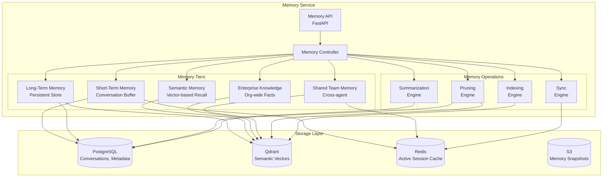
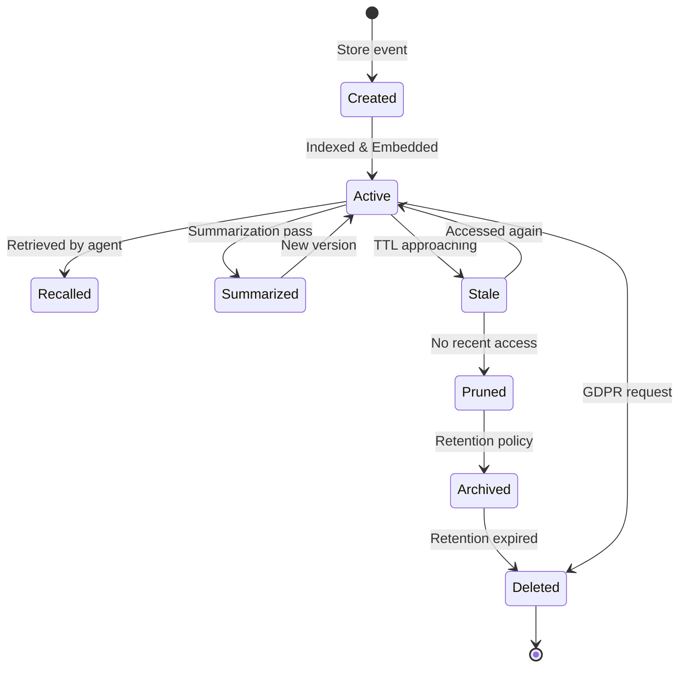
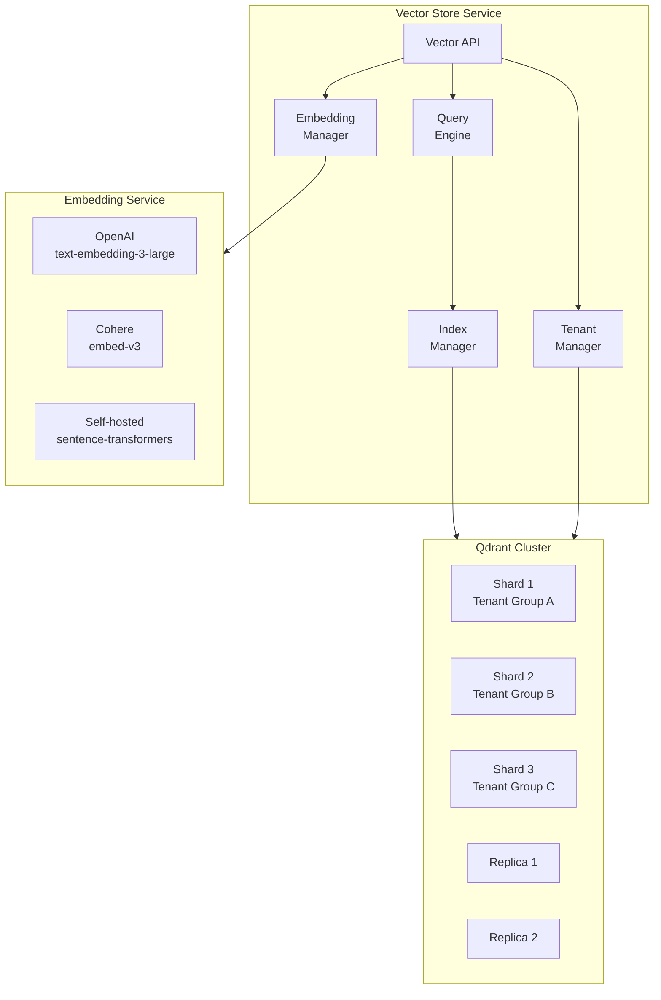
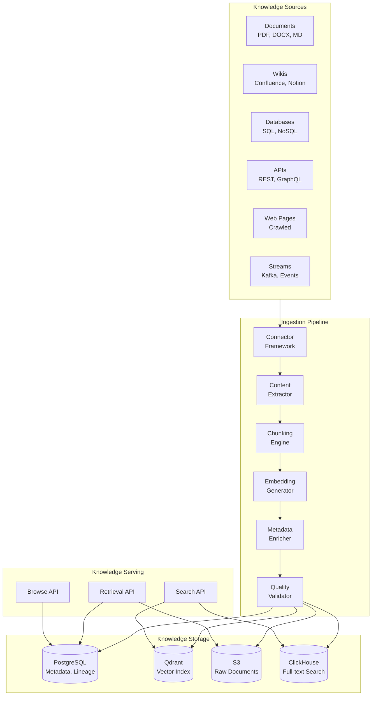
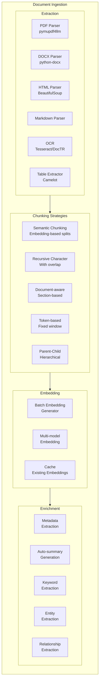

# AgentForge — Memory, Knowledge & RAG Architecture

> **Part 3 of 10** — Memory Service, Conversation Store, Vector Store, Knowledge Base, RAG Pipeline

---

## 1. Memory Service

### 1.1 Purpose
The Memory Service provides a unified, managed memory layer for all agents. It abstracts the complexity of multi-tier memory (short-term, long-term, semantic, shared) behind a single API, handling memory lifecycle, summarization, pruning, and cross-agent memory sharing.

### 1.2 Memory Architecture



### 1.3 Memory Types in Detail

#### Short-Term Memory (STM)
```
┌──────────────────────────────────────────────────────┐
│                 SHORT-TERM MEMORY                     │
│                                                       │
│  Scope: Single conversation / execution               │
│  TTL: Session duration (configurable, default 1h)     │
│  Storage: Redis (hot) → PostgreSQL (warm)             │
│  Max Size: 50 turns (configurable)                    │
│                                                       │
│  ┌─────────────────────────────────────────────┐      │
│  │ Turn 1: User: "What's my order status?"     │      │
│  │ Turn 2: Agent: [tool:lookup_order] ...      │      │
│  │ Turn 3: User: "Can you change the address?" │      │
│  │ ...                                         │      │
│  │ Turn 20: [SUMMARIZATION TRIGGER]            │      │
│  │ Summary: "Customer inquired about order..." │      │
│  │ Turn 21: ...                                │      │
│  └─────────────────────────────────────────────┘      │
│                                                       │
│  Summarization: After N turns, compress older turns   │
│  into a summary using a dedicated summarization LLM   │
│  call, preserving key facts and decisions.            │
└──────────────────────────────────────────────────────┘
```

#### Long-Term Memory (LTM)
```
┌──────────────────────────────────────────────────────┐
│                  LONG-TERM MEMORY                     │
│                                                       │
│  Scope: Per-agent, per-user, or per-entity            │
│  TTL: Configurable (90 days to indefinite)            │
│  Storage: PostgreSQL + Qdrant                         │
│                                                       │
│  Types:                                               │
│  ├── Episodic: Past interaction summaries             │
│  ├── Factual: Extracted facts about entities          │
│  ├── Procedural: Learned workflows/preferences        │
│  └── Relational: Entity relationships                 │
│                                                       │
│  Example:                                             │
│  {                                                    │
│    "entity": "user:12345",                            │
│    "facts": [                                         │
│      {"key": "preferred_name", "value": "Sam"},       │
│      {"key": "timezone", "value": "PST"},             │
│      {"key": "communication_style", "value": "brief"},│
│      {"key": "escalation_history", "value": 2}        │
│    ],                                                 │
│    "episodes": [                                      │
│      {"date": "2024-01-15", "summary": "..."},        │
│      {"date": "2024-02-03", "summary": "..."}         │
│    ]                                                  │
│  }                                                    │
└──────────────────────────────────────────────────────┘
```

#### Semantic Memory
```
┌──────────────────────────────────────────────────────┐
│                 SEMANTIC MEMORY                       │
│                                                       │
│  Scope: Agent or team-level                           │
│  Storage: Qdrant (vector) + PostgreSQL (metadata)     │
│                                                       │
│  How it works:                                        │
│  1. All significant interactions are embedded          │
│  2. Stored as vectors with rich metadata              │
│  3. Retrieved via similarity search on new queries    │
│  4. Used to provide relevant past context             │
│                                                       │
│  Vector Schema:                                       │
│  {                                                    │
│    "id": "mem_abc123",                                │
│    "vector": [0.123, -0.456, ...],  // 1536-dim      │
│    "payload": {                                       │
│      "tenant_id": "acme",                             │
│      "agent_id": "cs-agent",                          │
│      "content": "Customer prefers email over phone",  │
│      "type": "fact",                                  │
│      "entity": "user:12345",                          │
│      "confidence": 0.95,                              │
│      "source_execution": "exec_xyz",                  │
│      "created_at": "2024-01-15T10:30:00Z",            │
│      "access_count": 12,                              │
│      "last_accessed": "2024-03-01T14:00:00Z"          │
│    }                                                  │
│  }                                                    │
└──────────────────────────────────────────────────────┘
```

#### Shared Team Memory
```
┌──────────────────────────────────────────────────────┐
│               SHARED TEAM MEMORY                      │
│                                                       │
│  Scope: Team or project level                         │
│  Access: All agents within the team                   │
│  Governance: Write requires permission                │
│                                                       │
│  Use Cases:                                           │
│  ├── Agent A learns a customer preference →           │
│  │   Agent B uses it in next interaction              │
│  ├── Research agent stores findings →                 │
│  │   Analysis agent consumes them                     │
│  └── All agents share product knowledge updates       │
│                                                       │
│  Isolation:                                           │
│  ├── Tenant-level: Strict isolation                   │
│  ├── Team-level: Shared within team                   │
│  └── Project-level: Shared within project             │
│                                                       │
│  Conflict Resolution:                                 │
│  ├── Last-write-wins for simple facts                 │
│  ├── Append-only for events/episodes                  │
│  └── Merge with conflict detection for complex state  │
└──────────────────────────────────────────────────────┘
```

### 1.4 API

```
# Memory CRUD
POST   /api/v1/memory/store                    # Store memory
POST   /api/v1/memory/recall                   # Recall memories (search)
GET    /api/v1/memory/{id}                     # Get specific memory
DELETE /api/v1/memory/{id}                     # Delete memory (GDPR)
PUT    /api/v1/memory/{id}                     # Update memory

# Conversation Memory
POST   /api/v1/memory/conversations            # Start conversation
GET    /api/v1/memory/conversations/{id}       # Get conversation
POST   /api/v1/memory/conversations/{id}/turns  # Add turn
GET    /api/v1/memory/conversations/{id}/summary # Get summary

# Semantic Search
POST   /api/v1/memory/search                  # Semantic search
POST   /api/v1/memory/search/hybrid            # Hybrid search

# Memory Operations
POST   /api/v1/memory/summarize                # Trigger summarization
POST   /api/v1/memory/prune                    # Trigger pruning
GET    /api/v1/memory/stats                    # Memory statistics
POST   /api/v1/memory/export                   # Export memories (GDPR)

# Shared Memory
POST   /api/v1/memory/shared/{scope}/store     # Store shared memory
POST   /api/v1/memory/shared/{scope}/recall     # Recall shared memory
```

### 1.5 Memory Lifecycle



### 1.6 Summarization Engine

```python
# Memory summarization pipeline
class MemorySummarizationPipeline:
    """
    Triggered when conversation exceeds max_turns threshold.
    Uses a dedicated summarization model (cheaper, faster).
    """
    
    async def summarize_conversation(
        self,
        conversation_id: str,
        strategy: str = "progressive",  # progressive | hierarchical | map-reduce
    ) -> str:
        if strategy == "progressive":
            # Summarize oldest N turns, keep summary + recent turns
            old_turns = await self.get_turns(conversation_id, oldest=True, limit=20)
            summary = await self.llm.summarize(
                old_turns,
                model="gpt-4o-mini",  # Use cheap model for summarization
                instructions="Preserve: key facts, decisions, user preferences, "
                             "action items. Remove: pleasantries, redundancy.",
            )
            await self.replace_old_turns_with_summary(conversation_id, summary)
            
        elif strategy == "hierarchical":
            # Multi-level summarization for very long conversations
            chunks = await self.chunk_conversation(conversation_id, chunk_size=20)
            chunk_summaries = await asyncio.gather(*[
                self.llm.summarize(chunk) for chunk in chunks
            ])
            meta_summary = await self.llm.summarize(chunk_summaries)
            return meta_summary
```

### 1.7 Pruning Strategy

| Criterion | Action | Frequency |
|---|---|---|
| TTL expired | Move to archive tier (S3) | Daily |
| No access in 90 days | Mark as stale candidate | Weekly |
| Relevance score < 0.3 | Soft delete | Weekly |
| Storage quota exceeded | Prune lowest-relevance first | On threshold |
| GDPR deletion request | Hard delete across all tiers | Immediate |
| Duplicate detection | Merge and deduplicate | Daily |

### 1.8 Storage

| Data | Store | Size Estimate |
|---|---|---|
| Conversation turns | PostgreSQL (partitioned by month) | ~500GB/year |
| Memory metadata | PostgreSQL | ~50GB/year |
| Semantic vectors | Qdrant (HNSW index) | ~200GB/year for 100M vectors |
| Active sessions | Redis | ~10GB |
| Memory snapshots | S3 (Iceberg format) | ~2TB/year |

### 1.9 Scaling Strategy
- PostgreSQL: Citus distributed tables, partitioned by `tenant_id` and `created_at`
- Qdrant: Sharded by `tenant_id`, replicated for HA (3 replicas)
- Redis: Cluster mode with 6+ nodes, hash-based key distribution
- Summarization: Async Kafka consumer, dedicated worker pool
- Target: <50ms p99 for memory recall, <10ms p99 for STM read

---

## 2. Conversation Store

### 2.1 Purpose
Dedicated storage and retrieval service for agent conversations, optimized for sequential access patterns, full-text search, and compliance requirements (retention, export, deletion).

### 2.2 Data Model

```sql
-- Core conversation tables
CREATE TABLE conversations (
    id              UUID PRIMARY KEY DEFAULT gen_random_uuid(),
    tenant_id       UUID NOT NULL REFERENCES tenants(id),
    agent_id        UUID NOT NULL REFERENCES agents(id),
    user_id         VARCHAR(255),
    session_id      UUID,
    status          VARCHAR(20) DEFAULT 'active',  -- active, completed, archived
    metadata        JSONB DEFAULT '{}',
    started_at      TIMESTAMPTZ DEFAULT NOW(),
    ended_at        TIMESTAMPTZ,
    turn_count      INTEGER DEFAULT 0,
    total_tokens    INTEGER DEFAULT 0,
    total_cost      DECIMAL(10, 6) DEFAULT 0,
    summary         TEXT,
    tags            TEXT[] DEFAULT '{}',
    created_at      TIMESTAMPTZ DEFAULT NOW(),
    updated_at      TIMESTAMPTZ DEFAULT NOW()
) PARTITION BY RANGE (created_at);

-- Monthly partitions
CREATE TABLE conversations_2024_01 PARTITION OF conversations
    FOR VALUES FROM ('2024-01-01') TO ('2024-02-01');

CREATE TABLE conversation_turns (
    id              UUID PRIMARY KEY DEFAULT gen_random_uuid(),
    conversation_id UUID NOT NULL REFERENCES conversations(id),
    tenant_id       UUID NOT NULL,
    sequence_num    INTEGER NOT NULL,
    role            VARCHAR(20) NOT NULL,  -- user, assistant, system, tool
    content         TEXT NOT NULL,
    tool_calls      JSONB,
    tool_results    JSONB,
    model_id        VARCHAR(100),
    tokens_input    INTEGER,
    tokens_output   INTEGER,
    cost            DECIMAL(10, 6),
    latency_ms      INTEGER,
    metadata        JSONB DEFAULT '{}',
    created_at      TIMESTAMPTZ DEFAULT NOW(),
    UNIQUE (conversation_id, sequence_num)
) PARTITION BY RANGE (created_at);

-- Indexes
CREATE INDEX idx_conversations_tenant ON conversations(tenant_id, created_at DESC);
CREATE INDEX idx_conversations_agent ON conversations(agent_id, created_at DESC);
CREATE INDEX idx_conversations_user ON conversations(user_id, created_at DESC);
CREATE INDEX idx_turns_conversation ON conversation_turns(conversation_id, sequence_num);

-- Row-Level Security
ALTER TABLE conversations ENABLE ROW LEVEL SECURITY;
CREATE POLICY tenant_isolation ON conversations
    USING (tenant_id = current_setting('app.current_tenant')::UUID);
```

---

## 3. Vector Store

### 3.1 Purpose
Managed vector storage for semantic search across memories, documents, and knowledge. Provides multi-tenant, high-performance approximate nearest neighbor (ANN) search with metadata filtering.

### 3.2 Architecture



### 3.3 Collection Design

```python
# Qdrant collection configuration
COLLECTION_CONFIG = {
    "memory": {
        "vectors": {
            "content": {
                "size": 1536,         # OpenAI text-embedding-3-large
                "distance": "Cosine",
            },
        },
        "shard_number": 6,            # Across 3 nodes
        "replication_factor": 2,
        "write_consistency_factor": 1,  # AP mode for writes
        "on_disk_payload": True,       # Large payloads on disk
        "optimizers_config": {
            "indexing_threshold": 20000,
            "memmap_threshold": 50000,
        },
        "quantization_config": {
            "scalar": {
                "type": "int8",
                "quantile": 0.99,
                "always_ram": True,
            }
        },
    }
}

# Per-tenant collection pattern:
# Collection: af_memory_{tenant_id}
# Collection: af_knowledge_{tenant_id}
# Collection: af_documents_{tenant_id}
```

### 3.4 API

```
POST   /api/v1/vectors/upsert                 # Upsert vectors
POST   /api/v1/vectors/search                  # Similarity search
POST   /api/v1/vectors/search/hybrid           # Hybrid (vector + keyword)
DELETE /api/v1/vectors/{id}                    # Delete vector
POST   /api/v1/vectors/batch-upsert            # Batch upsert
GET    /api/v1/vectors/collections             # List collections
POST   /api/v1/vectors/collections             # Create collection
DELETE /api/v1/vectors/collections/{name}      # Delete collection
GET    /api/v1/vectors/collections/{name}/stats # Collection statistics
```

### 3.5 Scaling
- **Qdrant Cluster**: 3+ nodes, sharded by tenant, 2x replication
- **Scalar Quantization**: INT8 reduces memory by 4x with <1% accuracy loss
- **Disk-backed payloads**: Only vectors in RAM, payloads on NVMe SSD
- **Target**: <50ms p99 search latency for 10M vectors per collection

---

## 4. Knowledge Base

### 4.1 Purpose
The Knowledge Base is the enterprise content management layer — ingesting, processing, indexing, and serving organizational knowledge to agents. It handles documents, wikis, databases, APIs, and real-time data sources.

### 4.2 Architecture



### 4.3 Connector Framework

```python
# Extensible connector pattern
class KnowledgeConnector(ABC):
    """Base class for knowledge source connectors."""
    
    @abstractmethod
    async def discover(self) -> list[DocumentMetadata]:
        """Discover available documents from the source."""
        
    @abstractmethod
    async def fetch(self, doc_id: str) -> RawDocument:
        """Fetch a specific document."""
        
    @abstractmethod
    async def watch(self) -> AsyncIterator[ChangeEvent]:
        """Watch for changes (create, update, delete)."""

# Built-in connectors
CONNECTORS = {
    "confluence": ConfluenceConnector,
    "notion": NotionConnector,
    "sharepoint": SharePointConnector,
    "google-drive": GoogleDriveConnector,
    "github": GitHubConnector,
    "s3": S3Connector,
    "postgresql": PostgreSQLConnector,
    "web-crawler": WebCrawlerConnector,
    "kafka": KafkaConnector,
    "salesforce": SalesforceConnector,
    "servicenow": ServiceNowConnector,
}
```

### 4.4 API

```
# Knowledge Sources
POST   /api/v1/knowledge/sources                # Register source
GET    /api/v1/knowledge/sources                 # List sources
PUT    /api/v1/knowledge/sources/{id}            # Update source config
DELETE /api/v1/knowledge/sources/{id}            # Remove source
POST   /api/v1/knowledge/sources/{id}/sync       # Trigger sync
GET    /api/v1/knowledge/sources/{id}/status      # Sync status

# Documents
GET    /api/v1/knowledge/documents               # List documents
GET    /api/v1/knowledge/documents/{id}           # Get document
GET    /api/v1/knowledge/documents/{id}/chunks    # Get chunks
DELETE /api/v1/knowledge/documents/{id}           # Delete document
POST   /api/v1/knowledge/documents/upload         # Upload document
POST   /api/v1/knowledge/documents/bulk-upload     # Bulk upload

# Search
POST   /api/v1/knowledge/search                  # Search knowledge base
POST   /api/v1/knowledge/search/semantic          # Semantic search only
POST   /api/v1/knowledge/search/keyword           # Keyword search only
```

---

## 5. RAG Service

### 5.1 Purpose
The RAG (Retrieval-Augmented Generation) Service is the core intelligence pipeline that bridges knowledge retrieval with LLM generation. It orchestrates the complete RAG pipeline: query understanding → retrieval → re-ranking → context construction → generation → evaluation.

### 5.2 RAG Pipeline Architecture

```mermaid
flowchart TB
    subgraph QueryProcessing["1. Query Processing"]
        QU[Query<br/>Understanding]
        QR[Query<br/>Rewriting]
        QE[Query<br/>Expansion]
        QD[Query<br/>Decomposition]
    end

    subgraph Retrieval["2. Retrieval"]
        VR[Vector<br/>Retrieval<br/>Qdrant]
        KR[Keyword<br/>Retrieval<br/>BM25]
        MF[Metadata<br/>Filtering]
        HR[Hybrid<br/>Retrieval<br/>RRF Fusion]
    end

    subgraph PostRetrieval["3. Post-Retrieval"]
        RR[Re-ranking<br/>Cross-Encoder]
        DD[Deduplication]
        RL[Relevance<br/>Filtering]
        CS[Context<br/>Selection]
    end

    subgraph Generation["4. Generation"]
        CC[Context<br/>Construction]
        PB[Prompt<br/>Building]
        LLM[LLM<br/>Generation]
        CIT[Citation<br/>Extraction]
    end

    subgraph Evaluation["5. Quality"]
        GR[Groundedness<br/>Check]
        HL[Hallucination<br/>Detection]
        RA[Relevance<br/>Assessment]
        FB[Feedback<br/>Collection]
    end

    QueryProcessing --> Retrieval --> PostRetrieval --> Generation --> Evaluation
```



### 5.3 Document Ingestion Pipeline



### 5.4 Chunking Configuration

```python
# Chunking strategy configuration
CHUNKING_STRATEGIES = {
    "semantic": {
        "description": "Split by semantic similarity boundaries",
        "model": "text-embedding-3-small",
        "threshold": 0.5,        # Similarity threshold for splits
        "min_chunk_size": 100,   # tokens
        "max_chunk_size": 1000,  # tokens
        "overlap": 50,           # tokens
    },
    "recursive_character": {
        "description": "Recursive splitting with character separators",
        "separators": ["\n\n", "\n", ". ", " "],
        "chunk_size": 800,       # characters
        "chunk_overlap": 200,
    },
    "document_aware": {
        "description": "Split by document structure (headers, sections)",
        "header_levels": ["h1", "h2", "h3"],
        "preserve_tables": True,
        "preserve_code_blocks": True,
    },
    "parent_child": {
        "description": "Hierarchical chunking with parent context",
        "parent_chunk_size": 2000,
        "child_chunk_size": 400,
        "child_overlap": 100,
    },
}
```

### 5.5 Hybrid Retrieval

```python
class HybridRetriever:
    """
    Combines vector similarity search with BM25 keyword search
    using Reciprocal Rank Fusion (RRF).
    """
    
    async def retrieve(
        self,
        query: str,
        top_k: int = 20,
        filters: dict = None,
        alpha: float = 0.7,  # Weight for vector vs keyword
    ) -> list[RetrievedChunk]:
        # 1. Vector search
        query_embedding = await self.embed(query)
        vector_results = await self.qdrant.search(
            collection=self.collection,
            vector=query_embedding,
            limit=top_k * 2,
            query_filter=self._build_filter(filters),
        )
        
        # 2. Keyword search (BM25)
        keyword_results = await self.keyword_search(
            query=query,
            limit=top_k * 2,
            filters=filters,
        )
        
        # 3. Reciprocal Rank Fusion
        fused = self.rrf_fusion(
            vector_results, keyword_results,
            k=60,  # RRF constant
            alpha=alpha,
        )
        
        # 4. Re-ranking with cross-encoder
        reranked = await self.reranker.rerank(
            query=query,
            documents=[r.content for r in fused[:top_k * 2]],
            model="cross-encoder/ms-marco-MiniLM-L-12-v2",
            top_k=top_k,
        )
        
        return reranked
    
    def rrf_fusion(self, *result_lists, k=60, alpha=0.7):
        """Reciprocal Rank Fusion for combining multiple retrieval results."""
        scores = defaultdict(float)
        for i, results in enumerate(result_lists):
            weight = alpha if i == 0 else (1 - alpha)
            for rank, result in enumerate(results):
                scores[result.id] += weight * (1 / (k + rank + 1))
        
        return sorted(scores.items(), key=lambda x: x[1], reverse=True)
```

### 5.6 Context Construction

```python
class ContextConstructor:
    """
    Builds the optimal context window for LLM generation
    from retrieved chunks, respecting token budgets.
    """
    
    async def construct(
        self,
        query: str,
        chunks: list[RetrievedChunk],
        max_tokens: int = 8000,
        strategy: str = "relevance_first",
    ) -> ConstructedContext:
        if strategy == "relevance_first":
            # Order by relevance, pack until token budget
            selected = []
            token_count = 0
            for chunk in chunks:
                chunk_tokens = self.count_tokens(chunk.content)
                if token_count + chunk_tokens > max_tokens:
                    break
                selected.append(chunk)
                token_count += chunk_tokens
                
        elif strategy == "diversity":
            # MMR (Maximal Marginal Relevance) for diversity
            selected = self.mmr_select(chunks, max_tokens, lambda_param=0.7)
            
        elif strategy == "hierarchical":
            # Include parent context for selected children
            selected = await self.include_parent_context(chunks, max_tokens)
        
        # Format context with citations
        context_text = self.format_with_citations(selected)
        
        return ConstructedContext(
            text=context_text,
            chunks=selected,
            token_count=token_count,
            sources=[c.source for c in selected],
        )
```

### 5.7 RAG Evaluation Metrics

| Metric | Description | Method |
|---|---|---|
| **Context Relevance** | Are retrieved chunks relevant to the query? | Cross-encoder score |
| **Context Precision** | What fraction of retrieved chunks are relevant? | LLM-as-judge |
| **Context Recall** | Are all relevant chunks retrieved? | Golden set comparison |
| **Faithfulness** | Is the answer grounded in retrieved context? | NLI model + citation check |
| **Answer Relevance** | Does the answer address the query? | Embedding similarity |
| **Hallucination Rate** | Does the answer contain unsupported claims? | LLM-as-judge + fact verification |
| **Latency** | End-to-end RAG pipeline latency | Instrumentation |
| **Cost** | Total cost per RAG execution | Token counting + pricing |

### 5.8 API

```
POST   /api/v1/rag/query                       # Full RAG query
POST   /api/v1/rag/retrieve                    # Retrieval only
POST   /api/v1/rag/generate                    # Generation with provided context
POST   /api/v1/rag/evaluate                    # Evaluate RAG quality

# Pipeline Configuration
POST   /api/v1/rag/pipelines                   # Create RAG pipeline config
GET    /api/v1/rag/pipelines/{id}              # Get pipeline config
PUT    /api/v1/rag/pipelines/{id}              # Update pipeline config

# Ingestion
POST   /api/v1/rag/ingest                     # Ingest documents
GET    /api/v1/rag/ingest/{job_id}/status       # Ingestion job status
POST   /api/v1/rag/ingest/batch                # Batch ingestion
```

### 5.9 Scaling

| Component | Strategy | Target |
|---|---|---|
| Ingestion | Flink streaming + Spark batch | 10K docs/hour |
| Embedding | Ray cluster with GPU workers | 1M embeddings/hour |
| Vector Search | Qdrant sharding + replicas | <50ms p99 |
| Re-ranking | GPU-accelerated cross-encoder | <100ms p99 |
| Generation | Model Gateway with caching | <2s p99 |

### 5.10 Tradeoffs

| Decision | Tradeoff |
|---|---|
| Hybrid retrieval (vector + BM25) | More complex, higher latency, but significantly better recall |
| Cross-encoder re-ranking | Adds ~100ms latency, but dramatically improves precision |
| Semantic chunking | Slower ingestion, but better retrieval quality |
| Parent-child chunking | 2x storage, but provides context for small chunks |
| Per-tenant vector collections | Higher resource use, but complete isolation |

---

*Next: [04-tool-integration-layer.md](./04-tool-integration-layer.md) — Tool Registry, Tool Execution Runtime, MCP Gateway, A2A Communication*
