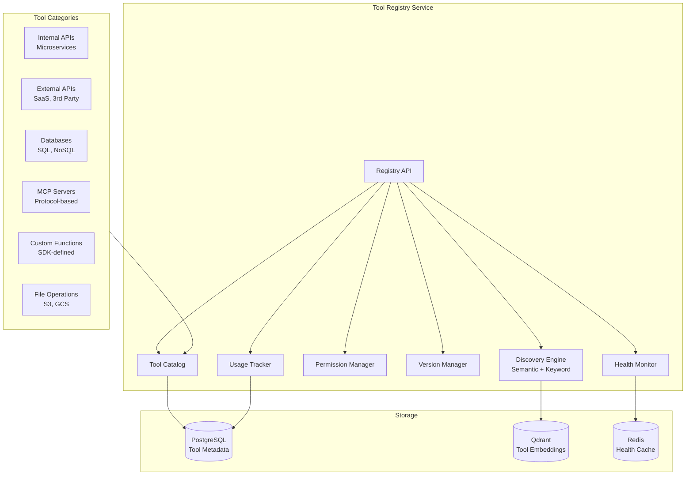
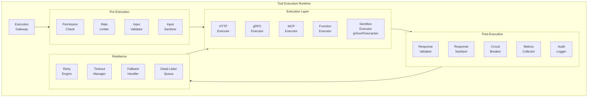
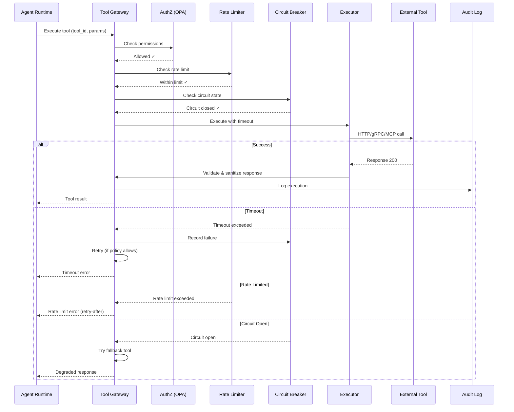
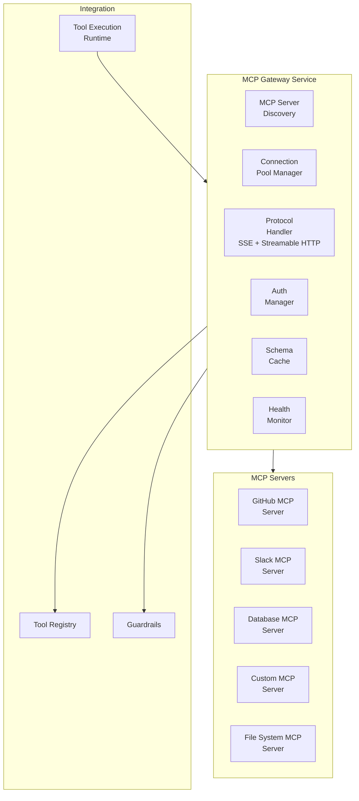
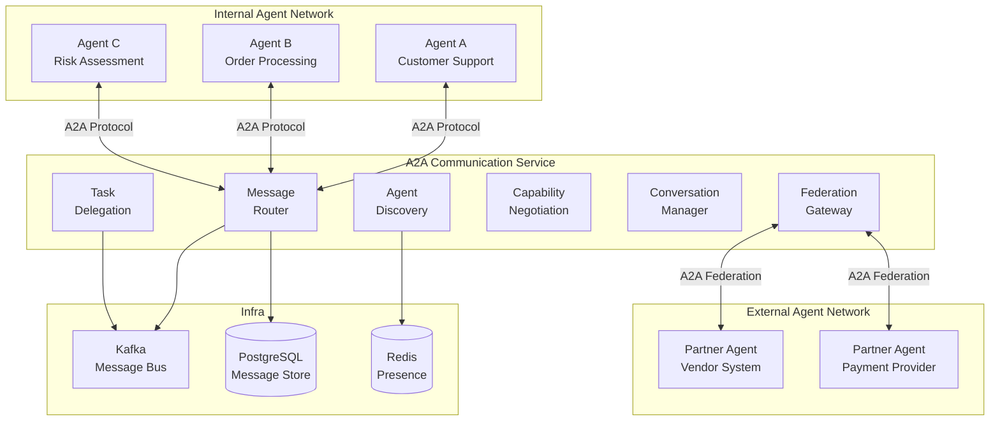
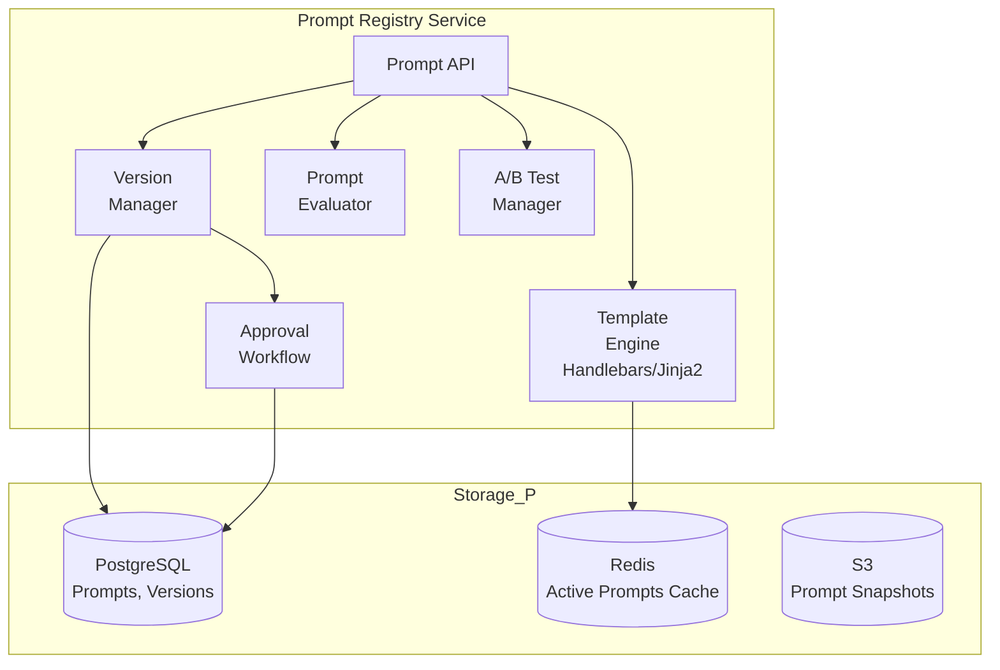
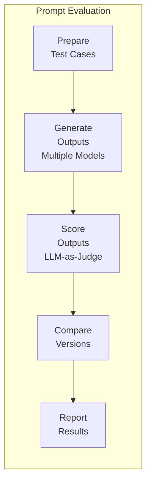

# AgentForge — Tool & Integration Layer

> **Part 4 of 10** — Tool Registry, Tool Execution Runtime, MCP Gateway, A2A Communication

---

## 1. Tool Registry

### 1.1 Purpose
The Tool Registry is the central catalog of all tools available to agents — internal APIs, external services, databases, MCP servers, and custom functions. It provides discovery, versioning, documentation, and governance for the 5,000+ tools expected in a large enterprise.

### 1.2 Responsibilities
- Register and version tools with OpenAPI/JSON Schema descriptions
- Dynamic tool discovery with capability-based search
- Permission management (which agents can use which tools)
- Rate limit configuration per tool per tenant
- Health monitoring and availability tracking
- Usage analytics and cost attribution
- Deprecation and migration workflows

### 1.3 Architecture



### 1.4 Tool Registration Schema

```python
@dataclass
class ToolRegistration:
    """Complete tool registration schema."""
    
    # Identity
    name: str                          # Unique within tenant
    version: str                       # Semantic version
    display_name: str
    description: str                   # Detailed description for LLM consumption
    category: str                      # e.g., "communication", "data", "crm"
    tags: list[str]
    
    # Schema
    input_schema: dict                 # JSON Schema for input parameters
    output_schema: dict                # JSON Schema for output
    
    # Execution
    execution_type: str                # "http" | "grpc" | "mcp" | "function" | "sdk"
    endpoint: str                      # URL, gRPC address, or MCP server
    method: str                        # HTTP method or RPC method
    authentication: AuthConfig         # How to authenticate
    
    # Governance
    owner_team: str
    data_classification: str           # "public" | "internal" | "confidential" | "restricted"
    allowed_agents: list[str]          # Whitelist (empty = all)
    denied_agents: list[str]           # Blacklist
    requires_approval: bool            # Human approval before use
    
    # Operational
    rate_limit: RateLimitConfig        # Per-agent, per-tenant limits
    timeout: int                       # Seconds
    retry_policy: RetryConfig
    circuit_breaker: CircuitBreakerConfig
    
    # Cost
    cost_per_call: float              # For attribution
    cost_model: str                    # "per-call" | "per-byte" | "per-record"

# Example registration
jira_tool = ToolRegistration(
    name="jira-create-ticket",
    version="2.1.0",
    display_name="Create Jira Ticket",
    description="Creates a new Jira ticket in the specified project. "
                "Supports setting summary, description, priority, assignee, "
                "labels, and custom fields.",
    category="project-management",
    tags=["jira", "tickets", "project-management"],
    input_schema={
        "type": "object",
        "properties": {
            "project_key": {"type": "string", "description": "Jira project key (e.g., PROJ)"},
            "summary": {"type": "string", "description": "Ticket title"},
            "description": {"type": "string", "description": "Detailed description"},
            "priority": {"type": "string", "enum": ["Critical", "High", "Medium", "Low"]},
            "assignee": {"type": "string", "description": "Assignee email"},
            "labels": {"type": "array", "items": {"type": "string"}},
        },
        "required": ["project_key", "summary"],
    },
    output_schema={
        "type": "object",
        "properties": {
            "ticket_id": {"type": "string"},
            "url": {"type": "string"},
            "status": {"type": "string"},
        },
    },
    execution_type="http",
    endpoint="https://jira.internal.acme.com/rest/api/3/issue",
    method="POST",
    authentication=AuthConfig(type="oauth2", secret_ref="vault:jira/oauth-token"),
    owner_team="devops",
    data_classification="internal",
    rate_limit=RateLimitConfig(requests_per_minute=60, burst=10),
    timeout=30,
    retry_policy=RetryConfig(max_attempts=3, backoff="exponential"),
    circuit_breaker=CircuitBreakerConfig(
        failure_threshold=5, recovery_timeout=60, half_open_requests=3,
    ),
    cost_per_call=0.001,
)
```

### 1.5 Dynamic Discovery

```python
class ToolDiscoveryEngine:
    """
    Finds the right tools for an agent's needs using semantic
    search + capability matching.
    """
    
    async def discover(
        self,
        query: str,                    # Natural language description
        agent_id: str,                 # For permission filtering
        tenant_id: str,
        categories: list[str] = None,  # Category filter
        max_results: int = 10,
    ) -> list[ToolMatch]:
        # 1. Semantic search on tool descriptions
        query_embedding = await self.embed(query)
        semantic_results = await self.qdrant.search(
            collection="tool_registry",
            vector=query_embedding,
            limit=max_results * 3,
            query_filter={
                "must": [
                    {"key": "tenant_id", "match": {"value": tenant_id}},
                    {"key": "status", "match": {"value": "active"}},
                ],
            },
        )
        
        # 2. Permission filtering
        permitted = await self.filter_by_permissions(
            tools=semantic_results,
            agent_id=agent_id,
        )
        
        # 3. Health filtering (exclude unhealthy tools)
        healthy = [t for t in permitted if await self.is_healthy(t.id)]
        
        # 4. Rank by relevance + popularity
        ranked = self.rank_tools(healthy, query_embedding)
        
        return ranked[:max_results]
```

### 1.6 API

```
POST   /api/v1/tools                           # Register tool
GET    /api/v1/tools                            # List tools
GET    /api/v1/tools/{id}                       # Get tool details
PUT    /api/v1/tools/{id}                       # Update tool
DELETE /api/v1/tools/{id}                       # Deprecate tool
POST   /api/v1/tools/discover                   # Discover tools by capability
GET    /api/v1/tools/{id}/versions               # List versions
GET    /api/v1/tools/{id}/health                 # Health status
GET    /api/v1/tools/{id}/usage                  # Usage statistics
POST   /api/v1/tools/{id}/test                   # Test tool connectivity
PUT    /api/v1/tools/{id}/permissions             # Update permissions
```

---

## 2. Tool Execution Runtime

### 2.1 Purpose
The Tool Execution Runtime securely executes tool calls on behalf of agents, enforcing permissions, rate limits, timeouts, retries, and circuit breakers. It provides a sandboxed execution environment that isolates tool calls from the agent runtime.

### 2.2 Architecture



### 2.3 Execution Flow



### 2.4 Sandbox Execution

```
┌─────────────────────────────────────────────────────┐
│               SANDBOX EXECUTION                      │
│                                                      │
│  For untrusted or user-defined tools:                │
│                                                      │
│  ┌─────────────────────────────────────────────┐     │
│  │            gVisor Container                  │     │
│  │  ┌───────────────────────────────────────┐   │     │
│  │  │  Tool Code Execution                   │   │     │
│  │  │  - No network access (unless allowed)  │   │     │
│  │  │  - No filesystem access                │   │     │
│  │  │  - Memory limited (256MB default)      │   │     │
│  │  │  - CPU limited (0.5 core default)      │   │     │
│  │  │  - Timeout enforced (30s default)      │   │     │
│  │  │  - Seccomp profile applied             │   │     │
│  │  │  - No privilege escalation             │   │     │
│  │  └───────────────────────────────────────┘   │     │
│  └─────────────────────────────────────────────┘     │
│                                                      │
│  Allowed network targets configured via NetworkPolicy│
│  Secrets injected as environment variables via Vault │
└─────────────────────────────────────────────────────┘
```

### 2.5 Rate Limiting

```python
class ToolRateLimiter:
    """
    Multi-level rate limiting using Redis token bucket.
    """
    
    LEVELS = {
        "global":     "tool:{tool_id}:global",          # Platform-wide
        "tenant":     "tool:{tool_id}:tenant:{tid}",    # Per tenant
        "agent":      "tool:{tool_id}:agent:{aid}",     # Per agent
        "user":       "tool:{tool_id}:user:{uid}",      # Per end user
    }
    
    async def check(
        self,
        tool_id: str,
        tenant_id: str,
        agent_id: str,
        user_id: str = None,
    ) -> RateLimitResult:
        for level, key_template in self.LEVELS.items():
            key = key_template.format(
                tool_id=tool_id, tid=tenant_id,
                aid=agent_id, uid=user_id,
            )
            config = await self.get_limit_config(tool_id, level)
            result = await self.redis_token_bucket(key, config)
            if not result.allowed:
                return RateLimitResult(
                    allowed=False,
                    level=level,
                    retry_after=result.retry_after,
                )
        return RateLimitResult(allowed=True)
```

### 2.6 Circuit Breaker

```python
class ToolCircuitBreaker:
    """
    Per-tool circuit breaker with three states:
    CLOSED → OPEN → HALF_OPEN → CLOSED
    """
    
    STATES = {
        "closed": "Normal operation, requests pass through",
        "open": "All requests fail fast, no calls to tool",
        "half_open": "Limited requests to test recovery",
    }
    
    async def execute(
        self,
        tool_id: str,
        executor: Callable,
        *args, **kwargs,
    ) -> ToolResult:
        state = await self.get_state(tool_id)
        
        if state == "open":
            if await self.should_attempt_reset(tool_id):
                await self.transition(tool_id, "half_open")
            else:
                raise CircuitOpenError(tool_id, self.reset_timeout)
        
        try:
            result = await asyncio.wait_for(
                executor(*args, **kwargs),
                timeout=self.timeout,
            )
            await self.record_success(tool_id)
            if state == "half_open":
                await self.transition(tool_id, "closed")
            return result
            
        except Exception as e:
            await self.record_failure(tool_id)
            if await self.failure_threshold_reached(tool_id):
                await self.transition(tool_id, "open")
                await self.alert(tool_id, "Circuit opened", e)
            raise
```

### 2.7 Storage

| Data | Store | Rationale |
|---|---|---|
| Execution logs | ClickHouse | High-volume, append-only, fast analytics |
| Rate limit counters | Redis | Sub-ms reads, atomic increments |
| Circuit breaker state | Redis | Shared across instances, fast |
| Tool health metrics | Prometheus + Redis | Time-series + real-time state |

### 2.8 Scaling
- Stateless execution proxies — HPA based on request rate
- Sandbox containers pre-warmed in pool (warm pool: 50 containers)
- Rate limit checks: <1ms (Redis cluster)
- Target: <20ms overhead per tool call (excluding tool execution time)

---

## 3. MCP Gateway

### 3.1 Purpose
The MCP (Model Context Protocol) Gateway provides a managed connectivity layer between AgentForge agents and MCP-compliant tool servers. It handles discovery, connection pooling, authentication, and protocol translation for the emerging MCP ecosystem.

### 3.2 Architecture



### 3.3 MCP Server Registration

```python
@dataclass
class MCPServerConfig:
    """MCP Server registration configuration."""
    
    name: str                          # "github-mcp"
    description: str
    transport: str                     # "sse" | "streamable-http" | "stdio"
    url: str                           # MCP server URL
    
    # Authentication
    auth: MCPAuthConfig                # OAuth2, API key, mTLS
    
    # Connection Management
    connection_pool_size: int = 10
    idle_timeout: int = 300            # seconds
    max_reconnect_attempts: int = 5
    
    # Rate Limiting
    rate_limit: RateLimitConfig
    
    # Tool Filtering
    allowed_tools: list[str] = None    # Whitelist of tools to expose
    denied_tools: list[str] = None     # Blacklist
    
    # Governance
    tenant_id: str
    data_classification: str
    requires_approval: bool = False
```

### 3.4 API

```
POST   /api/v1/mcp/servers                     # Register MCP server
GET    /api/v1/mcp/servers                      # List MCP servers
GET    /api/v1/mcp/servers/{id}                 # Get server details
PUT    /api/v1/mcp/servers/{id}                 # Update server config
DELETE /api/v1/mcp/servers/{id}                 # Remove MCP server
GET    /api/v1/mcp/servers/{id}/tools           # List tools from server
GET    /api/v1/mcp/servers/{id}/resources       # List resources
GET    /api/v1/mcp/servers/{id}/prompts         # List prompt templates
POST   /api/v1/mcp/servers/{id}/tools/{tool}/execute  # Execute MCP tool
GET    /api/v1/mcp/servers/{id}/health          # Health check
POST   /api/v1/mcp/servers/{id}/sync            # Re-sync tool catalog
```

---

## 4. A2A Communication

### 4.1 Purpose
The Agent-to-Agent (A2A) Communication subsystem enables agents to discover, communicate with, and delegate tasks to other agents — both within AgentForge and across organizational boundaries via the A2A protocol. It is the "service mesh" for AI agents.

### 4.2 Architecture



### 4.3 A2A Message Types

```python
# A2A message protocol
@dataclass
class A2AMessage:
    """Agent-to-Agent message."""
    
    message_id: str
    conversation_id: str
    
    # Routing
    from_agent: AgentIdentity
    to_agent: AgentIdentity           # Specific agent or capability query
    
    # Content
    type: str                          # "task" | "query" | "response" | "status" | "cancel"
    content: dict
    
    # Task delegation
    task: A2ATask = None              # For task delegation
    
    # Metadata
    priority: str = "normal"           # "critical" | "high" | "normal" | "low"
    ttl: int = 3600                    # Message TTL in seconds
    correlation_id: str = None         # For request-response correlation
    
    # Security
    signed: bool = True                # mTLS + message signing
    encrypted: bool = True             # E2E encryption for sensitive data

@dataclass 
class A2ATask:
    """Task delegation between agents."""
    
    task_id: str
    description: str
    input_data: dict
    expected_output_schema: dict
    deadline: datetime = None
    budget_limit: float = None
    human_approval_required: bool = False
    fallback_agent: str = None
```

### 4.4 Agent Discovery

```python
class AgentDiscoveryService:
    """
    Discovers agents by capability, similar to DNS-SD for services.
    """
    
    async def discover(
        self,
        capability: str,               # "order-processing"
        tenant_id: str,
        requirements: dict = None,      # Min confidence, max latency, etc.
    ) -> list[AgentCapability]:
        # 1. Search agent registry by capability
        candidates = await self.registry.search(
            capability=capability,
            tenant_id=tenant_id,
            status="active",
        )
        
        # 2. Filter by health and availability
        healthy = [a for a in candidates if await self.is_healthy(a.id)]
        
        # 3. Rank by performance metrics
        ranked = sorted(healthy, key=lambda a: (
            -a.success_rate,
            a.avg_latency,
            a.cost_per_execution,
        ))
        
        return ranked

    async def register_capabilities(
        self,
        agent_id: str,
        capabilities: list[str],
        agent_card: dict,              # A2A Agent Card
    ):
        """Register agent capabilities for discovery."""
        for cap in capabilities:
            await self.redis.sadd(f"capabilities:{cap}", agent_id)
        await self.redis.hset(f"agent_card:{agent_id}", mapping=agent_card)
```

### 4.5 API

```
# Agent Discovery
POST   /api/v1/a2a/discover                    # Discover agents by capability
GET    /api/v1/a2a/agents/{id}/card            # Get agent card

# Messaging
POST   /api/v1/a2a/messages                    # Send message
GET    /api/v1/a2a/messages/{id}               # Get message status
POST   /api/v1/a2a/conversations               # Start conversation
GET    /api/v1/a2a/conversations/{id}          # Get conversation

# Task Delegation
POST   /api/v1/a2a/tasks                       # Delegate task
GET    /api/v1/a2a/tasks/{id}                  # Get task status
POST   /api/v1/a2a/tasks/{id}/cancel           # Cancel task
GET    /api/v1/a2a/tasks/{id}/result           # Get task result

# Federation
POST   /api/v1/a2a/federation/peers            # Register federation peer
GET    /api/v1/a2a/federation/peers            # List federation peers
```

### 4.6 Tradeoffs

| Decision | Tradeoff |
|---|---|
| Kafka for inter-agent messaging | Higher latency than gRPC direct, but reliable and auditable |
| A2A protocol support | Adds complexity, but enables cross-organization agent communication |
| Agent capability registry | Maintenance overhead, but enables dynamic agent composition |
| Federation gateway | Security complexity, but enables partner integrations |

---

## 5. Prompt Registry & Versioning

### 5.1 Purpose
The Prompt Registry is the centralized management system for all prompt templates used across the platform. It provides versioning, A/B testing, approval workflows, and analytics — treating prompts as first-class, governed artifacts.

### 5.2 Architecture



### 5.3 Prompt Template Model

```python
@dataclass
class PromptTemplate:
    """Versioned prompt template."""
    
    id: str
    name: str                          # "customer-support-system-v5"
    tenant_id: str
    
    # Content
    template: str                      # Handlebars/Jinja2 template
    variables: list[PromptVariable]    # Typed variables
    
    # Versioning
    version: str                       # Semantic version
    parent_version: str = None         # Previous version
    change_log: str = None
    
    # Governance
    status: str                        # "draft" | "pending_review" | "approved" | "active" | "deprecated"
    approved_by: str = None
    approved_at: datetime = None
    
    # Evaluation
    eval_scores: dict = None           # Latest evaluation metrics
    
    # A/B Testing
    ab_test_id: str = None            # Active A/B test
    traffic_weight: float = 1.0        # % of traffic for this version
    
    # Metadata
    model_compatibility: list[str]     # Compatible models
    estimated_tokens: int              # Approximate token count
    tags: list[str]
    created_by: str
    created_at: datetime
```

### 5.4 Prompt Evaluation Pipeline



### 5.5 API

```
POST   /api/v1/prompts                         # Create prompt
GET    /api/v1/prompts                          # List prompts
GET    /api/v1/prompts/{id}                     # Get prompt
PUT    /api/v1/prompts/{id}                     # Update prompt
POST   /api/v1/prompts/{id}/render              # Render with variables
GET    /api/v1/prompts/{id}/versions             # List versions
POST   /api/v1/prompts/{id}/versions             # Create new version
POST   /api/v1/prompts/{id}/evaluate            # Run evaluation
POST   /api/v1/prompts/{id}/approve             # Approve for production
POST   /api/v1/prompts/{id}/ab-test             # Start A/B test
GET    /api/v1/prompts/{id}/ab-test/results     # Get A/B test results
POST   /api/v1/prompts/{id}/deprecate           # Deprecate prompt
GET    /api/v1/prompts/{id}/usage               # Usage analytics
```

---

*Next: [05-intelligence-layer.md](./05-intelligence-layer.md) — Model Gateway, LLM Router, Model Registry, Cost Optimization, Caching, Guardrails*
