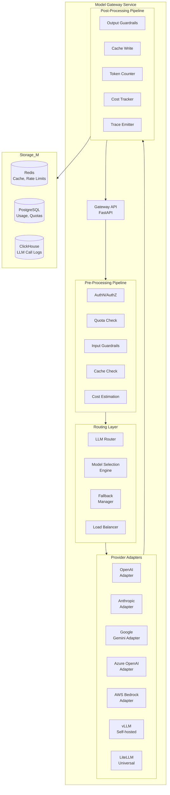
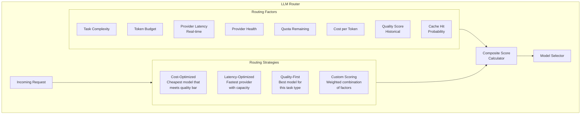
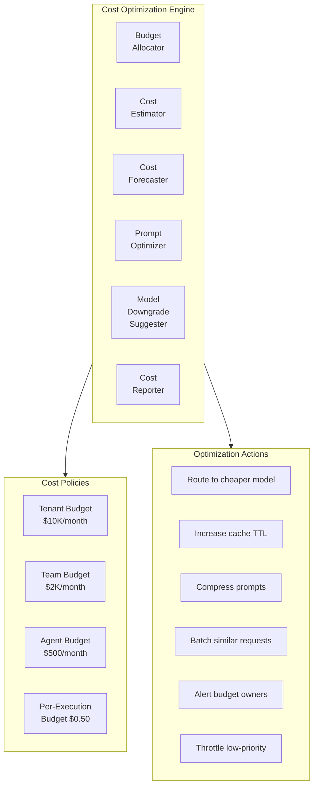
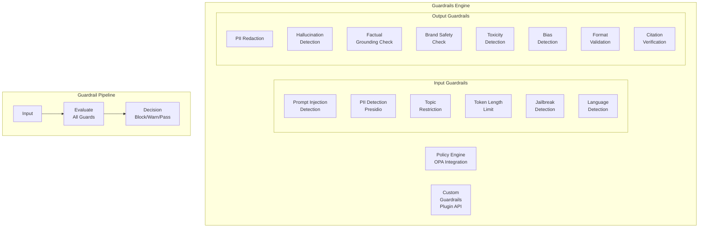

# AgentForge — Intelligence Layer

> **Part 5 of 10** — Model Gateway, LLM Router, Model Registry, Cost Optimization, Caching, Guardrails

---

## 1. Model Gateway

### 1.1 Purpose
The Model Gateway is the unified LLM access layer — a single entry point for all model inference across the platform. It abstracts provider differences, enforces quotas, implements caching, and provides complete observability for every LLM call. Think of it as an "API Gateway for LLMs."

### 1.2 Responsibilities
- Unified API across 100+ LLM providers (OpenAI, Anthropic, Google, Azure, Bedrock, self-hosted)
- Provider failover and fallback chains
- Request/response transformation and normalization
- Token counting and cost tracking
- Rate limiting per tenant/team/agent
- Semantic caching for identical/similar requests
- Request queuing during rate limits
- Streaming support (SSE)
- Guardrail integration (pre/post)
- Complete tracing (OpenTelemetry)

### 1.3 Architecture



### 1.4 Unified Request Schema

```python
@dataclass
class LLMRequest:
    """Unified LLM request across all providers."""
    
    # Routing
    model: str                          # "openai/gpt-4o" or logical name "default-reasoning"
    routing_strategy: str = "default"   # "cost" | "latency" | "quality" | "custom"
    
    # Messages
    messages: list[Message]
    
    # Generation Config
    temperature: float = 0.7
    max_tokens: int = 4096
    top_p: float = 1.0
    stop: list[str] = None
    
    # Tools
    tools: list[ToolDefinition] = None
    tool_choice: str = "auto"           # "auto" | "required" | "none" | specific tool
    
    # Structured Output
    response_format: dict = None        # JSON Schema for structured output
    
    # Streaming
    stream: bool = False
    
    # AgentForge Metadata
    agent_id: str = None
    execution_id: str = None
    tenant_id: str = None
    
    # Caching
    cache_policy: str = "auto"          # "auto" | "force" | "skip"
    cache_ttl: int = 3600               # seconds
    
    # Budget
    max_cost: float = None              # Maximum cost for this call
    
    # Tracing
    trace_context: dict = None          # W3C trace context

@dataclass
class LLMResponse:
    """Unified LLM response."""
    
    # Content
    message: Message
    tool_calls: list[ToolCall] = None
    
    # Metadata
    model: str                          # Actual model used
    provider: str                       # Actual provider used
    
    # Usage
    tokens_input: int
    tokens_output: int
    total_tokens: int
    cost: float                         # USD
    latency_ms: int
    
    # Cache
    cached: bool = False
    
    # Tracing
    trace_id: str
    span_id: str
    
    # Quality
    finish_reason: str                  # "stop" | "length" | "tool_calls"
```

### 1.5 API

```
# Inference
POST   /api/v1/llm/chat/completions            # Chat completion
POST   /api/v1/llm/completions                  # Text completion
POST   /api/v1/llm/embeddings                   # Generate embeddings

# Model Management
GET    /api/v1/llm/models                       # List available models
GET    /api/v1/llm/models/{id}                  # Get model details
GET    /api/v1/llm/models/{id}/pricing          # Get model pricing

# Usage & Costs
GET    /api/v1/llm/usage                        # Usage statistics
GET    /api/v1/llm/costs                        # Cost breakdown
GET    /api/v1/llm/costs/forecast               # Cost forecast

# Health
GET    /api/v1/llm/providers/health             # Provider health status
GET    /api/v1/llm/cache/stats                  # Cache hit rates
```

### 1.6 Storage

| Data | Store | Rationale |
|---|---|---|
| LLM call logs | ClickHouse | Billions of records, fast aggregation |
| Semantic cache | Redis | Sub-ms lookup, TTL support |
| Rate limit counters | Redis | Atomic operations, distributed |
| Quotas & budgets | PostgreSQL | ACID for financial data |
| Model metadata | PostgreSQL | Versioned, queryable |
| Cost reports | Apache Iceberg | Historical analytics, time-travel |

---

## 2. LLM Router

### 2.1 Purpose
The LLM Router intelligently routes inference requests to the optimal model/provider based on configurable strategies: cost optimization, latency minimization, quality maximization, or custom composite scoring.

### 2.2 Routing Strategies



### 2.3 Router Implementation

```python
class LLMRouter:
    """
    Intelligent routing engine for LLM requests.
    """
    
    async def route(self, request: LLMRequest) -> RoutingDecision:
        strategy = request.routing_strategy or self.default_strategy
        
        # 1. Get candidate models
        candidates = await self.get_candidates(request)
        
        # 2. Filter by constraints
        candidates = self.filter_constraints(candidates, request)
        
        # 3. Score candidates
        scored = []
        for model in candidates:
            score = await self.score_model(model, request, strategy)
            scored.append((model, score))
        
        # 4. Select best
        scored.sort(key=lambda x: x[1], reverse=True)
        primary = scored[0][0]
        fallbacks = [m for m, _ in scored[1:3]]  # Top 2 fallbacks
        
        return RoutingDecision(
            primary=primary,
            fallbacks=fallbacks,
            reasoning=self.explain_decision(scored),
        )
    
    async def score_model(
        self,
        model: ModelInfo,
        request: LLMRequest,
        strategy: str,
    ) -> float:
        weights = self.STRATEGY_WEIGHTS[strategy]
        
        scores = {
            "cost": self.score_cost(model, request),
            "latency": await self.score_latency(model),
            "quality": await self.score_quality(model, request),
            "availability": await self.score_availability(model),
            "cache_hit": await self.score_cache_probability(model, request),
        }
        
        return sum(scores[k] * weights[k] for k in scores)
    
    STRATEGY_WEIGHTS = {
        "cost": {"cost": 0.5, "quality": 0.3, "latency": 0.1, "availability": 0.05, "cache_hit": 0.05},
        "latency": {"cost": 0.1, "quality": 0.2, "latency": 0.5, "availability": 0.15, "cache_hit": 0.05},
        "quality": {"cost": 0.1, "quality": 0.6, "latency": 0.1, "availability": 0.1, "cache_hit": 0.1},
        "balanced": {"cost": 0.25, "quality": 0.35, "latency": 0.2, "availability": 0.1, "cache_hit": 0.1},
    }
```

---

## 3. Model Registry

### 3.1 Purpose
The Model Registry tracks all AI models available to the platform — external API models, self-hosted models, fine-tuned models, and embedding models. It provides versioning, approval workflows, and capability metadata.

### 3.2 Model Registration

```python
@dataclass
class ModelRegistration:
    """Model registry entry."""
    
    id: str                            # "openai/gpt-4o-2024-08-06"
    provider: str                      # "openai"
    name: str                          # "gpt-4o"
    version: str                       # "2024-08-06"
    
    # Capabilities
    capabilities: list[str]            # ["chat", "function-calling", "vision", "structured-output"]
    context_window: int                # 128000
    max_output_tokens: int             # 16384
    supported_modalities: list[str]    # ["text", "image"]
    
    # Pricing
    input_price_per_1k: float          # $0.0025
    output_price_per_1k: float         # $0.01
    cached_input_price_per_1k: float   # $0.00125
    
    # Performance
    avg_latency_ms: int                # Historical average
    p99_latency_ms: int
    tokens_per_second: int             # Output speed
    
    # Governance
    status: str                        # "approved" | "pending" | "deprecated" | "blocked"
    approved_by: str
    approved_for: list[str]            # Tenant/team restrictions
    data_residency: list[str]          # ["us", "eu"]
    compliance_certifications: list[str]  # ["SOC2", "HIPAA", "GDPR"]
    
    # Self-hosted
    deployment: ModelDeployment = None  # For vLLM/Ray deployments
```

### 3.3 API

```
POST   /api/v1/models                          # Register model
GET    /api/v1/models                           # List models
GET    /api/v1/models/{id}                      # Get model details
PUT    /api/v1/models/{id}                      # Update model
POST   /api/v1/models/{id}/approve              # Approve model
POST   /api/v1/models/{id}/block                # Block model
GET    /api/v1/models/{id}/usage                # Usage statistics
GET    /api/v1/models/{id}/benchmarks           # Benchmark results
POST   /api/v1/models/compare                   # Compare models
```

---

## 4. Cost Optimization Engine

### 4.1 Purpose
The Cost Optimization Engine minimizes LLM spend across the platform while maintaining quality. It implements budget enforcement, cost-aware routing, prompt optimization, caching strategies, and cost forecasting.

### 4.2 Architecture



### 4.3 Budget Enforcement

```python
class BudgetEnforcer:
    """
    Multi-level budget enforcement with configurable actions.
    """
    
    async def check_budget(
        self,
        tenant_id: str,
        team_id: str,
        agent_id: str,
        estimated_cost: float,
    ) -> BudgetDecision:
        # Check at each level
        for level, entity_id in [
            ("tenant", tenant_id),
            ("team", team_id),
            ("agent", agent_id),
        ]:
            budget = await self.get_budget(level, entity_id)
            spent = await self.get_spent(level, entity_id)
            remaining = budget.limit - spent
            
            if estimated_cost > remaining:
                return BudgetDecision(
                    allowed=False,
                    level=level,
                    action=budget.over_limit_action,  # "block" | "warn" | "downgrade"
                    remaining=remaining,
                )
            
            # Warning thresholds
            utilization = spent / budget.limit
            if utilization > 0.9:
                await self.alert(level, entity_id, "90% budget utilized")
            elif utilization > 0.75:
                await self.alert(level, entity_id, "75% budget utilized")
        
        return BudgetDecision(allowed=True)
    
    OPTIMIZATION_STRATEGIES = {
        "75%_utilized": [
            "Suggest cheaper model alternatives",
            "Increase semantic cache TTL",
        ],
        "90%_utilized": [
            "Auto-downgrade non-critical agents to cheaper models",
            "Increase prompt compression",
            "Alert budget owners",
        ],
        "100%_utilized": [
            "Block new requests (configurable)",
            "Queue requests for next billing cycle",
            "Emergency escalation",
        ],
    }
```

### 4.4 API

```
GET    /api/v1/costs/summary                    # Cost summary
GET    /api/v1/costs/breakdown                  # Cost by tenant/team/agent/model
GET    /api/v1/costs/forecast                   # Cost forecast
POST   /api/v1/costs/budgets                    # Set budget
GET    /api/v1/costs/budgets                     # List budgets
GET    /api/v1/costs/budgets/{id}/utilization    # Budget utilization
POST   /api/v1/costs/optimize                   # Run optimization suggestions
GET    /api/v1/costs/savings                    # Savings from optimizations
```

---

## 5. Caching Layer

### 5.1 Purpose
Multi-tier caching for LLM responses, embeddings, tool results, and knowledge retrievals. The caching layer is critical for cost reduction (avoid redundant LLM calls) and latency improvement.

### 5.2 Cache Architecture

```
┌─────────────────────────────────────────────────────────┐
│                    CACHING TIERS                         │
│                                                          │
│  Tier 1: EXACT MATCH CACHE (Redis)                      │
│  ├── Key: hash(model + messages + params)                │
│  ├── Hit Rate: ~15-25% for production agents             │
│  ├── TTL: 1 hour (configurable)                          │
│  └── Latency: <1ms                                       │
│                                                          │
│  Tier 2: SEMANTIC CACHE (Qdrant + Redis)                 │
│  ├── Key: embedding(user_message)                        │
│  ├── Similarity Threshold: 0.95                          │
│  ├── Hit Rate: ~10-15% additional                        │
│  ├── TTL: 4 hours (configurable)                         │
│  └── Latency: <10ms                                      │
│                                                          │
│  Tier 3: PROMPT CACHE (Provider-level)                   │
│  ├── OpenAI: Automatic prompt caching                    │
│  ├── Anthropic: Explicit cache_control blocks            │
│  ├── Google: Context caching API                         │
│  └── Savings: 50-90% on cached prefix tokens             │
│                                                          │
│  Tier 4: EMBEDDING CACHE (Redis)                         │
│  ├── Key: hash(text + model)                             │
│  ├── Hit Rate: ~30-40% (many repeated texts)             │
│  ├── TTL: 24 hours                                       │
│  └── Latency: <1ms                                       │
│                                                          │
│  Tier 5: TOOL RESULT CACHE (Redis)                       │
│  ├── Key: hash(tool_id + params)                         │
│  ├── Hit Rate: Varies by tool                            │
│  ├── TTL: Tool-specific (5min to 24hr)                   │
│  └── Latency: <1ms                                       │
└─────────────────────────────────────────────────────────┘
```

### 5.3 Semantic Cache Implementation

```python
class SemanticCache:
    """
    Caches LLM responses and returns cached results
    for semantically similar queries.
    """
    
    async def get(
        self,
        query: str,
        model: str,
        similarity_threshold: float = 0.95,
    ) -> CacheResult | None:
        # 1. Embed the query
        query_embedding = await self.embed(query)
        
        # 2. Search for similar cached queries
        results = await self.qdrant.search(
            collection="llm_cache",
            vector=query_embedding,
            limit=1,
            score_threshold=similarity_threshold,
            query_filter={
                "must": [
                    {"key": "model", "match": {"value": model}},
                    {"key": "expired", "match": {"value": False}},
                ],
            },
        )
        
        if results and results[0].score >= similarity_threshold:
            cached = results[0]
            # 3. Retrieve full response from Redis
            response = await self.redis.get(f"cache:response:{cached.id}")
            if response:
                return CacheResult(
                    hit=True,
                    response=json.loads(response),
                    similarity=cached.score,
                    original_query=cached.payload["query"],
                    savings=cached.payload["estimated_cost"],
                )
        
        return None
    
    async def put(
        self,
        query: str,
        model: str,
        response: LLMResponse,
        ttl: int = 3600,
    ):
        query_embedding = await self.embed(query)
        cache_id = str(uuid.uuid4())
        
        # Store vector for similarity search
        await self.qdrant.upsert(
            collection="llm_cache",
            points=[{
                "id": cache_id,
                "vector": query_embedding,
                "payload": {
                    "model": model,
                    "query": query,
                    "estimated_cost": response.cost,
                    "created_at": datetime.utcnow().isoformat(),
                    "expired": False,
                },
            }],
        )
        
        # Store full response in Redis with TTL
        await self.redis.setex(
            f"cache:response:{cache_id}",
            ttl,
            json.dumps(response.to_dict()),
        )
```

---

## 6. Guardrails

### 6.1 Purpose
The Guardrails subsystem enforces safety, compliance, and quality policies on all LLM inputs and outputs. It is the "firewall" for AI content — preventing prompt injection, PII leakage, hallucination, brand safety violations, and policy non-compliance.

### 6.2 Architecture



### 6.3 Guardrail Registry

```python
class GuardrailRegistry:
    """Registry of all available guardrails."""
    
    BUILT_IN = {
        # Input guardrails
        "prompt-injection": PromptInjectionGuard,
        "pii-detection": PIIDetectionGuard,
        "topic-restriction": TopicRestrictionGuard,
        "jailbreak-detection": JailbreakDetectionGuard,
        "language-filter": LanguageFilterGuard,
        "token-limit": TokenLimitGuard,
        
        # Output guardrails
        "pii-redaction": PIIRedactionGuard,
        "hallucination-check": HallucinationGuard,
        "factual-grounding": FactualGroundingGuard,
        "brand-safety": BrandSafetyGuard,
        "toxicity-detection": ToxicityGuard,
        "bias-detection": BiasDetectionGuard,
        "format-validation": FormatValidationGuard,
        "citation-check": CitationCheckGuard,
        "regex-filter": RegexFilterGuard,
        "competitor-mention": CompetitorMentionGuard,
    }

class PIIDetectionGuard:
    """
    Detects PII in input/output using Microsoft Presidio + custom models.
    """
    
    PII_TYPES = [
        "PERSON", "EMAIL_ADDRESS", "PHONE_NUMBER",
        "CREDIT_CARD", "SSN", "IBAN", "IP_ADDRESS",
        "MEDICAL_LICENSE", "PASSPORT", "DRIVER_LICENSE",
        "ADDRESS", "DATE_OF_BIRTH", "FINANCIAL_ACCOUNT",
    ]
    
    async def check(self, text: str, config: dict) -> GuardrailResult:
        # Run Presidio analyzer
        results = self.analyzer.analyze(
            text=text,
            language="en",
            entities=config.get("entities", self.PII_TYPES),
            score_threshold=config.get("threshold", 0.7),
        )
        
        if results:
            if config.get("action") == "redact":
                redacted = self.anonymizer.anonymize(
                    text=text,
                    analyzer_results=results,
                )
                return GuardrailResult(
                    passed=True,
                    modified_text=redacted.text,
                    findings=[self._to_finding(r) for r in results],
                )
            else:
                return GuardrailResult(
                    passed=False,
                    reason=f"PII detected: {[r.entity_type for r in results]}",
                    findings=[self._to_finding(r) for r in results],
                )
        
        return GuardrailResult(passed=True)
```

### 6.4 Guardrail Execution Pipeline

```python
class GuardrailPipeline:
    """
    Executes guardrails in order with configurable failure modes.
    """
    
    async def execute(
        self,
        text: str,
        guardrails: list[GuardrailConfig],
        mode: str = "all",  # "all" | "fail-fast"
    ) -> PipelineResult:
        results = []
        modified_text = text
        
        for guard_config in guardrails:
            guard = self.registry.get(guard_config.name)
            result = await guard.check(modified_text, guard_config.config)
            results.append(result)
            
            if result.modified_text:
                modified_text = result.modified_text
            
            if not result.passed:
                if mode == "fail-fast":
                    return PipelineResult(
                        passed=False,
                        blocked_by=guard_config.name,
                        results=results,
                    )
                elif guard_config.severity == "critical":
                    return PipelineResult(
                        passed=False,
                        blocked_by=guard_config.name,
                        results=results,
                    )
        
        all_passed = all(r.passed for r in results)
        return PipelineResult(
            passed=all_passed,
            text=modified_text,
            results=results,
        )
```

### 6.5 API

```
# Guardrail Operations
POST   /api/v1/guardrails/check                # Run guardrail check
POST   /api/v1/guardrails/check/input          # Input guardrails only
POST   /api/v1/guardrails/check/output         # Output guardrails only

# Guardrail Management
GET    /api/v1/guardrails                       # List available guardrails
GET    /api/v1/guardrails/{id}                  # Get guardrail details
POST   /api/v1/guardrails/custom               # Register custom guardrail
PUT    /api/v1/guardrails/{id}/config           # Update guardrail config

# Analytics
GET    /api/v1/guardrails/analytics             # Guardrail trigger analytics
GET    /api/v1/guardrails/analytics/blocks      # Block rate analytics
```

### 6.6 Guardrail Metrics

| Metric | Description | Target |
|---|---|---|
| `guardrail_check_latency_ms` | Time to execute guardrail check | <50ms p99 |
| `guardrail_block_rate` | % of requests blocked | Dashboard metric |
| `guardrail_pii_detections` | PII instances detected | Alert if spike |
| `guardrail_injection_attempts` | Prompt injection attempts | Alert always |
| `guardrail_hallucination_rate` | Output hallucination rate | <5% target |
| `guardrail_false_positive_rate` | False positive blocks | <2% target |

---

## 7. Model Selection Engine

### 7.1 Purpose
Automatically selects the optimal model for a given task based on task characteristics, historical performance, cost constraints, and real-time provider conditions.

### 7.2 Selection Algorithm

```python
class ModelSelectionEngine:
    """
    ML-based model selection using task classification
    and historical performance data.
    """
    
    async def select(
        self,
        request: LLMRequest,
        constraints: SelectionConstraints,
    ) -> list[ModelCandidate]:
        # 1. Classify the task
        task_type = await self.classify_task(request)
        # e.g., "reasoning", "creative", "extraction", "classification", "code"
        
        # 2. Get benchmark scores for task type
        benchmarks = await self.get_benchmarks(task_type)
        
        # 3. Get real-time provider metrics
        provider_metrics = await self.get_provider_metrics()
        
        # 4. Apply constraints
        candidates = self.filter_candidates(
            benchmarks,
            constraints=constraints,  # budget, latency, compliance, etc.
        )
        
        # 5. Score and rank
        scored = []
        for candidate in candidates:
            score = self.composite_score(
                quality=benchmarks[candidate.id].get(task_type, 0),
                cost=candidate.cost_per_1k_tokens,
                latency=provider_metrics[candidate.id].p50_latency,
                availability=provider_metrics[candidate.id].uptime,
                weights=constraints.weights,
            )
            scored.append(ModelCandidate(model=candidate, score=score))
        
        return sorted(scored, key=lambda x: x.score, reverse=True)
```

---

*Next: [06-governance-security.md](./06-governance-security.md) — Policy Engine, PII Detection, Compliance Engine, Approval Workflows, Identity, AuthN/AuthZ, RBAC/ABAC, Tenant Isolation, Secrets Management*
