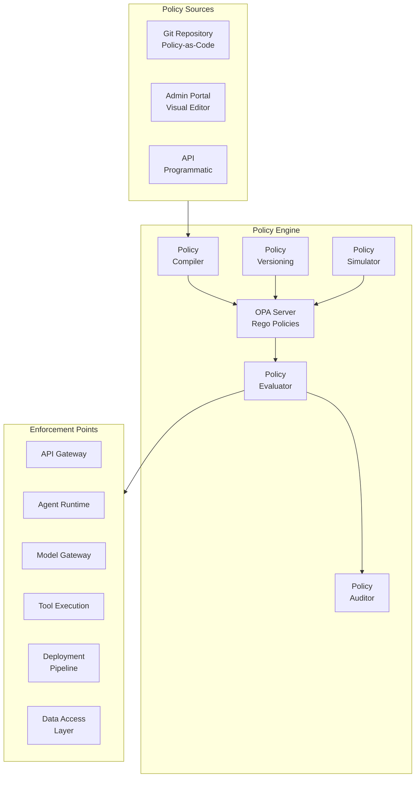
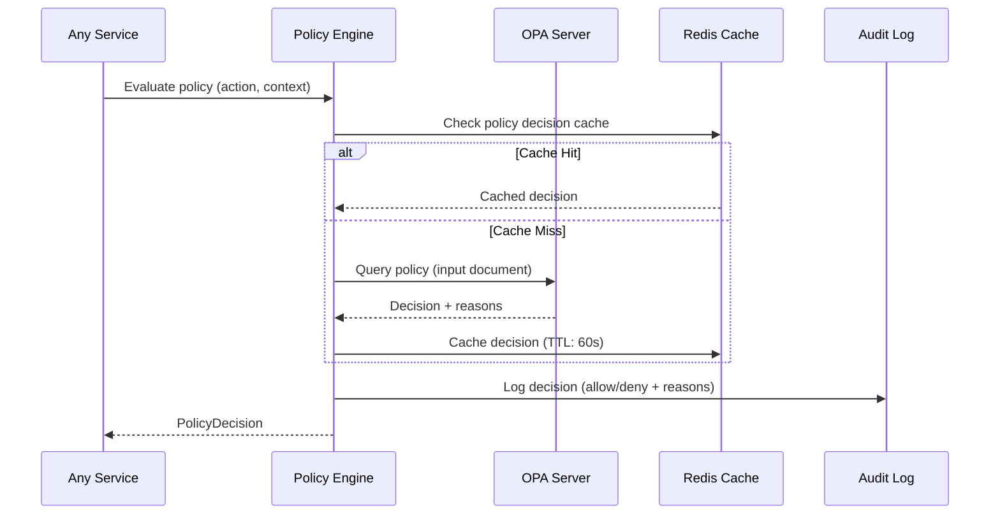
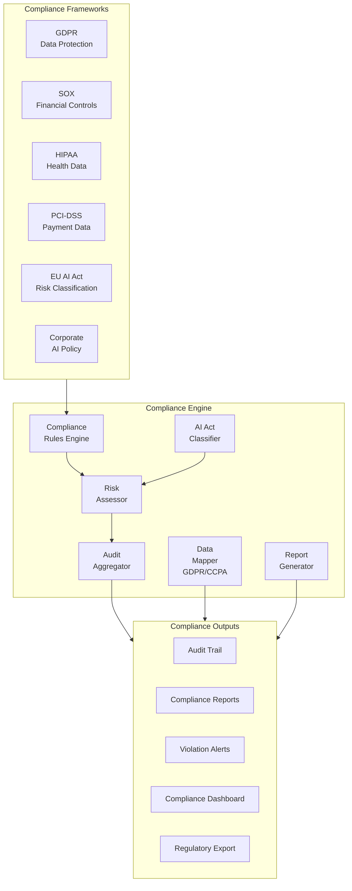
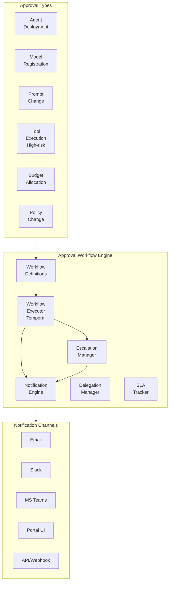
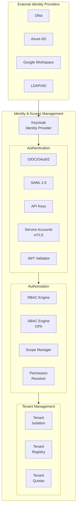
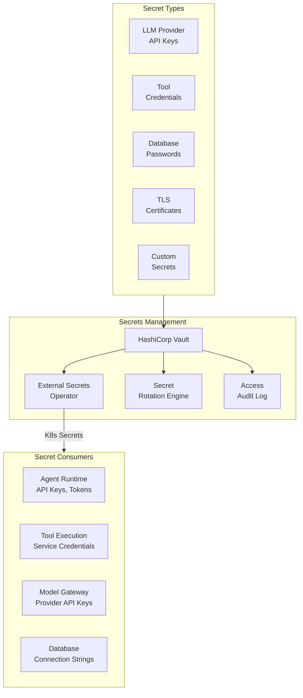

# AgentForge — Governance & Security Architecture

> **Part 6 of 10** — Policy Engine, Compliance, Approval Workflows, Identity, AuthN/AuthZ, RBAC/ABAC, Tenant Isolation, Secrets Management

---

## 1. Policy Engine

### 1.1 Purpose
The Policy Engine is the brain of enterprise governance — a centralized, declarative policy evaluation system powered by Open Policy Agent (OPA). Every action in AgentForge is policy-gated: agent deployment, tool access, model usage, data access, and budget allocation.

### 1.2 Architecture



### 1.3 Policy Categories

```rego
# ─── Agent Deployment Policy ────────────────────────────────
package agentforge.policies.deployment

default allow := false

allow {
    # Agent must be approved
    input.agent.status == "approved"
    
    # Deployer must have permission
    input.user.roles[_] == "agent-deployer"
    
    # Model must be approved for this tenant
    input.agent.model.id in data.approved_models[input.tenant_id]
    
    # Budget must be available
    input.agent.estimated_monthly_cost <= data.budgets[input.tenant_id].remaining
    
    # All guardrails must be configured
    required_guardrails_present(input.agent)
    
    # Evaluation scores must meet threshold
    input.agent.eval_scores.correctness >= 0.85
    input.agent.eval_scores.groundedness >= 0.90
}

required_guardrails_present(agent) {
    required := data.required_guardrails[input.tenant_id]
    configured := {g | g := agent.guardrails[_].name}
    missing := required - configured
    count(missing) == 0
}

# ─── Tool Access Policy ─────────────────────────────────────
package agentforge.policies.tool_access

default allow := false

allow {
    # Agent has explicit tool binding
    input.tool_id in input.agent.bound_tools
    
    # Tool data classification is compatible
    tool_classification := data.tools[input.tool_id].data_classification
    agent_clearance := data.agents[input.agent_id].data_clearance
    classification_compatible(tool_classification, agent_clearance)
    
    # Rate limit not exceeded
    not rate_limit_exceeded(input.agent_id, input.tool_id)
    
    # Time-of-day restrictions
    within_allowed_hours(input.timestamp)
}

# ─── Model Usage Policy ─────────────────────────────────────
package agentforge.policies.model_usage

default allow := false

allow {
    # Model approved for tenant
    input.model_id in data.approved_models[input.tenant_id]
    
    # Data residency compliance
    model_region := data.models[input.model_id].region
    required_regions := data.tenants[input.tenant_id].allowed_regions
    model_region in required_regions
    
    # Cost within budget
    input.estimated_cost <= data.per_call_limit[input.tenant_id]
    
    # No restricted content types
    not contains_restricted_content(input.messages)
}

# ─── Data Access Policy ─────────────────────────────────────
package agentforge.policies.data_access

allow {
    # ABAC: Attribute-based checks
    input.user.department == input.resource.owning_department
    input.user.clearance_level >= input.resource.classification_level
    
    # RBAC: Role check
    has_permission(input.user.roles, input.action, input.resource.type)
    
    # Temporal: Time-based
    within_business_hours(input.timestamp, input.user.timezone)
    
    # Contextual: Request context
    input.request.source_ip in data.allowed_networks[input.tenant_id]
}
```

### 1.4 Policy Evaluation Flow



### 1.5 API

```
# Policy Evaluation
POST   /api/v1/policies/evaluate                # Evaluate policy
POST   /api/v1/policies/batch-evaluate          # Batch evaluate

# Policy Management
GET    /api/v1/policies                          # List policies
POST   /api/v1/policies                          # Create policy
PUT    /api/v1/policies/{id}                     # Update policy
DELETE /api/v1/policies/{id}                     # Delete policy
GET    /api/v1/policies/{id}/versions            # List versions

# Policy Simulation
POST   /api/v1/policies/simulate                # Simulate policy decision
POST   /api/v1/policies/dry-run                 # Dry run policy changes

# Audit
GET    /api/v1/policies/audit                   # Policy audit log
GET    /api/v1/policies/audit/denials           # Denied decisions
```

---

## 2. Compliance Engine

### 2.1 Purpose
The Compliance Engine automates regulatory compliance for AI operations — GDPR, SOX, HIPAA, PCI-DSS, AI Act (EU), and internal corporate policies. It ensures every agent execution produces an auditable compliance trail.

### 2.2 Architecture



### 2.3 AI Act Risk Classification

```python
class AIActClassifier:
    """
    Classifies agents according to EU AI Act risk categories.
    """
    
    RISK_LEVELS = {
        "unacceptable": {
            "description": "Prohibited AI practices",
            "examples": ["social scoring", "real-time biometric ID"],
            "action": "block_deployment",
        },
        "high_risk": {
            "description": "High-risk AI systems requiring conformity assessment",
            "examples": ["credit scoring", "hiring", "medical diagnosis"],
            "requirements": [
                "risk_management_system",
                "data_governance",
                "technical_documentation",
                "record_keeping",
                "transparency",
                "human_oversight",
                "accuracy_robustness_cybersecurity",
            ],
        },
        "limited_risk": {
            "description": "AI with transparency obligations",
            "examples": ["chatbots", "deepfake generation"],
            "requirements": ["transparency_notice"],
        },
        "minimal_risk": {
            "description": "Minimal or no risk",
            "examples": ["spam filters", "content recommendation"],
            "requirements": [],
        },
    }
    
    async def classify(self, agent: Agent) -> RiskClassification:
        """Classify agent risk level based on its purpose and capabilities."""
        # Automatic classification based on agent metadata
        classification = await self.evaluate_risk_factors(
            domain=agent.domain,
            capabilities=agent.capabilities,
            data_types=agent.data_types,
            decision_impact=agent.decision_impact,
            affected_population=agent.affected_population,
        )
        return classification
```

### 2.4 Compliance Data Model

```sql
-- Compliance tracking
CREATE TABLE compliance_assessments (
    id              UUID PRIMARY KEY,
    tenant_id       UUID NOT NULL,
    agent_id        UUID NOT NULL,
    framework       VARCHAR(50) NOT NULL,  -- 'GDPR', 'SOX', 'HIPAA', 'EU_AI_ACT'
    risk_level      VARCHAR(20),           -- 'high', 'medium', 'low'
    status          VARCHAR(20),           -- 'compliant', 'non_compliant', 'pending_review'
    findings        JSONB,                 -- Detailed findings
    remediation     JSONB,                 -- Required remediations
    assessed_by     VARCHAR(255),
    assessed_at     TIMESTAMPTZ,
    next_review     TIMESTAMPTZ,
    created_at      TIMESTAMPTZ DEFAULT NOW()
);

-- Audit trail (append-only, immutable)
CREATE TABLE audit_logs (
    id              UUID PRIMARY KEY DEFAULT gen_random_uuid(),
    tenant_id       UUID NOT NULL,
    timestamp       TIMESTAMPTZ NOT NULL DEFAULT NOW(),
    actor_type      VARCHAR(20) NOT NULL,  -- 'user', 'agent', 'system'
    actor_id        VARCHAR(255) NOT NULL,
    action          VARCHAR(100) NOT NULL,
    resource_type   VARCHAR(50) NOT NULL,
    resource_id     VARCHAR(255),
    outcome         VARCHAR(20) NOT NULL,  -- 'success', 'denied', 'error'
    details         JSONB,
    ip_address      INET,
    user_agent      TEXT,
    trace_id        VARCHAR(64),
    
    -- Immutability: no UPDATE/DELETE allowed via RLS
    -- Partitioned for performance
    CONSTRAINT audit_logs_immutable CHECK (true)
) PARTITION BY RANGE (timestamp);

-- Create monthly partitions
CREATE TABLE audit_logs_2024_01 PARTITION OF audit_logs
    FOR VALUES FROM ('2024-01-01') TO ('2024-02-01');

-- Indexes for common queries
CREATE INDEX idx_audit_tenant_time ON audit_logs(tenant_id, timestamp DESC);
CREATE INDEX idx_audit_actor ON audit_logs(actor_id, timestamp DESC);
CREATE INDEX idx_audit_resource ON audit_logs(resource_type, resource_id, timestamp DESC);
CREATE INDEX idx_audit_action ON audit_logs(action, timestamp DESC);
```

---

## 3. Approval Workflows

### 3.1 Purpose
Managed approval workflows for agent deployments, model registrations, prompt changes, and high-risk tool executions. Supports multi-level approvals, escalation, delegation, and SLA tracking.

### 3.2 Architecture



### 3.3 Approval Workflow Definition

```python
@dataclass
class ApprovalWorkflow:
    """Multi-level approval workflow definition."""
    
    name: str
    trigger: str                       # "agent.deploy" | "model.register" | "prompt.update"
    
    levels: list[ApprovalLevel] = field(default_factory=list)
    
    # SLA
    sla_hours: int = 24               # Auto-escalate after
    
    # Auto-approval rules
    auto_approve_conditions: list[dict] = None
    
    # Example multi-level workflow:
    # Level 1: Team Lead (any 1 of team leads)
    # Level 2: AI Governance (specific team)
    # Level 3: CISO (for high-risk only)

AGENT_DEPLOYMENT_WORKFLOW = ApprovalWorkflow(
    name="agent-deployment",
    trigger="agent.deploy.production",
    levels=[
        ApprovalLevel(
            name="Team Lead Approval",
            approvers=ApproverRule(type="role", value="team-lead", scope="same-team"),
            required_approvals=1,
            sla_hours=8,
        ),
        ApprovalLevel(
            name="AI Governance Review",
            approvers=ApproverRule(type="team", value="ai-governance"),
            required_approvals=1,
            sla_hours=24,
            skip_conditions=[
                {"field": "agent.risk_level", "op": "eq", "value": "low"},
                {"field": "agent.change_type", "op": "eq", "value": "config-only"},
            ],
        ),
        ApprovalLevel(
            name="Security Review",
            approvers=ApproverRule(type="team", value="security"),
            required_approvals=1,
            sla_hours=48,
            only_if=[
                {"field": "agent.data_classification", "op": "in", "value": ["confidential", "restricted"]},
                {"field": "agent.tools", "op": "contains", "value": "external-api"},
            ],
        ),
    ],
    auto_approve_conditions=[
        # Auto-approve staging deployments
        {"field": "environment", "op": "eq", "value": "staging"},
        # Auto-approve config changes to already-approved agents
        {"field": "change_type", "op": "eq", "value": "config-only",
         "and": {"field": "agent.has_production_approval", "op": "eq", "value": True}},
    ],
)
```

---

## 4. Identity, Authentication & Authorization

### 4.1 Identity Architecture



### 4.2 RBAC Model

```python
# Role-Based Access Control hierarchy

ROLES = {
    # Platform Roles
    "platform-admin": {
        "description": "Full platform administration",
        "permissions": ["*"],
    },
    "platform-operator": {
        "description": "Platform operations (no policy changes)",
        "permissions": [
            "platform:read", "agents:read", "executions:read",
            "metrics:read", "logs:read", "alerts:manage",
        ],
    },
    
    # Tenant Roles
    "tenant-admin": {
        "description": "Tenant-level administration",
        "permissions": [
            "tenant:manage", "teams:manage", "budgets:manage",
            "policies:manage", "models:approve", "agents:approve",
        ],
    },
    
    # Team Roles
    "team-lead": {
        "description": "Team management and agent approval",
        "permissions": [
            "team:manage", "agents:approve", "agents:deploy",
            "prompts:approve", "budgets:view",
        ],
    },
    "agent-developer": {
        "description": "Build and test agents",
        "permissions": [
            "agents:create", "agents:update", "agents:test",
            "agents:deploy:staging", "prompts:create", "tools:use",
            "knowledge:read", "evaluations:run",
        ],
    },
    "agent-viewer": {
        "description": "View agents and metrics",
        "permissions": [
            "agents:read", "executions:read", "metrics:read",
        ],
    },
    
    # Specialized Roles
    "ml-engineer": {
        "description": "Model management and evaluation",
        "permissions": [
            "models:register", "models:deploy", "evaluations:manage",
            "experiments:manage", "benchmarks:run",
        ],
    },
    "compliance-officer": {
        "description": "Compliance review and audit",
        "permissions": [
            "compliance:manage", "audit:read", "policies:review",
            "agents:review", "approvals:decide",
        ],
    },
    "security-analyst": {
        "description": "Security monitoring and response",
        "permissions": [
            "security:manage", "audit:read", "guardrails:manage",
            "pii:manage", "secrets:manage",
        ],
    },
}
```

### 4.3 ABAC (Attribute-Based Access Control)

```rego
# ABAC policies evaluated by OPA
package agentforge.authz.abac

# Allow access if user's department matches resource department
# AND user has sufficient clearance level
# AND request is within allowed time window
allow {
    # Department match
    input.user.attributes.department == input.resource.attributes.department
    
    # Clearance level
    clearance_levels := {"public": 0, "internal": 1, "confidential": 2, "restricted": 3}
    clearance_levels[input.user.attributes.clearance] >= clearance_levels[input.resource.attributes.classification]
    
    # Geographic restriction
    input.user.attributes.region in input.resource.attributes.allowed_regions
    
    # Time-based access (business hours only for restricted resources)
    not restricted_time_check_failed
}

restricted_time_check_failed {
    input.resource.attributes.classification == "restricted"
    not within_business_hours(input.timestamp, input.user.attributes.timezone)
}
```

### 4.4 Token Structure

```json
{
  "sub": "user-uuid-12345",
  "iss": "https://auth.agentforge.internal",
  "aud": "agentforge-api",
  "exp": 1720000000,
  "iat": 1719996400,
  "tenant_id": "acme-corp",
  "team_ids": ["customer-success", "ai-platform"],
  "roles": ["agent-developer", "team-lead"],
  "permissions": ["agents:create", "agents:deploy:staging"],
  "attributes": {
    "department": "engineering",
    "clearance": "confidential",
    "region": "us-east",
    "cost_center": "CC-4521"
  },
  "scopes": ["agents", "tools", "models", "knowledge"]
}
```

---

## 5. Tenant Isolation

### 5.1 Isolation Architecture

```
┌──────────────────────────────────────────────────────────────────┐
│                    TENANT ISOLATION LAYERS                        │
│                                                                   │
│  Layer 1: NETWORK ISOLATION                                      │
│  ├── Kubernetes NetworkPolicies per namespace                    │
│  ├── Service mesh mTLS (Istio)                                   │
│  ├── Separate ingress controllers per tenant tier                │
│  └── DNS isolation for internal services                         │
│                                                                   │
│  Layer 2: COMPUTE ISOLATION                                      │
│  ├── Dedicated namespaces per tenant                             │
│  ├── ResourceQuotas (CPU, memory, pods)                          │
│  ├── LimitRanges for pod sizing                                  │
│  ├── PriorityClasses for scheduling                              │
│  ├── Node affinity for premium tenants (dedicated nodes)         │
│  └── Pod anti-affinity for blast radius reduction                │
│                                                                   │
│  Layer 3: DATA ISOLATION                                         │
│  ├── PostgreSQL: Row-Level Security (RLS) with tenant_id         │
│  ├── Qdrant: Collection-per-tenant                               │
│  ├── Redis: Key prefix + ACLs                                    │
│  ├── Kafka: Topic-per-tenant + ACLs                              │
│  ├── S3: Prefix-per-tenant + bucket policies                     │
│  └── ClickHouse: tenant_id column + query rewriting              │
│                                                                   │
│  Layer 4: SECRETS ISOLATION                                      │
│  ├── Vault: Namespace-per-tenant                                 │
│  ├── Kubernetes: Separate ServiceAccounts                        │
│  └── External secrets: Scoped sync                               │
│                                                                   │
│  Layer 5: OBSERVABILITY ISOLATION                                │
│  ├── Metrics: tenant_id label on all metrics                     │
│  ├── Traces: tenant_id attribute on all spans                    │
│  ├── Logs: tenant_id field, filtered views                       │
│  └── Dashboards: Tenant-scoped Grafana orgs                      │
│                                                                   │
│  Layer 6: RATE LIMIT ISOLATION                                   │
│  ├── Per-tenant API rate limits                                  │
│  ├── Per-tenant LLM token quotas                                 │
│  ├── Per-tenant tool execution limits                            │
│  └── Per-tenant storage quotas                                   │
└──────────────────────────────────────────────────────────────────┘
```

### 5.2 PostgreSQL Row-Level Security

```sql
-- Enable RLS on all tenant-scoped tables
ALTER TABLE agents ENABLE ROW LEVEL SECURITY;
ALTER TABLE executions ENABLE ROW LEVEL SECURITY;
ALTER TABLE conversations ENABLE ROW LEVEL SECURITY;
ALTER TABLE prompts ENABLE ROW LEVEL SECURITY;
ALTER TABLE tools ENABLE ROW LEVEL SECURITY;

-- Create tenant isolation policy
CREATE POLICY tenant_isolation ON agents
    USING (tenant_id = current_setting('app.current_tenant')::UUID);

-- Application sets tenant context on every connection
-- SET app.current_tenant = 'tenant-uuid';

-- Connection middleware (Python)
class TenantContextMiddleware:
    async def __call__(self, request, call_next):
        tenant_id = request.state.tenant_id  # From JWT
        async with db.acquire() as conn:
            await conn.execute(
                f"SET app.current_tenant = '{tenant_id}'"
            )
            request.state.db = conn
            response = await call_next(request)
        return response
```

---

## 6. Secrets Management

### 6.1 Architecture



### 6.2 Secret Access Pattern

```python
class SecretManager:
    """
    Secure secret access with caching, rotation, and audit logging.
    """
    
    async def get_secret(
        self,
        path: str,                     # "tenant/acme/llm/openai-api-key"
        version: int = None,           # Specific version (None = latest)
    ) -> SecretValue:
        # 1. Check local cache (short TTL: 5 min)
        cached = self.cache.get(path)
        if cached and not cached.expired:
            return cached.value
        
        # 2. Fetch from Vault
        secret = await self.vault.read(
            path=f"secret/data/agentforge/{path}",
            version=version,
        )
        
        # 3. Audit log
        await self.audit.log(
            action="secret.read",
            path=path,
            accessor=self.current_identity,
        )
        
        # 4. Cache
        self.cache.set(path, secret, ttl=300)
        
        return secret
    
    async def rotate_secret(self, path: str) -> RotationResult:
        """Rotate a secret with zero-downtime."""
        # 1. Generate new secret value
        new_value = await self.generate_new_value(path)
        
        # 2. Write new version (old version still valid)
        await self.vault.write(path, new_value)
        
        # 3. Update consumers (gradual rollout)
        await self.update_consumers(path)
        
        # 4. Verify new secret works
        await self.verify_secret(path, new_value)
        
        # 5. Mark old version as deprecated
        await self.deprecate_old_version(path)
        
        return RotationResult(success=True, new_version=new_value.version)
```

---

## 7. Security Architecture Overview

```mermaid
flowchart TB
    subgraph SecurityLayers["Security Architecture"]
        subgraph Perimeter["Perimeter"]
            WAF[Web Application<br/>Firewall]
            DDOS[DDoS<br/>Protection]
            GW_S[API Gateway<br/>Rate Limiting]
        end
        
        subgraph Network["Network"]
            MESH[Service Mesh<br/>mTLS]
            NP[Network<br/>Policies]
            EGRESS[Egress<br/>Controls]
        end
        
        subgraph Application["Application"]
            AUTHN[Authentication<br/>JWT/OIDC]
            AUTHZ[Authorization<br/>OPA]
            INPUT[Input<br/>Validation]
            ENCRYPT[Encryption<br/>At Rest + Transit]
        end
        
        subgraph AI_Security["AI-Specific Security"]
            PI_S[Prompt Injection<br/>Prevention]
            DATA[Data Exfiltration<br/>Prevention]
            MODEL_S[Model Security<br/>Access Controls]
            SANDBOX_S[Tool Sandbox<br/>gVisor]
        end
        
        subgraph Monitoring_S["Security Monitoring"]
            SIEM[SIEM<br/>Integration]
            ANOMALY[Anomaly<br/>Detection]
            THREAT[Threat<br/>Intelligence]
            INCIDENT[Incident<br/>Response]
        end
    end

    Perimeter --> Network --> Application --> AI_Security
    AI_Security --> Monitoring_S
```



### 7.1 Encryption Standards

| Data State | Method | Details |
|---|---|---|
| **At Rest** | AES-256-GCM | PostgreSQL: TDE; S3: SSE-KMS; Redis: encryption at rest |
| **In Transit** | TLS 1.3 | All inter-service: mTLS via service mesh; external: TLS 1.3 |
| **In Processing** | Application-level | PII fields encrypted before LLM calls; secrets in memory: zeroed after use |
| **Key Management** | Vault + cloud KMS | Envelope encryption, automatic rotation every 90 days |

---

*Next: [07-observability-evaluation.md](./07-observability-evaluation.md) — Tracing, Logging, Metrics, Evaluation Framework, Benchmarking, Human Feedback, Business KPIs*
