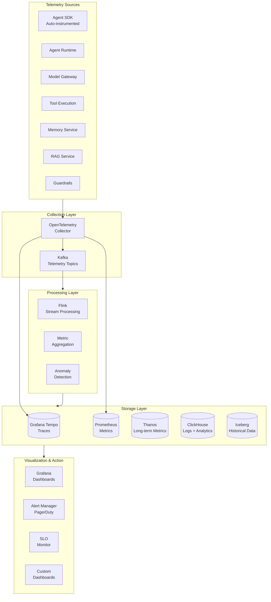
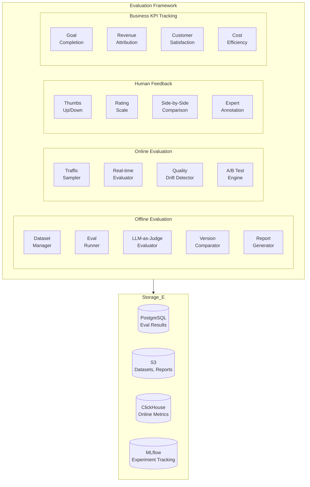
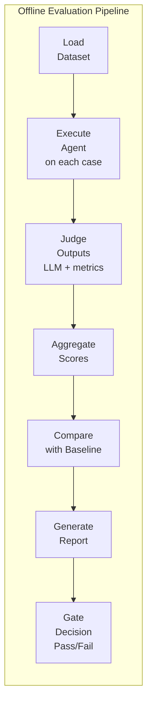

# AgentForge — Observability & Evaluation Architecture

> **Part 7 of 10** — Tracing, Logging, Metrics, Evaluation Framework, Benchmarking, Human Feedback, Business KPIs

---

## 1. Observability Architecture

### 1.1 Philosophy
Every agent execution in AgentForge produces a complete observability package: distributed trace, structured logs, metrics, reasoning graph, cost attribution, and business KPI impact. Observability is not optional — it is embedded into the platform SDK and runtime.

### 1.2 Observability Stack



---

## 2. Distributed Tracing

### 2.1 Trace Structure
Every agent execution produces a distributed trace spanning all subsystems:

```
Trace: agent-execution-abc123
│
├── Span: agent.execute (root)
│   ├── tenant_id: acme
│   ├── agent_id: cs-agent
│   ├── execution_id: exec-xyz
│   │
│   ├── Span: guardrail.input_check
│   │   ├── guardrail: pii-detection
│   │   ├── result: passed
│   │   └── duration: 12ms
│   │
│   ├── Span: memory.recall
│   │   ├── memory_type: semantic
│   │   ├── results_count: 5
│   │   └── duration: 35ms
│   │
│   ├── Span: rag.retrieve
│   │   ├── Span: rag.embed_query
│   │   │   └── duration: 15ms
│   │   ├── Span: rag.vector_search
│   │   │   ├── results: 20
│   │   │   └── duration: 25ms
│   │   ├── Span: rag.rerank
│   │   │   ├── results: 5
│   │   │   └── duration: 45ms
│   │   └── duration: 95ms
│   │
│   ├── Span: llm.chat_completion [1]
│   │   ├── model: gpt-4o
│   │   ├── provider: openai
│   │   ├── tokens_input: 2450
│   │   ├── tokens_output: 156
│   │   ├── cost: $0.0065
│   │   ├── cached: false
│   │   ├── tool_calls: ["lookup_order"]
│   │   └── duration: 1250ms
│   │
│   ├── Span: tool.execute
│   │   ├── tool: lookup_order
│   │   ├── Span: tool.permission_check
│   │   │   └── duration: 2ms
│   │   ├── Span: tool.rate_limit_check
│   │   │   └── duration: 1ms
│   │   ├── Span: tool.http_call
│   │   │   ├── url: https://orders.internal/api/v1/orders/ORD-123
│   │   │   ├── status: 200
│   │   │   └── duration: 85ms
│   │   └── duration: 95ms
│   │
│   ├── Span: llm.chat_completion [2]
│   │   ├── model: gpt-4o
│   │   ├── tokens_input: 2800
│   │   ├── tokens_output: 230
│   │   ├── cost: $0.0078
│   │   └── duration: 980ms
│   │
│   ├── Span: guardrail.output_check
│   │   ├── guardrail: hallucination-check
│   │   ├── result: passed
│   │   ├── grounding_score: 0.94
│   │   └── duration: 45ms
│   │
│   ├── Span: memory.store
│   │   └── duration: 8ms
│   │
│   ├── total_cost: $0.0143
│   ├── total_tokens: 5636
│   ├── total_llm_calls: 2
│   ├── total_tool_calls: 1
│   └── duration: 2650ms
```

### 2.2 OpenTelemetry Integration

```python
# SDK auto-instrumentation
from agentforge.observability import AgentTracer

class AgentRuntimeTracer:
    """
    Automatic OpenTelemetry instrumentation for all agent operations.
    """
    
    def __init__(self):
        self.tracer = trace.get_tracer("agentforge.runtime")
        self.meter = metrics.get_meter("agentforge.runtime")
        
        # Metrics
        self.execution_duration = self.meter.create_histogram(
            "agentforge.execution.duration_ms",
            description="Agent execution duration in milliseconds",
        )
        self.llm_call_count = self.meter.create_counter(
            "agentforge.llm.calls_total",
            description="Total LLM calls",
        )
        self.llm_tokens_total = self.meter.create_counter(
            "agentforge.llm.tokens_total",
            description="Total tokens consumed",
        )
        self.llm_cost_total = self.meter.create_counter(
            "agentforge.llm.cost_usd",
            description="Total LLM cost in USD",
        )
        self.tool_call_count = self.meter.create_counter(
            "agentforge.tool.calls_total",
            description="Total tool calls",
        )
        self.guardrail_blocks = self.meter.create_counter(
            "agentforge.guardrail.blocks_total",
            description="Total guardrail blocks",
        )
    
    @contextmanager
    def trace_execution(self, agent_id: str, execution_id: str, tenant_id: str):
        with self.tracer.start_as_current_span(
            "agent.execute",
            attributes={
                "agentforge.agent_id": agent_id,
                "agentforge.execution_id": execution_id,
                "agentforge.tenant_id": tenant_id,
            },
        ) as span:
            yield span
    
    @contextmanager
    def trace_llm_call(self, model: str, provider: str):
        with self.tracer.start_as_current_span(
            "llm.chat_completion",
            attributes={
                "agentforge.llm.model": model,
                "agentforge.llm.provider": provider,
            },
        ) as span:
            yield span
```

### 2.3 Custom Span Attributes

```python
# AgentForge-specific semantic conventions
AGENTFORGE_ATTRIBUTES = {
    # Agent
    "agentforge.agent_id": "Unique agent identifier",
    "agentforge.agent_name": "Agent display name",
    "agentforge.agent_version": "Agent version",
    "agentforge.execution_id": "Unique execution identifier",
    "agentforge.tenant_id": "Tenant identifier",
    "agentforge.team_id": "Team identifier",
    
    # LLM
    "agentforge.llm.model": "Model identifier",
    "agentforge.llm.provider": "Provider name",
    "agentforge.llm.tokens_input": "Input tokens",
    "agentforge.llm.tokens_output": "Output tokens",
    "agentforge.llm.cost_usd": "Cost in USD",
    "agentforge.llm.cached": "Whether response was cached",
    "agentforge.llm.routing_strategy": "Routing strategy used",
    "agentforge.llm.fallback_used": "Whether fallback was triggered",
    
    # Tool
    "agentforge.tool.name": "Tool name",
    "agentforge.tool.category": "Tool category",
    "agentforge.tool.status_code": "HTTP status code",
    "agentforge.tool.retries": "Number of retries",
    
    # RAG
    "agentforge.rag.chunks_retrieved": "Number of chunks retrieved",
    "agentforge.rag.chunks_used": "Number of chunks in context",
    "agentforge.rag.relevance_score": "Average relevance score",
    
    # Guardrail
    "agentforge.guardrail.name": "Guardrail name",
    "agentforge.guardrail.result": "pass/block/warn",
    "agentforge.guardrail.score": "Confidence score",
    
    # Memory
    "agentforge.memory.type": "Memory type accessed",
    "agentforge.memory.items_recalled": "Items recalled",
    "agentforge.memory.items_stored": "Items stored",
    
    # Business
    "agentforge.business.use_case": "Business use case",
    "agentforge.business.customer_id": "Customer identifier",
    "agentforge.business.outcome": "Business outcome",
}
```

---

## 3. Metrics Architecture

### 3.1 Key Metrics

```yaml
# ─── Platform Health Metrics ────────────────────────────
platform_metrics:
  - name: agentforge_active_executions
    type: gauge
    labels: [tenant_id, agent_id]
    
  - name: agentforge_execution_duration_ms
    type: histogram
    labels: [tenant_id, agent_id, status]
    buckets: [100, 500, 1000, 2500, 5000, 10000, 30000, 60000]
    
  - name: agentforge_executions_total
    type: counter
    labels: [tenant_id, agent_id, status, trigger_type]

# ─── LLM Metrics ────────────────────────────────────────
llm_metrics:
  - name: agentforge_llm_request_duration_ms
    type: histogram
    labels: [tenant_id, provider, model, cached]
    buckets: [100, 250, 500, 1000, 2000, 5000, 10000]
    
  - name: agentforge_llm_tokens_total
    type: counter
    labels: [tenant_id, provider, model, direction]  # input/output
    
  - name: agentforge_llm_cost_usd
    type: counter
    labels: [tenant_id, team_id, agent_id, provider, model]
    
  - name: agentforge_llm_cache_hits_total
    type: counter
    labels: [tenant_id, cache_tier]  # exact/semantic/provider
    
  - name: agentforge_llm_errors_total
    type: counter
    labels: [tenant_id, provider, model, error_type]  # timeout/rate_limit/500/etc

# ─── Tool Metrics ────────────────────────────────────────
tool_metrics:
  - name: agentforge_tool_request_duration_ms
    type: histogram
    labels: [tenant_id, tool_name, status]
    
  - name: agentforge_tool_errors_total
    type: counter
    labels: [tenant_id, tool_name, error_type]
    
  - name: agentforge_tool_circuit_breaker_state
    type: gauge
    labels: [tool_name]  # 0=closed, 1=half_open, 2=open

# ─── Guardrail Metrics ──────────────────────────────────
guardrail_metrics:
  - name: agentforge_guardrail_check_duration_ms
    type: histogram
    labels: [guardrail_name, position]  # input/output
    
  - name: agentforge_guardrail_blocks_total
    type: counter
    labels: [tenant_id, guardrail_name, agent_id]
    
  - name: agentforge_guardrail_pii_detections_total
    type: counter
    labels: [tenant_id, pii_type]

# ─── Business Metrics ───────────────────────────────────
business_metrics:
  - name: agentforge_business_goal_completion_rate
    type: gauge
    labels: [tenant_id, agent_id, use_case]
    
  - name: agentforge_business_customer_satisfaction
    type: gauge
    labels: [tenant_id, agent_id]
    
  - name: agentforge_business_cost_savings_usd
    type: counter
    labels: [tenant_id, agent_id, use_case]
```

### 3.2 SLO Definitions

```yaml
slos:
  # Platform SLOs
  - name: "Agent Execution Availability"
    target: 99.9%
    window: 30d
    indicator:
      type: availability
      good: "agentforge_executions_total{status='success'}"
      total: "agentforge_executions_total"
  
  - name: "Agent Execution Latency"
    target: 95%
    window: 30d
    indicator:
      type: latency
      threshold: 5000  # ms
      metric: "agentforge_execution_duration_ms"
  
  - name: "LLM Call Latency"
    target: 99%
    window: 7d
    indicator:
      type: latency
      threshold: 3000  # ms
      metric: "agentforge_llm_request_duration_ms"
  
  - name: "Tool Execution Success Rate"
    target: 99.5%
    window: 7d
    indicator:
      type: availability
      good: "agentforge_tool_requests_total{status='success'}"
      total: "agentforge_tool_requests_total"
  
  - name: "Guardrail Check Latency"
    target: 99.9%
    window: 7d
    indicator:
      type: latency
      threshold: 100  # ms
      metric: "agentforge_guardrail_check_duration_ms"

  # Burn rate alerts
  alerts:
    - name: "HighErrorRate"
      expr: |
        agentforge_executions_total{status="error"} 
        / agentforge_executions_total > 0.01
      for: 5m
      severity: critical
      
    - name: "LLMProviderDown"
      expr: |
        rate(agentforge_llm_errors_total{error_type="5xx"}[5m]) 
        / rate(agentforge_llm_requests_total[5m]) > 0.05
      for: 2m
      severity: critical
      
    - name: "BudgetThreshold90"
      expr: |
        agentforge_cost_utilization_percent > 90
      for: 0m
      severity: warning
```

---

## 4. Structured Logging

### 4.1 Log Schema

```json
{
  "timestamp": "2024-07-15T14:30:45.123Z",
  "level": "INFO",
  "service": "agent-runtime",
  "instance_id": "runtime-pod-abc123",
  "trace_id": "4bf92f3577b34da6a3ce929d0e0e4736",
  "span_id": "00f067aa0ba902b7",
  "tenant_id": "acme-corp",
  "agent_id": "cs-agent-v2",
  "execution_id": "exec-xyz789",
  "message": "LLM call completed",
  "attributes": {
    "model": "gpt-4o",
    "provider": "openai",
    "tokens_input": 2450,
    "tokens_output": 156,
    "cost_usd": 0.0065,
    "duration_ms": 1250,
    "cached": false,
    "finish_reason": "tool_calls",
    "tool_calls": ["lookup_order"]
  }
}
```

### 4.2 ClickHouse Log Table

```sql
CREATE TABLE agent_logs ON CLUSTER '{cluster}'
(
    timestamp       DateTime64(3),
    level           LowCardinality(String),
    service         LowCardinality(String),
    instance_id     String,
    trace_id        String,
    span_id         String,
    tenant_id       LowCardinality(String),
    agent_id        String,
    execution_id    String,
    message         String,
    attributes      Map(String, String),
    
    -- Materialized columns for fast filtering
    date            Date DEFAULT toDate(timestamp),
    hour            UInt8 DEFAULT toHour(timestamp)
)
ENGINE = MergeTree()
PARTITION BY (tenant_id, toYYYYMM(timestamp))
ORDER BY (tenant_id, service, timestamp)
TTL timestamp + INTERVAL 90 DAY DELETE
SETTINGS index_granularity = 8192;
```

---

## 5. Evaluation Framework

### 5.1 Purpose
The Evaluation Framework provides a comprehensive, automated system for measuring agent quality across correctness, safety, cost, latency, and business impact — both offline (pre-deployment) and online (production monitoring).

### 5.2 Architecture



### 5.3 Evaluation Metrics

```python
class EvaluationMetrics:
    """Built-in evaluation metrics."""
    
    METRICS = {
        # Quality Metrics
        "correctness": {
            "description": "Is the response factually correct?",
            "method": "llm-as-judge",
            "judge_model": "gpt-4o",
            "scale": [1, 5],
            "threshold": 4.0,
        },
        "groundedness": {
            "description": "Is the response grounded in retrieved context?",
            "method": "nli-model + llm-judge",
            "models": ["cross-encoder/nli-deberta-v3-large", "gpt-4o"],
            "scale": [0, 1],
            "threshold": 0.85,
        },
        "hallucination_rate": {
            "description": "Percentage of claims not supported by context",
            "method": "claim-extraction + verification",
            "scale": [0, 1],
            "threshold": 0.05,  # Max 5% hallucination
        },
        "relevance": {
            "description": "Is the response relevant to the query?",
            "method": "embedding-similarity + llm-judge",
            "scale": [0, 1],
            "threshold": 0.80,
        },
        
        # Tool Metrics
        "tool_accuracy": {
            "description": "Were the correct tools called with correct parameters?",
            "method": "exact-match + fuzzy-match",
            "scale": [0, 1],
            "threshold": 0.90,
        },
        "tool_selection_precision": {
            "description": "Were only necessary tools called?",
            "method": "comparison-with-golden",
            "scale": [0, 1],
            "threshold": 0.85,
        },
        
        # Performance Metrics
        "latency_p50": {
            "description": "50th percentile end-to-end latency",
            "method": "instrumentation",
            "unit": "ms",
            "threshold": 2000,
        },
        "latency_p99": {
            "description": "99th percentile end-to-end latency",
            "method": "instrumentation",
            "unit": "ms",
            "threshold": 10000,
        },
        "cost_per_execution": {
            "description": "Average cost per execution",
            "method": "cost-tracking",
            "unit": "USD",
            "threshold": 0.50,
        },
        
        # Business Metrics
        "goal_completion": {
            "description": "Did the agent achieve the user's goal?",
            "method": "llm-judge + heuristics",
            "scale": [0, 1],
            "threshold": 0.85,
        },
        "customer_satisfaction": {
            "description": "Human satisfaction rating",
            "method": "human-feedback",
            "scale": [1, 5],
            "threshold": 4.0,
        },
        "revenue_impact": {
            "description": "Estimated revenue influenced by agent",
            "method": "attribution-model",
            "unit": "USD",
        },
    }
```

### 5.4 Offline Evaluation Pipeline



```python
class OfflineEvaluationPipeline:
    """
    Runs comprehensive offline evaluation on a golden dataset.
    Executed as an Argo Workflow for scalability.
    """
    
    async def run(
        self,
        agent_id: str,
        version: str,
        dataset_id: str,
        metrics: list[str],
        baseline_version: str = None,
        parallelism: int = 10,
    ) -> EvaluationReport:
        # 1. Load dataset
        dataset = await self.load_dataset(dataset_id)
        
        # 2. Execute agent on each test case (parallel via Ray)
        results = await self.execute_batch(
            agent_id=agent_id,
            version=version,
            test_cases=dataset.cases,
            parallelism=parallelism,
        )
        
        # 3. Evaluate each result
        scored_results = []
        for result, test_case in zip(results, dataset.cases):
            scores = {}
            for metric_name in metrics:
                metric = self.metrics_registry[metric_name]
                score = await metric.evaluate(
                    query=test_case.input,
                    response=result.output,
                    expected=test_case.expected_output,
                    context=result.retrieved_context,
                    tool_calls=result.tool_calls,
                )
                scores[metric_name] = score
            scored_results.append(ScoredResult(result=result, scores=scores))
        
        # 4. Aggregate
        aggregated = self.aggregate_scores(scored_results)
        
        # 5. Compare with baseline
        comparison = None
        if baseline_version:
            baseline_scores = await self.get_baseline_scores(
                agent_id, baseline_version, dataset_id,
            )
            comparison = self.compare(aggregated, baseline_scores)
        
        # 6. Generate report
        report = self.generate_report(
            aggregated, comparison, scored_results,
        )
        
        # 7. Log to MLflow
        await self.log_to_mlflow(agent_id, version, report)
        
        # 8. Gate decision
        gate_result = self.evaluate_gate(aggregated, self.thresholds)
        report.gate_result = gate_result
        
        return report
```

### 5.5 Online Evaluation

```python
class OnlineEvaluator:
    """
    Continuous evaluation of production agent quality.
    Samples a percentage of executions for evaluation.
    """
    
    async def evaluate_execution(
        self,
        execution: Execution,
        sample_rate: float = 0.05,  # Evaluate 5% of executions
    ):
        # Probabilistic sampling
        if random.random() > sample_rate:
            return
        
        # Run evaluation metrics on completed execution
        scores = {}
        
        # Groundedness check
        if execution.rag_context:
            scores["groundedness"] = await self.check_groundedness(
                response=execution.output,
                context=execution.rag_context,
            )
        
        # Goal completion
        scores["goal_completion"] = await self.check_goal_completion(
            query=execution.input,
            response=execution.output,
            tool_calls=execution.tool_calls,
        )
        
        # Latency
        scores["latency_ms"] = execution.duration_ms
        
        # Cost
        scores["cost_usd"] = execution.total_cost
        
        # Store scores
        await self.store_online_scores(execution.id, scores)
        
        # Check for quality drift
        await self.check_quality_drift(
            agent_id=execution.agent_id,
            current_scores=scores,
        )
    
    async def check_quality_drift(
        self,
        agent_id: str,
        current_scores: dict,
        window: str = "1h",
    ):
        """Detect quality degradation using sliding window comparison."""
        historical = await self.get_historical_scores(agent_id, window)
        
        for metric, current_value in current_scores.items():
            if metric in historical:
                baseline = historical[metric].mean
                threshold = historical[metric].std * 2  # 2-sigma
                
                if abs(current_value - baseline) > threshold:
                    await self.alert(
                        severity="warning",
                        message=f"Quality drift detected for {agent_id}: "
                                f"{metric} = {current_value:.3f} "
                                f"(baseline: {baseline:.3f})",
                    )
```

### 5.6 Human Feedback System

```python
class HumanFeedbackCollector:
    """
    Collects and manages human feedback for agent improvement.
    """
    
    FEEDBACK_TYPES = {
        "thumbs": {
            "description": "Binary thumbs up/down",
            "schema": {"rating": "boolean"},
            "collection_point": "inline",  # After each response
        },
        "rating": {
            "description": "1-5 star rating",
            "schema": {"rating": "integer", "min": 1, "max": 5},
            "collection_point": "inline",
        },
        "comparison": {
            "description": "Side-by-side comparison of two versions",
            "schema": {"preferred": "string", "reason": "string"},
            "collection_point": "batch",  # Periodic evaluation sessions
        },
        "annotation": {
            "description": "Expert annotation with corrections",
            "schema": {
                "correct_response": "string",
                "error_categories": "list[string]",
                "notes": "string",
            },
            "collection_point": "review_queue",
        },
    }
```

### 5.7 Experiment Tracking (MLflow)

```python
class ExperimentTracker:
    """
    Tracks agent experiments using MLflow.
    """
    
    async def log_experiment(
        self,
        agent_id: str,
        version: str,
        config: dict,
        eval_results: EvaluationReport,
    ):
        with mlflow.start_run(
            experiment_id=f"agentforge/{agent_id}",
            run_name=f"{agent_id}-{version}",
        ):
            # Log configuration
            mlflow.log_params({
                "agent_version": version,
                "model": config["model"]["primary"]["model"],
                "temperature": config["model"]["primary"]["temperature"],
                "rag_strategy": config.get("rag", {}).get("strategy"),
                "guardrails": str(config.get("guardrails", [])),
            })
            
            # Log metrics
            for metric_name, score in eval_results.aggregated.items():
                mlflow.log_metric(metric_name, score.mean)
                mlflow.log_metric(f"{metric_name}_std", score.std)
            
            # Log artifacts
            mlflow.log_artifact(eval_results.report_path)
            mlflow.log_artifact(eval_results.dataset_path)
            
            # Log model (agent configuration as "model")
            mlflow.log_dict(config, "agent_config.yaml")
            
            # Set tags
            mlflow.set_tags({
                "tenant_id": config["tenant_id"],
                "team_id": config["team_id"],
                "status": "candidate" if eval_results.gate_passed else "rejected",
            })
```

### 5.8 API

```
# Offline Evaluation
POST   /api/v1/evaluations                      # Start evaluation run
GET    /api/v1/evaluations/{id}                  # Get evaluation status
GET    /api/v1/evaluations/{id}/report           # Get evaluation report
GET    /api/v1/evaluations/{id}/results          # Get detailed results
POST   /api/v1/evaluations/compare               # Compare two versions

# Datasets
POST   /api/v1/eval-datasets                    # Create dataset
GET    /api/v1/eval-datasets                     # List datasets
POST   /api/v1/eval-datasets/{id}/cases         # Add test cases
GET    /api/v1/eval-datasets/{id}/cases         # Get test cases

# Online Evaluation
GET    /api/v1/online-eval/scores               # Get online scores
GET    /api/v1/online-eval/drift                 # Get drift detection results
GET    /api/v1/online-eval/trends                # Quality trends

# Human Feedback
POST   /api/v1/feedback                         # Submit feedback
GET    /api/v1/feedback/summary                  # Feedback summary
GET    /api/v1/feedback/queue                    # Annotation queue

# Experiments
GET    /api/v1/experiments                       # List experiments
GET    /api/v1/experiments/{id}                  # Get experiment details
POST   /api/v1/experiments/{id}/promote          # Promote winning variant

# Benchmarks
POST   /api/v1/benchmarks/run                   # Run benchmark suite
GET    /api/v1/benchmarks/results               # Get benchmark results
GET    /api/v1/benchmarks/leaderboard           # Agent leaderboard
```

---

## 6. Business KPI Tracking

### 6.1 Revenue Attribution Model

```python
class RevenueAttributionEngine:
    """
    Tracks the business impact and revenue attributed to AI agents.
    """
    
    ATTRIBUTION_MODELS = {
        "direct": {
            "description": "Agent directly caused a revenue event",
            "examples": ["Agent completed a sale", "Agent resolved a churn case"],
        },
        "assisted": {
            "description": "Agent assisted a human who completed the action",
            "examples": ["Agent prepared a proposal reviewed by sales rep"],
        },
        "cost_avoidance": {
            "description": "Agent prevented a cost that would have occurred",
            "examples": ["Agent resolved ticket that would need L2 support"],
        },
        "time_savings": {
            "description": "Agent reduced time for a task",
            "examples": ["Agent automated report generation"],
            "calculation": "hours_saved * hourly_cost",
        },
    }
    
    async def track_kpi(
        self,
        agent_id: str,
        execution_id: str,
        kpi: BusinessKPI,
    ):
        await self.clickhouse.insert("business_kpis", {
            "timestamp": datetime.utcnow(),
            "tenant_id": kpi.tenant_id,
            "agent_id": agent_id,
            "execution_id": execution_id,
            "kpi_name": kpi.name,
            "kpi_value": kpi.value,
            "attribution_model": kpi.attribution_model,
            "confidence": kpi.confidence,
            "metadata": kpi.metadata,
        })
```

---

*Next: [08-developer-experience.md](./08-developer-experience.md) — Developer Portal, Admin Portal, CLI, SDK, REST/gRPC APIs, Webhooks, Plugin Framework, Marketplace*
