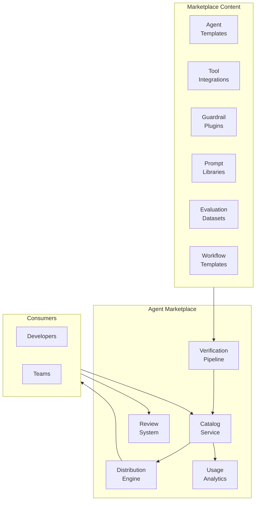
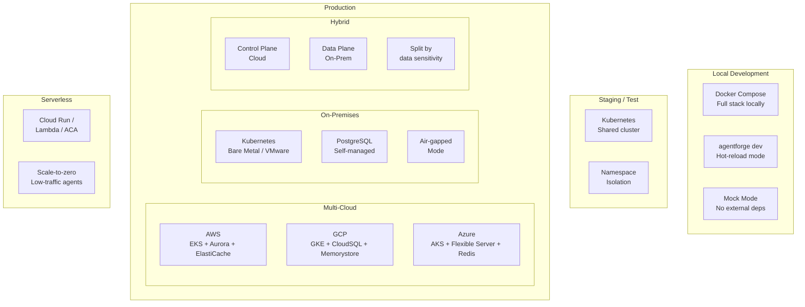
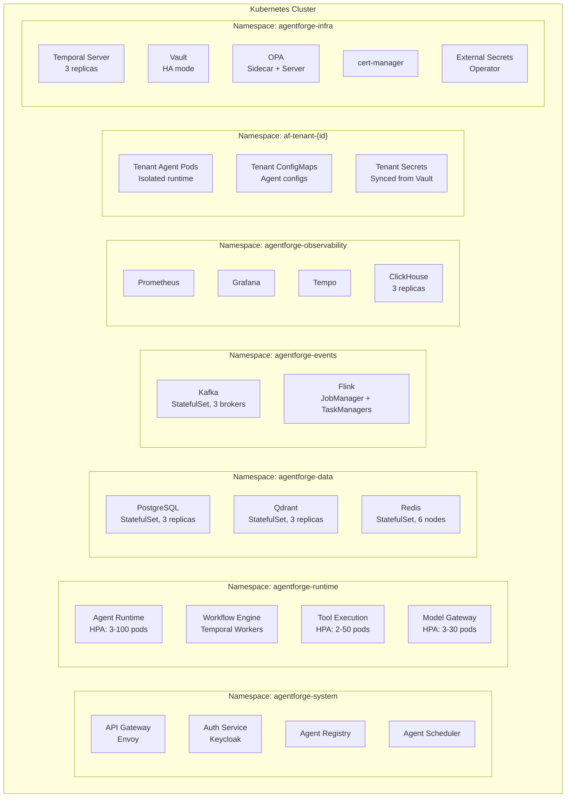
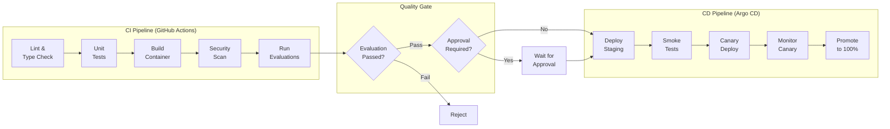

# AgentForge — Developer Experience & Deployment

> **Part 8 of 10** — Developer Portal, Admin Portal, CLI, APIs, Webhooks, Plugin Framework, Marketplace, Deployment Model

---

## 1. Developer Portal

### 1.1 Purpose
The Developer Portal is the self-service hub for all AgentForge users — a unified web application for building, deploying, monitoring, and managing agents. It serves as the "console" of the platform, comparable to the AWS Console or GCP Console.

### 1.2 Portal Sections

```
┌─────────────────────────────────────────────────────────────────┐
│                     DEVELOPER PORTAL                             │
├─────────────────────────────────────────────────────────────────┤
│                                                                  │
│  📦 MY AGENTS                                                   │
│  ├── Agent List (filterable, searchable)                         │
│  ├── Agent Details (config, versions, metrics)                  │
│  ├── Agent Builder (visual + YAML editor)                       │
│  ├── Execution History (traces, timelines)                      │
│  └── Deployment Status (environments, rollouts)                 │
│                                                                  │
│  🧪 EVALUATION LAB                                              │
│  ├── Run Evaluations (configure, execute, view)                 │
│  ├── Datasets (manage golden sets)                               │
│  ├── Experiments (A/B tests, comparisons)                       │
│  ├── Benchmarks (leaderboard, trends)                           │
│  └── Human Feedback Queue                                       │
│                                                                  │
│  🔧 TOOLS & KNOWLEDGE                                           │
│  ├── Tool Catalog (browse, test, register)                      │
│  ├── Knowledge Bases (manage sources, ingestion)                │
│  ├── Prompt Library (templates, versions, A/B)                  │
│  └── MCP Servers (connections, health)                           │
│                                                                  │
│  🤖 MODEL HUB                                                   │
│  ├── Model Catalog (available models, pricing)                  │
│  ├── Model Benchmarks (quality comparisons)                     │
│  └── Usage & Costs (per model, per agent)                       │
│                                                                  │
│  📊 OBSERVABILITY                                                │
│  ├── Dashboards (Grafana embedded)                              │
│  ├── Traces (search, detail view)                               │
│  ├── Logs (structured search, filters)                          │
│  ├── Alerts (active, history, configuration)                    │
│  └── SLO Status (budget, burn rate)                             │
│                                                                  │
│  🏪 MARKETPLACE                                                  │
│  ├── Agent Templates (browse, preview, deploy)                  │
│  ├── Tool Integrations (connectors, plugins)                    │
│  └── Community Resources (examples, guides)                     │
│                                                                  │
│  ⚙️ SETTINGS                                                     │
│  ├── Team Settings (members, roles, quotas)                     │
│  ├── API Keys (manage, rotate)                                  │
│  ├── Webhooks (configure, test, logs)                           │
│  └── Integrations (Slack, Jira, GitHub)                         │
│                                                                  │
└─────────────────────────────────────────────────────────────────┘
```

### 1.3 Technology

| Component | Technology | Rationale |
|---|---|---|
| Frontend | React 18 + TypeScript | Component ecosystem, type safety |
| UI Framework | Radix UI + custom design system | Accessible, composable |
| State Management | TanStack Query | Server state, caching, optimistic updates |
| Routing | React Router v7 | File-based routing, SSR support |
| Code Editor | Monaco Editor | VS Code experience in browser |
| Diagrams | Reactflow | Agent composition graphs |
| Charts | Recharts / Plotly | Metrics visualization |
| API Client | Auto-generated from OpenAPI | Type-safe, always in sync |

---

## 2. Platform Admin Portal

### 2.1 Purpose
The Admin Portal serves platform operators, security teams, and compliance officers with infrastructure management, tenant administration, and governance controls.

```
┌─────────────────────────────────────────────────────────────────┐
│                     ADMIN PORTAL                                 │
├─────────────────────────────────────────────────────────────────┤
│                                                                  │
│  🏢 TENANT MANAGEMENT                                           │
│  ├── Tenant Registry (create, configure, suspend)               │
│  ├── Team Management (within tenants)                           │
│  ├── Quota Management (compute, storage, LLM)                   │
│  └── Billing & Chargebacks                                      │
│                                                                  │
│  🛡️ GOVERNANCE                                                   │
│  ├── Policy Editor (OPA Rego with playground)                   │
│  ├── Approval Queues (pending reviews)                          │
│  ├── Compliance Dashboard (framework status)                    │
│  └── Audit Log Viewer (searchable, exportable)                  │
│                                                                  │
│  🔐 SECURITY                                                     │
│  ├── Identity Management (users, roles, permissions)            │
│  ├── Secrets Management (Vault UI integration)                  │
│  ├── Security Alerts (anomalies, threats)                       │
│  └── PII Detection Reports                                     │
│                                                                  │
│  📈 EXECUTIVE DASHBOARD                                         │
│  ├── Platform Usage (executions, users, agents)                 │
│  ├── Cost Dashboard (by tenant, team, model)                    │
│  ├── Quality Metrics (platform-wide)                            │
│  ├── Business Impact (revenue attribution)                      │
│  └── Capacity Planning (forecasts, trends)                      │
│                                                                  │
│  🏗️ INFRASTRUCTURE                                              │
│  ├── Cluster Health (K8s, databases, queues)                    │
│  ├── Model Gateway Status (providers, latency)                  │
│  ├── Event Bus Monitoring (Kafka lag, throughput)                │
│  └── Scaling Dashboard (HPA, KEDA, resource usage)              │
│                                                                  │
└─────────────────────────────────────────────────────────────────┘
```

---

## 3. REST & gRPC API Design

### 3.1 API Design Principles

```
┌──────────────────────────────────────────────────────────┐
│                  API DESIGN PRINCIPLES                     │
│                                                           │
│  1. Versioned: /api/v1/ prefix, version in URL           │
│  2. Resource-oriented: Nouns, not verbs                   │
│  3. Consistent: Same patterns across all endpoints       │
│  4. Paginated: cursor-based pagination on lists          │
│  5. Filterable: query params for filtering               │
│  6. Idempotent: client-generated request IDs             │
│  7. Rate-limited: per-tenant rate limits                 │
│  8. Documented: Auto-generated OpenAPI 3.1              │
│  9. Backwards-compatible: additive changes only          │
│ 10. Errors: RFC 7807 Problem Details format              │
└──────────────────────────────────────────────────────────┘
```

### 3.2 API Surface Area

```yaml
# Complete REST API surface
api:
  # ─── Agent Management ─────────────────────────────
  agents:
    - POST   /api/v1/agents
    - GET    /api/v1/agents
    - GET    /api/v1/agents/{id}
    - PUT    /api/v1/agents/{id}
    - DELETE /api/v1/agents/{id}
    - POST   /api/v1/agents/{id}/versions
    - GET    /api/v1/agents/{id}/versions
    - POST   /api/v1/agents/{id}/validate
    - POST   /api/v1/agents/{id}/dry-run

  # ─── Executions ────────────────────────────────────
  executions:
    - POST   /api/v1/executions
    - GET    /api/v1/executions/{id}
    - POST   /api/v1/executions/{id}/cancel
    - POST   /api/v1/executions/{id}/pause
    - POST   /api/v1/executions/{id}/resume
    - GET    /api/v1/executions/{id}/trace
    - WS     /api/v1/executions/{id}/stream

  # ─── Workflows ─────────────────────────────────────
  workflows:
    - POST   /api/v1/workflows
    - GET    /api/v1/workflows/{id}
    - POST   /api/v1/workflows/{id}/signal/{name}
    - POST   /api/v1/workflows/{id}/cancel

  # ─── LLM Gateway ──────────────────────────────────
  llm:
    - POST   /api/v1/llm/chat/completions
    - POST   /api/v1/llm/embeddings
    - GET    /api/v1/llm/models
    - GET    /api/v1/llm/usage

  # ─── Tools ─────────────────────────────────────────
  tools:
    - POST   /api/v1/tools
    - GET    /api/v1/tools
    - GET    /api/v1/tools/{id}
    - PUT    /api/v1/tools/{id}
    - POST   /api/v1/tools/discover
    - POST   /api/v1/tools/{id}/execute

  # ─── Memory ────────────────────────────────────────
  memory:
    - POST   /api/v1/memory/store
    - POST   /api/v1/memory/recall
    - POST   /api/v1/memory/search
    - DELETE /api/v1/memory/{id}

  # ─── Knowledge ─────────────────────────────────────
  knowledge:
    - POST   /api/v1/knowledge/sources
    - GET    /api/v1/knowledge/sources
    - POST   /api/v1/knowledge/search
    - POST   /api/v1/knowledge/documents/upload

  # ─── RAG ───────────────────────────────────────────
  rag:
    - POST   /api/v1/rag/query
    - POST   /api/v1/rag/retrieve
    - POST   /api/v1/rag/ingest

  # ─── Prompts ───────────────────────────────────────
  prompts:
    - POST   /api/v1/prompts
    - GET    /api/v1/prompts
    - GET    /api/v1/prompts/{id}
    - POST   /api/v1/prompts/{id}/render
    - POST   /api/v1/prompts/{id}/versions

  # ─── Models ────────────────────────────────────────
  models:
    - POST   /api/v1/models
    - GET    /api/v1/models
    - POST   /api/v1/models/{id}/approve

  # ─── Evaluations ───────────────────────────────────
  evaluations:
    - POST   /api/v1/evaluations
    - GET    /api/v1/evaluations/{id}
    - GET    /api/v1/evaluations/{id}/report
    - POST   /api/v1/evaluations/compare

  # ─── Governance ────────────────────────────────────
  governance:
    - POST   /api/v1/policies/evaluate
    - GET    /api/v1/policies
    - POST   /api/v1/approvals/{id}/approve
    - POST   /api/v1/approvals/{id}/reject
    - GET    /api/v1/audit-logs

  # ─── Costs ─────────────────────────────────────────
  costs:
    - GET    /api/v1/costs/summary
    - GET    /api/v1/costs/breakdown
    - POST   /api/v1/costs/budgets

  # ─── Marketplace ───────────────────────────────────
  marketplace:
    - GET    /api/v1/marketplace/templates
    - GET    /api/v1/marketplace/templates/{id}
    - POST   /api/v1/marketplace/templates/{id}/install
```

### 3.3 gRPC Services

```protobuf
// agentforge.proto — Core gRPC services (for high-performance internal comms)

syntax = "proto3";
package agentforge.v1;

service AgentRuntimeService {
  rpc Execute(ExecuteRequest) returns (stream ExecutionEvent);
  rpc GetStatus(StatusRequest) returns (ExecutionStatus);
  rpc Cancel(CancelRequest) returns (CancelResponse);
  rpc Pause(PauseRequest) returns (PauseResponse);
  rpc Resume(ResumeRequest) returns (ResumeResponse);
}

service ModelGatewayService {
  rpc ChatCompletion(ChatRequest) returns (stream ChatChunk);
  rpc Embedding(EmbeddingRequest) returns (EmbeddingResponse);
}

service ToolExecutionService {
  rpc Execute(ToolRequest) returns (ToolResponse);
  rpc BatchExecute(BatchToolRequest) returns (stream ToolResponse);
}

service MemoryService {
  rpc Store(StoreRequest) returns (StoreResponse);
  rpc Recall(RecallRequest) returns (RecallResponse);
  rpc Search(SearchRequest) returns (SearchResponse);
}

service PolicyService {
  rpc Evaluate(PolicyRequest) returns (PolicyDecision);
  rpc BatchEvaluate(BatchPolicyRequest) returns (BatchPolicyDecision);
}
```

### 3.4 Error Response Format (RFC 7807)

```json
{
  "type": "https://docs.agentforge.io/errors/budget-exceeded",
  "title": "Budget Limit Exceeded",
  "status": 429,
  "detail": "Agent 'cs-agent' has exceeded its daily budget of $500.00. Current spend: $502.34.",
  "instance": "/api/v1/executions/exec-xyz789",
  "extensions": {
    "agent_id": "cs-agent",
    "tenant_id": "acme-corp",
    "budget_limit": 500.00,
    "current_spend": 502.34,
    "reset_at": "2024-07-16T00:00:00Z",
    "request_id": "req-abc123",
    "trace_id": "4bf92f3577b34da6a3ce929d0e0e4736"
  }
}
```

---

## 4. Webhook Framework

### 4.1 Purpose
Event-driven notifications for external system integration — notify Slack, Jira, PagerDuty, or custom systems when agent events occur.

### 4.2 Webhook Events

```yaml
webhook_events:
  # Agent Lifecycle
  agent.created:
    description: "New agent created"
    payload: { agent_id, name, version, team }
  agent.deployed:
    description: "Agent deployed to environment"
    payload: { agent_id, version, environment, strategy }
  agent.failed:
    description: "Agent deployment or execution failure"
    payload: { agent_id, error, trace_id }
  
  # Execution Events
  execution.started:
    description: "Agent execution started"
    payload: { execution_id, agent_id, trigger }
  execution.completed:
    description: "Agent execution completed"
    payload: { execution_id, agent_id, status, duration_ms, cost }
  execution.escalated:
    description: "Execution escalated to human"
    payload: { execution_id, agent_id, reason, assignee }
  
  # Governance Events
  approval.requested:
    description: "Approval requested"
    payload: { approval_id, type, requestor, approvers }
  approval.decided:
    description: "Approval decision made"
    payload: { approval_id, decision, decided_by }
  policy.violated:
    description: "Policy violation detected"
    payload: { policy_id, violation, agent_id }
  
  # Guardrail Events
  guardrail.blocked:
    description: "Guardrail blocked a request"
    payload: { guardrail_name, agent_id, reason }
  pii.detected:
    description: "PII detected in agent I/O"
    payload: { pii_type, agent_id, redacted }
  
  # Cost Events
  budget.warning:
    description: "Budget threshold reached"
    payload: { entity_type, entity_id, utilization_pct }
  budget.exceeded:
    description: "Budget limit exceeded"
    payload: { entity_type, entity_id, limit, current }
  
  # Quality Events
  quality.drift:
    description: "Quality drift detected"
    payload: { agent_id, metric, current, baseline, deviation }
  evaluation.completed:
    description: "Evaluation run completed"
    payload: { eval_id, agent_id, scores, gate_result }
```

### 4.3 Webhook Delivery

```python
class WebhookDeliveryEngine:
    """
    Reliable webhook delivery with retries and DLQ.
    """
    
    async def deliver(self, webhook: WebhookConfig, event: Event):
        payload = {
            "id": str(uuid.uuid4()),
            "type": event.type,
            "timestamp": event.timestamp.isoformat(),
            "data": event.data,
            "tenant_id": event.tenant_id,
        }
        
        signature = self.sign_payload(payload, webhook.secret)
        
        headers = {
            "Content-Type": "application/json",
            "X-AgentForge-Signature": signature,
            "X-AgentForge-Event": event.type,
            "X-AgentForge-Delivery": payload["id"],
        }
        
        for attempt in range(self.max_retries):
            try:
                response = await httpx.post(
                    webhook.url,
                    json=payload,
                    headers=headers,
                    timeout=30,
                )
                if response.status_code < 300:
                    await self.log_delivery(webhook.id, payload["id"], "success")
                    return
                elif response.status_code >= 500:
                    await asyncio.sleep(2 ** attempt)  # Exponential backoff
                    continue
                else:
                    await self.log_delivery(webhook.id, payload["id"], "client_error")
                    return
            except Exception as e:
                await asyncio.sleep(2 ** attempt)
        
        # Max retries exceeded → DLQ
        await self.dead_letter(webhook.id, payload)
```

---

## 5. Plugin Framework

### 5.1 Purpose
Extensibility framework for adding custom guardrails, tools, memory backends, evaluation metrics, and integrations without modifying the core platform.

### 5.2 Plugin Types

```python
class PluginType(Enum):
    GUARDRAIL = "guardrail"         # Custom guardrail logic
    TOOL = "tool"                    # Custom tool implementation
    MEMORY_BACKEND = "memory"        # Custom memory store
    EVALUATOR = "evaluator"          # Custom evaluation metric
    CONNECTOR = "connector"          # Knowledge source connector
    NOTIFIER = "notifier"            # Custom notification channel
    ROUTER = "router"                # Custom LLM routing logic
    TRANSFORMER = "transformer"      # Request/response transformer

class PluginSpec:
    """Plugin specification."""
    
    name: str
    version: str
    type: PluginType
    description: str
    author: str
    
    # Entry point
    entrypoint: str                  # Python module path
    
    # Dependencies
    requirements: list[str]          # pip packages
    
    # Configuration schema
    config_schema: dict              # JSON Schema for plugin config
    
    # Permissions required
    permissions: list[str]           # Platform permissions needed
    
    # Health check
    health_check: str                # Health check endpoint/function

# Plugin registration
@plugin(
    name="custom-compliance-check",
    type=PluginType.GUARDRAIL,
    version="1.0.0",
)
class CustomComplianceGuardrail:
    """Custom guardrail for industry-specific compliance."""
    
    async def check(self, text: str, config: dict) -> GuardrailResult:
        # Custom compliance logic
        violations = await self.check_industry_rules(text, config["industry"])
        
        if violations:
            return GuardrailResult(
                passed=False,
                reason=f"Compliance violations: {violations}",
            )
        return GuardrailResult(passed=True)
```

---

## 6. Agent Marketplace

### 6.1 Purpose
Enterprise marketplace for sharing and discovering agent templates, tool integrations, guardrails, and best practices across the organization.

### 6.2 Marketplace Architecture



### 6.3 Template Model

```yaml
# Marketplace template specification
apiVersion: marketplace.agentforge.io/v1
kind: AgentTemplate
metadata:
  name: customer-support-agent-template
  version: "2.1.0"
  category: customer-success
  tags: [support, conversational, rag]
  author:
    team: ai-platform
    email: ai-platform@acme.com
  rating: 4.6
  installs: 234
  verified: true
spec:
  description: |
    Production-ready customer support agent with RAG-powered knowledge 
    retrieval, multi-tool integration, and human escalation capabilities.
  
  features:
    - RAG-powered knowledge base access
    - Jira ticket management
    - Customer identity verification
    - Automatic escalation
    - Multi-language support
    
  requirements:
    - Knowledge base with product documentation
    - Jira integration configured
    - PII detection guardrail enabled
    
  customization_points:
    - system_prompt: "Customize the agent persona"
    - tools: "Add/remove tool integrations"
    - guardrails: "Configure safety policies"
    - knowledge_sources: "Point to your knowledge bases"
    
  quickstart:
    estimated_time: "15 minutes"
    steps:
      - "Install template: agentforge init --from-marketplace=customer-support-v2"
      - "Configure knowledge sources in agentforge.yaml"
      - "Set up tool credentials in settings"
      - "Deploy to staging: agentforge deploy --env=staging"
```

---

## 7. Deployment Architecture

### 7.1 Deployment Models



### 7.2 Kubernetes Architecture



### 7.3 Kubernetes Resource Definitions

```yaml
# Agent Runtime Deployment
apiVersion: apps/v1
kind: Deployment
metadata:
  name: agent-runtime
  namespace: agentforge-runtime
spec:
  replicas: 5
  selector:
    matchLabels:
      app: agent-runtime
  template:
    metadata:
      labels:
        app: agent-runtime
      annotations:
        prometheus.io/scrape: "true"
        prometheus.io/port: "8000"
    spec:
      serviceAccountName: agent-runtime
      containers:
        - name: runtime
          image: agentforge/agent-runtime:v1.5.0
          ports:
            - containerPort: 8000
              name: http
            - containerPort: 50051
              name: grpc
          resources:
            requests:
              cpu: "2"
              memory: "4Gi"
            limits:
              cpu: "4"
              memory: "8Gi"
          env:
            - name: POSTGRES_URL
              valueFrom:
                secretKeyRef:
                  name: db-credentials
                  key: url
            - name: REDIS_URL
              valueFrom:
                secretKeyRef:
                  name: redis-credentials
                  key: url
            - name: KAFKA_BROKERS
              value: "kafka-0.kafka:9092,kafka-1.kafka:9092,kafka-2.kafka:9092"
            - name: TEMPORAL_HOST
              value: "temporal-frontend.agentforge-infra:7233"
            - name: OTEL_EXPORTER_OTLP_ENDPOINT
              value: "http://otel-collector.agentforge-observability:4317"
          livenessProbe:
            httpGet:
              path: /health/live
              port: 8000
            initialDelaySeconds: 10
            periodSeconds: 10
          readinessProbe:
            httpGet:
              path: /health/ready
              port: 8000
            initialDelaySeconds: 5
            periodSeconds: 5
          startupProbe:
            httpGet:
              path: /health/startup
              port: 8000
            failureThreshold: 30
            periodSeconds: 2

---
# HPA for Agent Runtime
apiVersion: autoscaling/v2
kind: HorizontalPodAutoscaler
metadata:
  name: agent-runtime-hpa
  namespace: agentforge-runtime
spec:
  scaleTargetRef:
    apiVersion: apps/v1
    kind: Deployment
    name: agent-runtime
  minReplicas: 3
  maxReplicas: 100
  metrics:
    - type: Pods
      pods:
        metric:
          name: agentforge_active_executions_per_pod
        target:
          type: AverageValue
          averageValue: "30"
    - type: Resource
      resource:
        name: cpu
        target:
          type: Utilization
          averageUtilization: 70
  behavior:
    scaleUp:
      stabilizationWindowSeconds: 30
      policies:
        - type: Percent
          value: 50
          periodSeconds: 60
    scaleDown:
      stabilizationWindowSeconds: 300
      policies:
        - type: Percent
          value: 10
          periodSeconds: 60

---
# Tenant Resource Quotas
apiVersion: v1
kind: ResourceQuota
metadata:
  name: tenant-quota
  namespace: af-tenant-acme
spec:
  hard:
    requests.cpu: "32"
    requests.memory: "64Gi"
    limits.cpu: "64"
    limits.memory: "128Gi"
    pods: "100"
    persistentvolumeclaims: "20"

---
# Network Policy for tenant isolation
apiVersion: networking.k8s.io/v1
kind: NetworkPolicy
metadata:
  name: tenant-isolation
  namespace: af-tenant-acme
spec:
  podSelector: {}
  policyTypes:
    - Ingress
    - Egress
  ingress:
    - from:
        - namespaceSelector:
            matchLabels:
              agentforge.io/system: "true"
        - podSelector: {}   # Same namespace
  egress:
    - to:
        - namespaceSelector:
            matchLabels:
              agentforge.io/system: "true"
        - podSelector: {}
    - to:                    # Allow external tool calls
        - ipBlock:
            cidr: 0.0.0.0/0
            except:
              - 10.0.0.0/8
              - 172.16.0.0/12
              - 192.168.0.0/16
      ports:
        - protocol: TCP
          port: 443
```

---

## 8. CI/CD Pipeline

### 8.1 Agent Deployment Pipeline



---

*Next: [09-database-event-architecture.md](./09-database-event-architecture.md) — Database Design, Event-Driven Architecture, Event Schemas, State Machines, DDD Boundaries*
