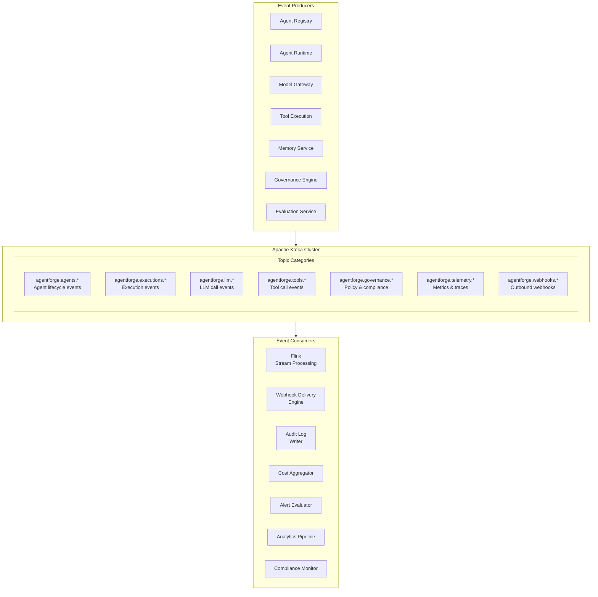
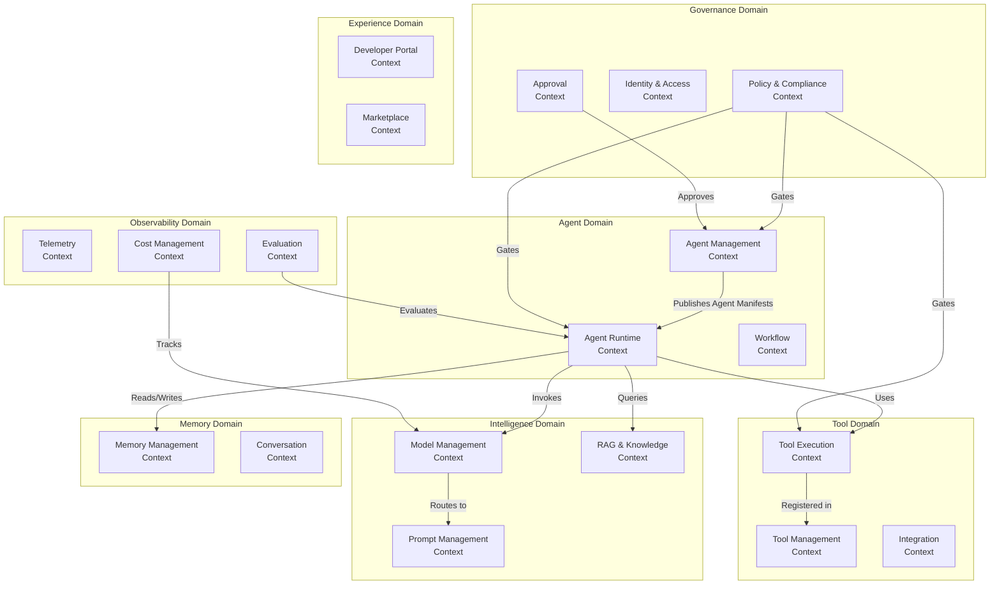
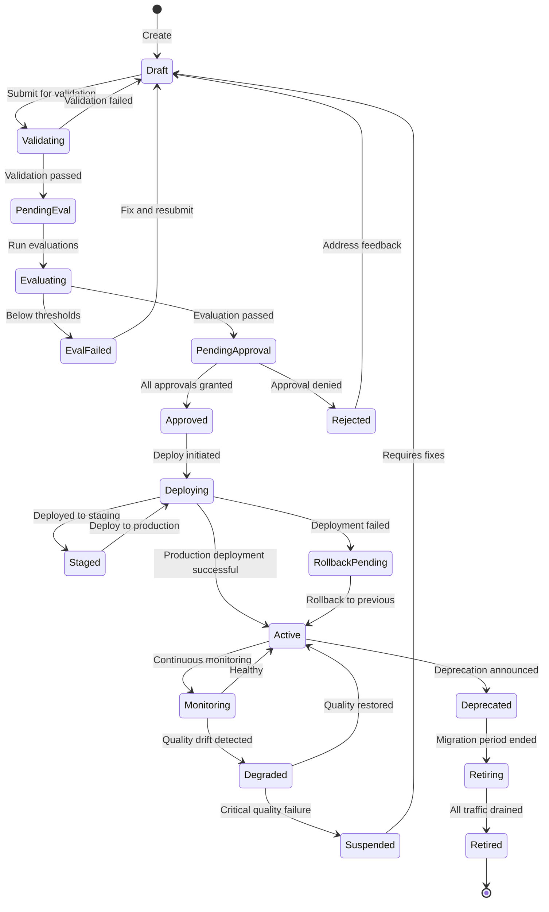
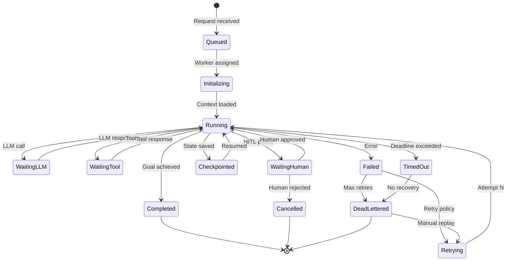
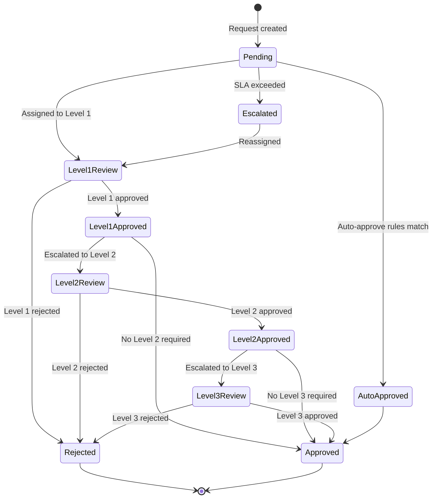

# AgentForge — Database Design & Event Architecture

> **Part 9 of 10** — Database Design, Event-Driven Architecture, Event Schemas, State Machines, DDD Boundaries, Microservice Topology

---

## 1. Database Design

### 1.1 PostgreSQL Schema (Core Platform)

```sql
-- ═══════════════════════════════════════════════════════════
-- AGENTFORGE CORE DATABASE SCHEMA
-- Database: PostgreSQL 16+ with Citus extension
-- Multi-tenancy: Row-Level Security (RLS)
-- ═══════════════════════════════════════════════════════════

-- ─── TENANT & IDENTITY ────────────────────────────────────

CREATE TABLE tenants (
    id              UUID PRIMARY KEY DEFAULT gen_random_uuid(),
    name            VARCHAR(255) NOT NULL UNIQUE,
    display_name    VARCHAR(255) NOT NULL,
    status          VARCHAR(20) DEFAULT 'active',
    tier            VARCHAR(20) DEFAULT 'standard',  -- standard | premium | enterprise
    config          JSONB DEFAULT '{}',
    quotas          JSONB DEFAULT '{}',
    created_at      TIMESTAMPTZ DEFAULT NOW(),
    updated_at      TIMESTAMPTZ DEFAULT NOW()
);

CREATE TABLE teams (
    id              UUID PRIMARY KEY DEFAULT gen_random_uuid(),
    tenant_id       UUID NOT NULL REFERENCES tenants(id),
    name            VARCHAR(255) NOT NULL,
    display_name    VARCHAR(255),
    description     TEXT,
    owner_email     VARCHAR(255),
    config          JSONB DEFAULT '{}',
    created_at      TIMESTAMPTZ DEFAULT NOW(),
    UNIQUE (tenant_id, name)
);

CREATE TABLE projects (
    id              UUID PRIMARY KEY DEFAULT gen_random_uuid(),
    tenant_id       UUID NOT NULL REFERENCES tenants(id),
    team_id         UUID NOT NULL REFERENCES teams(id),
    name            VARCHAR(255) NOT NULL,
    description     TEXT,
    config          JSONB DEFAULT '{}',
    created_at      TIMESTAMPTZ DEFAULT NOW(),
    UNIQUE (tenant_id, team_id, name)
);

-- ─── AGENT MANAGEMENT ─────────────────────────────────────

CREATE TABLE agents (
    id              UUID PRIMARY KEY DEFAULT gen_random_uuid(),
    tenant_id       UUID NOT NULL REFERENCES tenants(id),
    team_id         UUID NOT NULL REFERENCES teams(id),
    project_id      UUID REFERENCES projects(id),
    name            VARCHAR(255) NOT NULL,
    display_name    VARCHAR(255),
    description     TEXT,
    agent_type      VARCHAR(30) NOT NULL DEFAULT 'stateful',
    status          VARCHAR(20) DEFAULT 'draft',
    current_version VARCHAR(20),
    tags            TEXT[] DEFAULT '{}',
    labels          JSONB DEFAULT '{}',
    config          JSONB DEFAULT '{}',
    created_by      VARCHAR(255),
    created_at      TIMESTAMPTZ DEFAULT NOW(),
    updated_at      TIMESTAMPTZ DEFAULT NOW(),
    UNIQUE (tenant_id, name)
);

CREATE TABLE agent_versions (
    id              UUID PRIMARY KEY DEFAULT gen_random_uuid(),
    agent_id        UUID NOT NULL REFERENCES agents(id),
    tenant_id       UUID NOT NULL,
    version         VARCHAR(20) NOT NULL,
    manifest        JSONB NOT NULL,          -- Full agent manifest
    manifest_hash   VARCHAR(64) NOT NULL,    -- SHA-256 of manifest
    status          VARCHAR(20) DEFAULT 'draft',
    changelog       TEXT,
    eval_scores     JSONB,
    approved_by     VARCHAR(255),
    approved_at     TIMESTAMPTZ,
    created_by      VARCHAR(255),
    created_at      TIMESTAMPTZ DEFAULT NOW(),
    UNIQUE (agent_id, version)
);

CREATE TABLE deployments (
    id              UUID PRIMARY KEY DEFAULT gen_random_uuid(),
    agent_id        UUID NOT NULL REFERENCES agents(id),
    version_id      UUID NOT NULL REFERENCES agent_versions(id),
    tenant_id       UUID NOT NULL,
    environment     VARCHAR(20) NOT NULL,    -- dev | staging | production
    strategy        VARCHAR(20) DEFAULT 'rolling',
    status          VARCHAR(20) DEFAULT 'pending',
    desired_replicas INTEGER DEFAULT 1,
    current_replicas INTEGER DEFAULT 0,
    canary_percent  INTEGER,
    config          JSONB DEFAULT '{}',
    deployed_by     VARCHAR(255),
    deployed_at     TIMESTAMPTZ,
    created_at      TIMESTAMPTZ DEFAULT NOW(),
    updated_at      TIMESTAMPTZ DEFAULT NOW()
);

-- ─── EXECUTION TRACKING ───────────────────────────────────

CREATE TABLE executions (
    id              UUID PRIMARY KEY DEFAULT gen_random_uuid(),
    tenant_id       UUID NOT NULL,
    agent_id        UUID NOT NULL REFERENCES agents(id),
    version_id      UUID REFERENCES agent_versions(id),
    session_id      UUID,
    user_id         VARCHAR(255),
    trigger_type    VARCHAR(20),             -- api | schedule | event | webhook | a2a
    status          VARCHAR(20) DEFAULT 'queued',
    input           JSONB,
    output          JSONB,
    error           JSONB,
    
    -- Performance
    started_at      TIMESTAMPTZ,
    completed_at    TIMESTAMPTZ,
    duration_ms     INTEGER,
    
    -- LLM Usage
    total_llm_calls INTEGER DEFAULT 0,
    total_tokens_in INTEGER DEFAULT 0,
    total_tokens_out INTEGER DEFAULT 0,
    total_cost      DECIMAL(10,6) DEFAULT 0,
    
    -- Tool Usage
    total_tool_calls INTEGER DEFAULT 0,
    
    -- Observability
    trace_id        VARCHAR(64),
    
    -- Metadata
    metadata        JSONB DEFAULT '{}',
    created_at      TIMESTAMPTZ DEFAULT NOW()
) PARTITION BY RANGE (created_at);

-- Create partitions (automated via pg_partman)
CREATE TABLE executions_2024_01 PARTITION OF executions
    FOR VALUES FROM ('2024-01-01') TO ('2024-02-01');

-- ─── TOOL MANAGEMENT ──────────────────────────────────────

CREATE TABLE tools (
    id              UUID PRIMARY KEY DEFAULT gen_random_uuid(),
    tenant_id       UUID NOT NULL,
    name            VARCHAR(255) NOT NULL,
    display_name    VARCHAR(255),
    description     TEXT NOT NULL,
    category        VARCHAR(50),
    version         VARCHAR(20) DEFAULT '1.0.0',
    execution_type  VARCHAR(20) NOT NULL,    -- http | grpc | mcp | function
    endpoint        TEXT,
    input_schema    JSONB NOT NULL,
    output_schema   JSONB,
    auth_config     JSONB,
    rate_limit      JSONB,
    timeout_seconds INTEGER DEFAULT 30,
    retry_config    JSONB,
    data_classification VARCHAR(20) DEFAULT 'internal',
    owner_team      VARCHAR(255),
    status          VARCHAR(20) DEFAULT 'active',
    tags            TEXT[] DEFAULT '{}',
    created_at      TIMESTAMPTZ DEFAULT NOW(),
    updated_at      TIMESTAMPTZ DEFAULT NOW(),
    UNIQUE (tenant_id, name, version)
);

CREATE TABLE tool_bindings (
    id              UUID PRIMARY KEY DEFAULT gen_random_uuid(),
    agent_id        UUID NOT NULL REFERENCES agents(id),
    tool_id         UUID NOT NULL REFERENCES tools(id),
    tenant_id       UUID NOT NULL,
    permissions     TEXT[] DEFAULT '{}',
    rate_limit_override JSONB,
    requires_approval BOOLEAN DEFAULT FALSE,
    created_at      TIMESTAMPTZ DEFAULT NOW(),
    UNIQUE (agent_id, tool_id)
);

-- ─── PROMPT MANAGEMENT ────────────────────────────────────

CREATE TABLE prompt_templates (
    id              UUID PRIMARY KEY DEFAULT gen_random_uuid(),
    tenant_id       UUID NOT NULL,
    name            VARCHAR(255) NOT NULL,
    description     TEXT,
    current_version VARCHAR(20),
    category        VARCHAR(50),
    tags            TEXT[] DEFAULT '{}',
    created_by      VARCHAR(255),
    created_at      TIMESTAMPTZ DEFAULT NOW(),
    updated_at      TIMESTAMPTZ DEFAULT NOW(),
    UNIQUE (tenant_id, name)
);

CREATE TABLE prompt_versions (
    id              UUID PRIMARY KEY DEFAULT gen_random_uuid(),
    template_id     UUID NOT NULL REFERENCES prompt_templates(id),
    tenant_id       UUID NOT NULL,
    version         VARCHAR(20) NOT NULL,
    content         TEXT NOT NULL,
    variables       JSONB,
    status          VARCHAR(20) DEFAULT 'draft',
    eval_scores     JSONB,
    approved_by     VARCHAR(255),
    approved_at     TIMESTAMPTZ,
    created_at      TIMESTAMPTZ DEFAULT NOW(),
    UNIQUE (template_id, version)
);

-- ─── MODEL MANAGEMENT ─────────────────────────────────────

CREATE TABLE models (
    id              UUID PRIMARY KEY DEFAULT gen_random_uuid(),
    provider        VARCHAR(50) NOT NULL,
    name            VARCHAR(100) NOT NULL,
    version         VARCHAR(50),
    display_name    VARCHAR(255),
    capabilities    TEXT[] DEFAULT '{}',
    context_window  INTEGER,
    max_output      INTEGER,
    input_price     DECIMAL(10,8),
    output_price    DECIMAL(10,8),
    status          VARCHAR(20) DEFAULT 'pending',
    compliance      TEXT[] DEFAULT '{}',
    data_residency  TEXT[] DEFAULT '{}',
    benchmark_scores JSONB,
    approved_tenants UUID[] DEFAULT '{}',
    created_at      TIMESTAMPTZ DEFAULT NOW(),
    updated_at      TIMESTAMPTZ DEFAULT NOW(),
    UNIQUE (provider, name, version)
);

-- ─── KNOWLEDGE MANAGEMENT ─────────────────────────────────

CREATE TABLE knowledge_sources (
    id              UUID PRIMARY KEY DEFAULT gen_random_uuid(),
    tenant_id       UUID NOT NULL,
    name            VARCHAR(255) NOT NULL,
    source_type     VARCHAR(50) NOT NULL,    -- confluence | s3 | github | web
    config          JSONB NOT NULL,
    sync_schedule   VARCHAR(50),             -- cron expression
    last_sync_at    TIMESTAMPTZ,
    sync_status     VARCHAR(20) DEFAULT 'pending',
    document_count  INTEGER DEFAULT 0,
    chunk_count     INTEGER DEFAULT 0,
    status          VARCHAR(20) DEFAULT 'active',
    created_at      TIMESTAMPTZ DEFAULT NOW(),
    UNIQUE (tenant_id, name)
);

CREATE TABLE documents (
    id              UUID PRIMARY KEY DEFAULT gen_random_uuid(),
    source_id       UUID NOT NULL REFERENCES knowledge_sources(id),
    tenant_id       UUID NOT NULL,
    external_id     VARCHAR(500),
    title           VARCHAR(500),
    content_hash    VARCHAR(64),
    content_type    VARCHAR(50),
    chunk_count     INTEGER DEFAULT 0,
    metadata        JSONB DEFAULT '{}',
    status          VARCHAR(20) DEFAULT 'pending',
    indexed_at      TIMESTAMPTZ,
    created_at      TIMESTAMPTZ DEFAULT NOW(),
    updated_at      TIMESTAMPTZ DEFAULT NOW()
);

CREATE TABLE document_chunks (
    id              UUID PRIMARY KEY DEFAULT gen_random_uuid(),
    document_id     UUID NOT NULL REFERENCES documents(id),
    tenant_id       UUID NOT NULL,
    chunk_index     INTEGER NOT NULL,
    content         TEXT NOT NULL,
    token_count     INTEGER,
    embedding_id    VARCHAR(100),            -- Reference to Qdrant point ID
    metadata        JSONB DEFAULT '{}',
    created_at      TIMESTAMPTZ DEFAULT NOW(),
    UNIQUE (document_id, chunk_index)
);

-- ─── EVALUATION ───────────────────────────────────────────

CREATE TABLE eval_datasets (
    id              UUID PRIMARY KEY DEFAULT gen_random_uuid(),
    tenant_id       UUID NOT NULL,
    name            VARCHAR(255) NOT NULL,
    description     TEXT,
    case_count      INTEGER DEFAULT 0,
    version         VARCHAR(20) DEFAULT '1.0.0',
    created_by      VARCHAR(255),
    created_at      TIMESTAMPTZ DEFAULT NOW(),
    UNIQUE (tenant_id, name, version)
);

CREATE TABLE eval_cases (
    id              UUID PRIMARY KEY DEFAULT gen_random_uuid(),
    dataset_id      UUID NOT NULL REFERENCES eval_datasets(id),
    tenant_id       UUID NOT NULL,
    input           JSONB NOT NULL,
    expected_output JSONB,
    expected_tools  JSONB,
    metadata        JSONB DEFAULT '{}',
    created_at      TIMESTAMPTZ DEFAULT NOW()
);

CREATE TABLE eval_runs (
    id              UUID PRIMARY KEY DEFAULT gen_random_uuid(),
    tenant_id       UUID NOT NULL,
    agent_id        UUID NOT NULL,
    version_id      UUID NOT NULL,
    dataset_id      UUID NOT NULL,
    status          VARCHAR(20) DEFAULT 'running',
    metrics         JSONB,
    summary         JSONB,
    gate_result     VARCHAR(10),             -- pass | fail
    mlflow_run_id   VARCHAR(100),
    started_at      TIMESTAMPTZ DEFAULT NOW(),
    completed_at    TIMESTAMPTZ,
    created_by      VARCHAR(255)
);

CREATE TABLE eval_results (
    id              UUID PRIMARY KEY DEFAULT gen_random_uuid(),
    run_id          UUID NOT NULL REFERENCES eval_runs(id),
    case_id         UUID NOT NULL REFERENCES eval_cases(id),
    tenant_id       UUID NOT NULL,
    actual_output   JSONB,
    actual_tools    JSONB,
    scores          JSONB NOT NULL,
    latency_ms      INTEGER,
    cost            DECIMAL(10,6),
    trace_id        VARCHAR(64),
    created_at      TIMESTAMPTZ DEFAULT NOW()
);

-- ─── GOVERNANCE ───────────────────────────────────────────

CREATE TABLE policies (
    id              UUID PRIMARY KEY DEFAULT gen_random_uuid(),
    tenant_id       UUID,                    -- NULL = platform-wide
    name            VARCHAR(255) NOT NULL,
    description     TEXT,
    policy_type     VARCHAR(50) NOT NULL,
    rego_content    TEXT NOT NULL,
    version         VARCHAR(20) DEFAULT '1.0.0',
    status          VARCHAR(20) DEFAULT 'active',
    created_by      VARCHAR(255),
    created_at      TIMESTAMPTZ DEFAULT NOW(),
    updated_at      TIMESTAMPTZ DEFAULT NOW()
);

CREATE TABLE approvals (
    id              UUID PRIMARY KEY DEFAULT gen_random_uuid(),
    tenant_id       UUID NOT NULL,
    approval_type   VARCHAR(50) NOT NULL,    -- agent_deploy | model_register | prompt_update
    resource_type   VARCHAR(50) NOT NULL,
    resource_id     UUID NOT NULL,
    status          VARCHAR(20) DEFAULT 'pending',
    requested_by    VARCHAR(255),
    current_level   INTEGER DEFAULT 1,
    total_levels    INTEGER NOT NULL,
    metadata        JSONB DEFAULT '{}',
    created_at      TIMESTAMPTZ DEFAULT NOW(),
    updated_at      TIMESTAMPTZ DEFAULT NOW()
);

CREATE TABLE approval_decisions (
    id              UUID PRIMARY KEY DEFAULT gen_random_uuid(),
    approval_id     UUID NOT NULL REFERENCES approvals(id),
    level           INTEGER NOT NULL,
    decision        VARCHAR(20) NOT NULL,    -- approved | rejected
    decided_by      VARCHAR(255) NOT NULL,
    reason          TEXT,
    decided_at      TIMESTAMPTZ DEFAULT NOW()
);

-- ─── BUDGETS & COSTS ──────────────────────────────────────

CREATE TABLE budgets (
    id              UUID PRIMARY KEY DEFAULT gen_random_uuid(),
    tenant_id       UUID NOT NULL,
    entity_type     VARCHAR(20) NOT NULL,    -- tenant | team | agent
    entity_id       UUID NOT NULL,
    period          VARCHAR(20) NOT NULL,    -- daily | monthly
    limit_usd       DECIMAL(10,2) NOT NULL,
    alert_threshold DECIMAL(3,2) DEFAULT 0.75,
    over_limit_action VARCHAR(20) DEFAULT 'warn',
    created_at      TIMESTAMPTZ DEFAULT NOW(),
    UNIQUE (tenant_id, entity_type, entity_id, period)
);

CREATE TABLE cost_records (
    id              UUID PRIMARY KEY DEFAULT gen_random_uuid(),
    tenant_id       UUID NOT NULL,
    team_id         UUID,
    agent_id        UUID,
    execution_id    UUID,
    cost_type       VARCHAR(30) NOT NULL,    -- llm | tool | compute | storage
    provider        VARCHAR(50),
    model           VARCHAR(100),
    amount_usd      DECIMAL(10,6) NOT NULL,
    tokens_input    INTEGER,
    tokens_output   INTEGER,
    metadata        JSONB DEFAULT '{}',
    recorded_at     TIMESTAMPTZ DEFAULT NOW()
) PARTITION BY RANGE (recorded_at);

-- ─── ROW-LEVEL SECURITY ──────────────────────────────────

-- Enable RLS on all tenant-scoped tables
DO $$
DECLARE
    tbl TEXT;
BEGIN
    FOR tbl IN
        SELECT tablename FROM pg_tables
        WHERE schemaname = 'public'
        AND tablename NOT IN ('tenants', 'models')
    LOOP
        EXECUTE format('ALTER TABLE %I ENABLE ROW LEVEL SECURITY', tbl);
        EXECUTE format(
            'CREATE POLICY tenant_isolation_%I ON %I USING (tenant_id = current_setting(''app.current_tenant'')::UUID)',
            tbl, tbl
        );
    END LOOP;
END $$;

-- ─── INDEXES ──────────────────────────────────────────────

CREATE INDEX idx_agents_tenant_status ON agents(tenant_id, status);
CREATE INDEX idx_agents_team ON agents(team_id);
CREATE INDEX idx_executions_agent ON executions(agent_id, created_at DESC);
CREATE INDEX idx_executions_status ON executions(tenant_id, status, created_at DESC);
CREATE INDEX idx_executions_trace ON executions(trace_id);
CREATE INDEX idx_cost_tenant_date ON cost_records(tenant_id, recorded_at DESC);
CREATE INDEX idx_cost_agent_date ON cost_records(agent_id, recorded_at DESC);
CREATE INDEX idx_approvals_pending ON approvals(tenant_id, status) WHERE status = 'pending';
CREATE INDEX idx_documents_source ON documents(source_id, status);
```

### 1.2 ClickHouse Schema (Analytics)

```sql
-- ═══════════════════════════════════════════════════════════
-- CLICKHOUSE ANALYTICS SCHEMA
-- Purpose: High-volume telemetry, logs, and analytics
-- ═══════════════════════════════════════════════════════════

-- LLM Call Analytics
CREATE TABLE llm_calls ON CLUSTER '{cluster}'
(
    timestamp         DateTime64(3),
    tenant_id         LowCardinality(String),
    team_id           LowCardinality(String),
    agent_id          String,
    execution_id      String,
    trace_id          String,
    model             LowCardinality(String),
    provider          LowCardinality(String),
    tokens_input      UInt32,
    tokens_output     UInt32,
    cost_usd          Float64,
    latency_ms        UInt32,
    cached            UInt8,
    cache_tier        LowCardinality(String),
    status            LowCardinality(String),
    error_type        LowCardinality(String),
    routing_strategy  LowCardinality(String),
    fallback_used     UInt8,
    
    date              Date DEFAULT toDate(timestamp)
)
ENGINE = ReplicatedMergeTree('/clickhouse/tables/{shard}/llm_calls', '{replica}')
PARTITION BY (tenant_id, toYYYYMM(timestamp))
ORDER BY (tenant_id, agent_id, timestamp)
TTL timestamp + INTERVAL 365 DAY DELETE
SETTINGS index_granularity = 8192;

-- Tool Call Analytics
CREATE TABLE tool_calls ON CLUSTER '{cluster}'
(
    timestamp         DateTime64(3),
    tenant_id         LowCardinality(String),
    agent_id          String,
    execution_id      String,
    tool_name         LowCardinality(String),
    tool_category     LowCardinality(String),
    status_code       UInt16,
    latency_ms        UInt32,
    retries           UInt8,
    circuit_state     LowCardinality(String),
    error_type        LowCardinality(String),
    
    date              Date DEFAULT toDate(timestamp)
)
ENGINE = ReplicatedMergeTree('/clickhouse/tables/{shard}/tool_calls', '{replica}')
PARTITION BY (tenant_id, toYYYYMM(timestamp))
ORDER BY (tenant_id, tool_name, timestamp)
TTL timestamp + INTERVAL 180 DAY DELETE;

-- Guardrail Events
CREATE TABLE guardrail_events ON CLUSTER '{cluster}'
(
    timestamp         DateTime64(3),
    tenant_id         LowCardinality(String),
    agent_id          String,
    execution_id      String,
    guardrail_name    LowCardinality(String),
    position          LowCardinality(String),  -- input | output
    result            LowCardinality(String),  -- pass | block | warn
    score             Float32,
    pii_types         Array(String),
    details           String,
    
    date              Date DEFAULT toDate(timestamp)
)
ENGINE = ReplicatedMergeTree('/clickhouse/tables/{shard}/guardrail_events', '{replica}')
PARTITION BY (tenant_id, toYYYYMM(timestamp))
ORDER BY (tenant_id, guardrail_name, timestamp)
TTL timestamp + INTERVAL 365 DAY DELETE;

-- Business KPIs
CREATE TABLE business_kpis ON CLUSTER '{cluster}'
(
    timestamp         DateTime64(3),
    tenant_id         LowCardinality(String),
    agent_id          String,
    execution_id      String,
    kpi_name          LowCardinality(String),
    kpi_value         Float64,
    attribution_model LowCardinality(String),
    confidence        Float32,
    metadata          String,  -- JSON string
    
    date              Date DEFAULT toDate(timestamp)
)
ENGINE = ReplicatedMergeTree('/clickhouse/tables/{shard}/business_kpis', '{replica}')
PARTITION BY (tenant_id, toYYYYMM(timestamp))
ORDER BY (tenant_id, kpi_name, timestamp)
TTL timestamp + INTERVAL 730 DAY DELETE;

-- ─── MATERIALIZED VIEWS FOR DASHBOARDS ─────────────────

-- Hourly cost aggregation
CREATE MATERIALIZED VIEW cost_hourly_mv
ENGINE = SummingMergeTree()
ORDER BY (tenant_id, agent_id, model, hour)
AS SELECT
    tenant_id,
    agent_id,
    model,
    toStartOfHour(timestamp) AS hour,
    sum(cost_usd) AS total_cost,
    sum(tokens_input) AS total_tokens_in,
    sum(tokens_output) AS total_tokens_out,
    count() AS call_count,
    avg(latency_ms) AS avg_latency
FROM llm_calls
GROUP BY tenant_id, agent_id, model, hour;

-- Daily execution summary
CREATE MATERIALIZED VIEW execution_daily_mv
ENGINE = SummingMergeTree()
ORDER BY (tenant_id, agent_id, date)
AS SELECT
    tenant_id,
    agent_id,
    toDate(timestamp) AS date,
    countIf(status = 'success') AS success_count,
    countIf(status = 'error') AS error_count,
    count() AS total_count,
    avg(latency_ms) AS avg_latency,
    quantile(0.99)(latency_ms) AS p99_latency,
    sum(cost_usd) AS total_cost
FROM llm_calls
GROUP BY tenant_id, agent_id, date;
```

---

## 2. Event-Driven Architecture

### 2.1 Event Infrastructure



### 2.2 Event Schemas

```python
# ─── Base Event Schema ──────────────────────────────────
@dataclass
class BaseEvent:
    """Base schema for all AgentForge events."""
    
    event_id: str                      # UUID v7 (time-ordered)
    event_type: str                    # Dot-notation type
    event_version: str                 # Schema version
    timestamp: datetime
    tenant_id: str
    correlation_id: str = None         # For request tracing
    causation_id: str = None           # ID of event that caused this
    source: str = None                 # Producing service
    metadata: dict = field(default_factory=dict)

# ─── Agent Events ───────────────────────────────────────
class AgentCreated(BaseEvent):
    event_type = "agentforge.agent.created"
    agent_id: str
    name: str
    team_id: str
    created_by: str

class AgentVersionPublished(BaseEvent):
    event_type = "agentforge.agent.version.published"
    agent_id: str
    version: str
    manifest_hash: str

class AgentDeployed(BaseEvent):
    event_type = "agentforge.agent.deployed"
    agent_id: str
    version: str
    environment: str
    strategy: str
    deployed_by: str

class AgentRetired(BaseEvent):
    event_type = "agentforge.agent.retired"
    agent_id: str
    reason: str
    retired_by: str

# ─── Execution Events ──────────────────────────────────
class ExecutionStarted(BaseEvent):
    event_type = "agentforge.execution.started"
    execution_id: str
    agent_id: str
    trigger_type: str
    user_id: str = None

class ExecutionCompleted(BaseEvent):
    event_type = "agentforge.execution.completed"
    execution_id: str
    agent_id: str
    status: str                        # success | error | timeout | cancelled
    duration_ms: int
    total_cost: float
    llm_calls: int
    tool_calls: int
    trace_id: str

class ExecutionEscalated(BaseEvent):
    event_type = "agentforge.execution.escalated"
    execution_id: str
    agent_id: str
    reason: str
    escalation_target: str

# ─── LLM Events ────────────────────────────────────────
class LLMCallCompleted(BaseEvent):
    event_type = "agentforge.llm.call.completed"
    execution_id: str
    model: str
    provider: str
    tokens_input: int
    tokens_output: int
    cost_usd: float
    latency_ms: int
    cached: bool
    routing_strategy: str

class LLMCallFailed(BaseEvent):
    event_type = "agentforge.llm.call.failed"
    execution_id: str
    model: str
    provider: str
    error_type: str
    fallback_triggered: bool

# ─── Governance Events ──────────────────────────────────
class PolicyViolation(BaseEvent):
    event_type = "agentforge.governance.policy.violation"
    policy_id: str
    policy_name: str
    resource_type: str
    resource_id: str
    violation_details: dict

class ApprovalRequested(BaseEvent):
    event_type = "agentforge.governance.approval.requested"
    approval_id: str
    approval_type: str
    resource_id: str
    requested_by: str
    approvers: list[str]

class BudgetExceeded(BaseEvent):
    event_type = "agentforge.cost.budget.exceeded"
    entity_type: str
    entity_id: str
    budget_limit: float
    current_spend: float

# ─── Guardrail Events ──────────────────────────────────
class GuardrailBlocked(BaseEvent):
    event_type = "agentforge.guardrail.blocked"
    guardrail_name: str
    agent_id: str
    execution_id: str
    reason: str
    severity: str
```

### 2.3 Kafka Topic Configuration

```yaml
# Kafka topic configuration
topics:
  # Agent lifecycle (low volume, high retention)
  agentforge.agents.lifecycle:
    partitions: 6
    replication_factor: 3
    retention_ms: 2592000000    # 30 days
    cleanup_policy: delete
    
  # Execution events (high volume)
  agentforge.executions.events:
    partitions: 24
    replication_factor: 3
    retention_ms: 604800000     # 7 days
    cleanup_policy: delete
    partition_key: tenant_id
    
  # LLM call events (very high volume)
  agentforge.llm.calls:
    partitions: 48
    replication_factor: 3
    retention_ms: 259200000     # 3 days
    cleanup_policy: delete
    compression_type: zstd
    partition_key: tenant_id
    
  # Telemetry (very high volume)
  agentforge.telemetry.traces:
    partitions: 48
    replication_factor: 2
    retention_ms: 86400000      # 1 day
    cleanup_policy: delete
    compression_type: lz4
    
  # Governance (medium volume, long retention)
  agentforge.governance.audit:
    partitions: 12
    replication_factor: 3
    retention_ms: 31536000000   # 365 days
    cleanup_policy: compact
    
  # Dead Letter Queue
  agentforge.dlq:
    partitions: 6
    replication_factor: 3
    retention_ms: 2592000000    # 30 days
    cleanup_policy: delete
    
  # Webhooks (medium volume)
  agentforge.webhooks.outbound:
    partitions: 12
    replication_factor: 3
    retention_ms: 604800000     # 7 days
```

---

## 3. Domain-Driven Design & Microservice Boundaries

### 3.1 Bounded Contexts



### 3.2 Service Decomposition

```
┌──────────────────────────────────────────────────────────────────┐
│                    MICROSERVICE MAP                               │
├──────────────────────────────────────────────────────────────────┤
│                                                                   │
│  AGENT DOMAIN (5 services)                                       │
│  ├── agent-registry-service      Control plane, CRUD             │
│  ├── agent-runtime-service       Data plane, execution           │
│  ├── agent-scheduler-service     Scheduling, deployment          │
│  ├── workflow-engine-service     Temporal workers                │
│  └── orchestration-service       Multi-agent coordination        │
│                                                                   │
│  INTELLIGENCE DOMAIN (4 services)                                │
│  ├── model-gateway-service       LLM proxy, routing              │
│  ├── prompt-registry-service     Prompt management               │
│  ├── rag-service                 Retrieval & generation          │
│  └── guardrails-service          Safety checks                   │
│                                                                   │
│  TOOL DOMAIN (3 services)                                        │
│  ├── tool-registry-service       Tool catalog                    │
│  ├── tool-execution-service      Tool proxy, sandbox             │
│  └── mcp-gateway-service         MCP protocol handling           │
│                                                                   │
│  MEMORY DOMAIN (2 services)                                      │
│  ├── memory-service              Unified memory API              │
│  └── knowledge-service           Document ingestion              │
│                                                                   │
│  GOVERNANCE DOMAIN (3 services)                                  │
│  ├── policy-engine-service       OPA integration                 │
│  ├── compliance-service          Audit, compliance               │
│  └── approval-service            Approval workflows              │
│                                                                   │
│  OBSERVABILITY DOMAIN (3 services)                               │
│  ├── telemetry-service           OTEL collector, processing      │
│  ├── evaluation-service          Eval pipelines                  │
│  └── cost-service                Cost tracking, budgets          │
│                                                                   │
│  EXPERIENCE DOMAIN (3 services)                                  │
│  ├── api-gateway-service         Kong/Envoy                      │
│  ├── portal-service              React frontend + BFF            │
│  └── marketplace-service         Templates, catalog              │
│                                                                   │
│  INFRASTRUCTURE (shared)                                         │
│  ├── auth-service (Keycloak)                                     │
│  ├── secrets-service (Vault)                                     │
│  ├── notification-service        Email, Slack, webhooks          │
│  └── webhook-delivery-service    Reliable webhook dispatch       │
│                                                                   │
│  TOTAL: ~25 services                                             │
└──────────────────────────────────────────────────────────────────┘
```

---

## 4. State Machines

### 4.1 Agent Lifecycle State Machine



### 4.2 Execution State Machine



### 4.3 Approval State Machine



---

*Next: [10-operational-excellence.md](./10-operational-excellence.md) — Disaster Recovery, Scaling Strategy, Cost Optimization Architecture, Agent Lifecycle, Sequence Diagrams*
