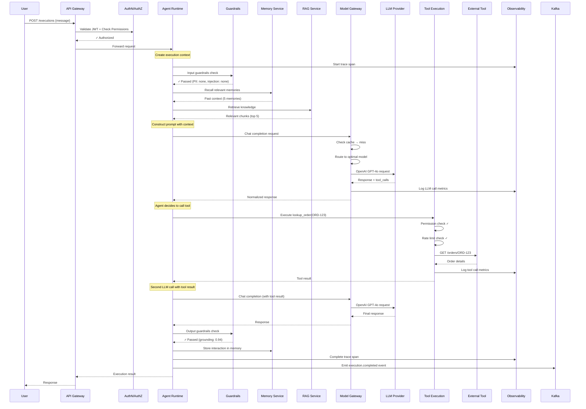
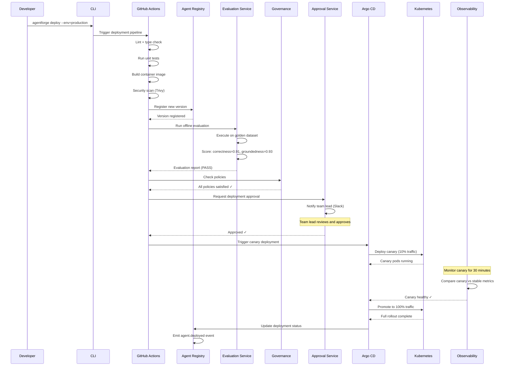
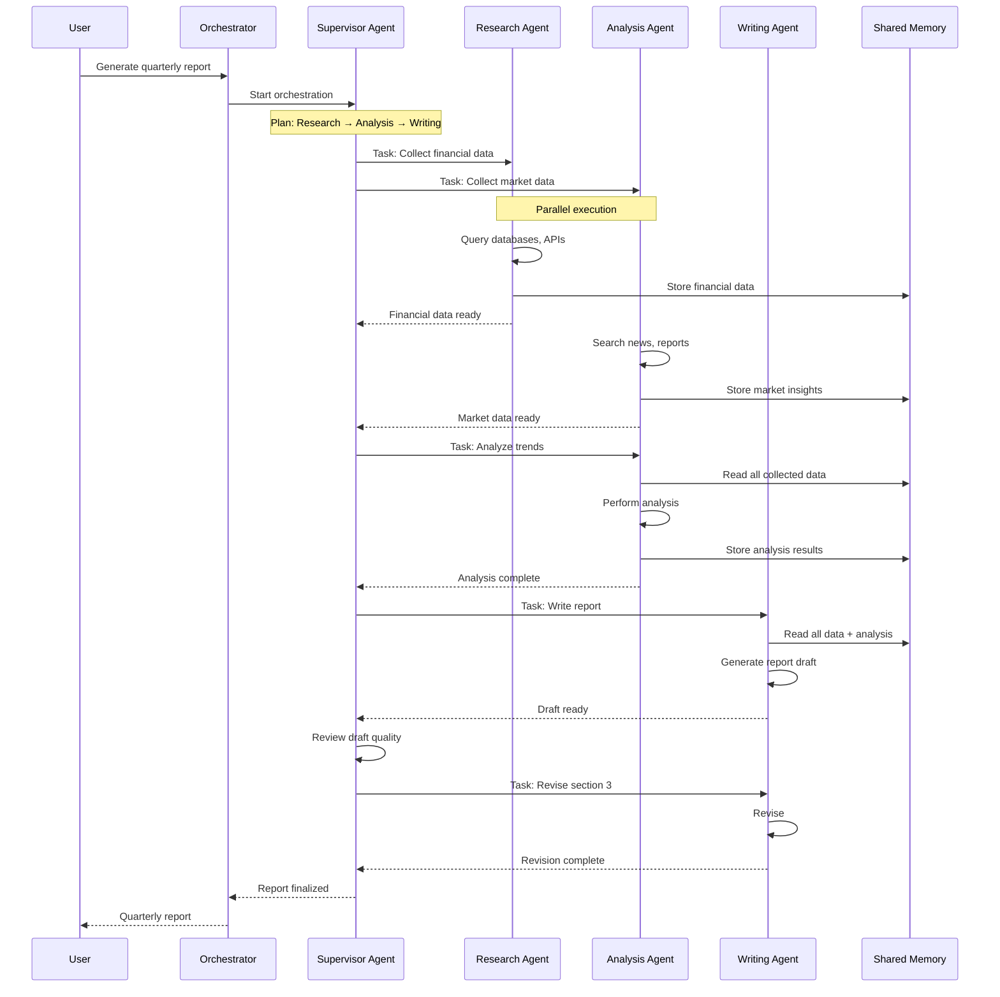

# AgentForge — Operational Excellence & Sequence Diagrams

> **Part 10 of 10** — Disaster Recovery, Scaling Strategy, Cost Architecture, Agent Lifecycle, Key Sequence Diagrams, Implementation Roadmap

---

## 1. Disaster Recovery

### 1.1 DR Architecture

```
┌──────────────────────────────────────────────────────────────────┐
│                   DISASTER RECOVERY ARCHITECTURE                  │
├──────────────────────────────────────────────────────────────────┤
│                                                                   │
│  RTO (Recovery Time Objective): 15 minutes                       │
│  RPO (Recovery Point Objective): 1 minute                        │
│                                                                   │
│  ┌─────────────────────┐        ┌─────────────────────┐         │
│  │   PRIMARY REGION     │        │   DR REGION          │         │
│  │   (us-east-1)        │        │   (eu-west-1)        │         │
│  │                      │        │                      │         │
│  │  ┌────────────────┐  │  Sync  │  ┌────────────────┐  │         │
│  │  │ K8s Cluster    │──┼────────┼──│ K8s Cluster    │  │         │
│  │  │ Active         │  │        │  │ Hot Standby    │  │         │
│  │  └────────────────┘  │        │  └────────────────┘  │         │
│  │                      │        │                      │         │
│  │  ┌────────────────┐  │ Stream │  ┌────────────────┐  │         │
│  │  │ PostgreSQL     │──┼────────┼──│ PostgreSQL     │  │         │
│  │  │ Primary        │  │ Replic │  │ Streaming      │  │         │
│  │  └────────────────┘  │        │  │ Replica        │  │         │
│  │                      │        │  └────────────────┘  │         │
│  │  ┌────────────────┐  │ Async  │  ┌────────────────┐  │         │
│  │  │ Qdrant         │──┼────────┼──│ Qdrant         │  │         │
│  │  │ Primary        │  │ Replic │  │ Replica        │  │         │
│  │  └────────────────┘  │        │  └────────────────┘  │         │
│  │                      │        │                      │         │
│  │  ┌────────────────┐  │ Mirror │  ┌────────────────┐  │         │
│  │  │ Kafka          │──┼────────┼──│ Kafka          │  │         │
│  │  │ Cluster        │  │ Maker2 │  │ Mirror         │  │         │
│  │  └────────────────┘  │        │  └────────────────┘  │         │
│  │                      │        │                      │         │
│  │  ┌────────────────┐  │ Sentl  │  ┌────────────────┐  │         │
│  │  │ Redis          │──┼────────┼──│ Redis          │  │         │
│  │  │ Primary        │  │        │  │ Replica        │  │         │
│  │  └────────────────┘  │        │  └────────────────┘  │         │
│  │                      │        │                      │         │
│  │  ┌────────────────┐  │ Cross  │  ┌────────────────┐  │         │
│  │  │ S3 / Object    │──┼────────┼──│ S3 / Object    │  │         │
│  │  │ Storage        │  │ Region │  │ Storage        │  │         │
│  │  └────────────────┘  │ Replic │  └────────────────┘  │         │
│  │                      │        │                      │         │
│  └─────────────────────┘        └─────────────────────┘         │
│                                                                   │
│  FAILOVER PROCEDURE:                                             │
│  1. Health check detects primary region failure (30s)            │
│  2. DNS failover triggered (Global Accelerator/CloudFlare)       │
│  3. PostgreSQL promoted to primary (< 1 min)                    │
│  4. Kafka consumers rebalanced                                   │
│  5. Temporal workflows resume from checkpoints                   │
│  6. Warm agent pools activated in DR region                      │
│  7. Traffic routed to DR region (< 5 min total)                  │
│                                                                   │
│  BACKUP STRATEGY:                                                │
│  ├── PostgreSQL: Continuous WAL archiving + daily base backup    │
│  ├── Qdrant: Daily snapshot to S3                                │
│  ├── ClickHouse: Daily backup to S3 (Iceberg format)            │
│  ├── Redis: RDB snapshots every 15 min + AOF                    │
│  ├── Kafka: Topic-level MirrorMaker 2 (continuous)              │
│  ├── Vault: Raft snapshots + cross-region replication            │
│  └── S3: Cross-region replication (CRR)                          │
│                                                                   │
│  DATA RETENTION:                                                 │
│  ├── Hot (online): 90 days                                       │
│  ├── Warm (Iceberg): 1 year                                     │
│  ├── Cold (S3 Glacier): 7 years (compliance)                    │
│  └── Audit logs: 7 years (immutable, compliance)                │
└──────────────────────────────────────────────────────────────────┘
```

---

## 2. Scaling Strategy

### 2.1 Component-Level Scaling

| Component | Scaling Method | Min | Max | Trigger |
|---|---|---|---|---|
| **API Gateway** | HPA (CPU) | 3 | 50 | CPU > 60% |
| **Agent Runtime** | HPA (custom metric) | 3 | 100 | Active executions / max concurrency > 70% |
| **Model Gateway** | HPA (requests/sec) | 3 | 30 | Requests > 1000/s/pod |
| **Tool Execution** | HPA (CPU + custom) | 2 | 50 | Pending executions > 100 |
| **RAG Service** | HPA (CPU) | 2 | 20 | CPU > 70% |
| **Memory Service** | HPA (requests) | 2 | 20 | Requests > 500/s/pod |
| **Guardrails** | HPA (latency) | 3 | 30 | P99 > 50ms |
| **Temporal Workers** | KEDA | 3 | 50 | Task queue depth > 100 |
| **Kafka Consumers** | KEDA | 1 | 30 | Consumer lag > 1000 |
| **Flink TaskManagers** | Reactive | 2 | 20 | Backpressure > 50% |
| **PostgreSQL** | Vertical + read replicas | 3 | 7 | Connection count, CPU |
| **Qdrant** | Horizontal (shards) | 3 | 12 | Collection size > threshold |
| **Redis** | Cluster scaling | 6 | 18 | Memory > 70% |
| **ClickHouse** | Horizontal (shards) | 3 | 9 | Query latency, storage |

### 2.2 Load Estimation (10M Executions/Day)

```
┌──────────────────────────────────────────────────────────────────┐
│                LOAD ESTIMATION (10M executions/day)               │
├──────────────────────────────────────────────────────────────────┤
│                                                                   │
│  Agent Executions:      10M/day = ~116/sec (avg), ~500/sec (peak)│
│  LLM Calls:             50M/day = ~580/sec (avg), ~2000/sec (pk)│
│  Tool Calls:            20M/day = ~230/sec (avg), ~800/sec (peak)│
│  Memory Operations:     100M/day = ~1157/sec (avg)               │
│  Vector Searches:       30M/day = ~347/sec (avg)                 │
│  Guardrail Checks:      100M/day = ~1157/sec (avg)               │
│  Events (Kafka):        500M/day = ~5787/sec (avg)               │
│                                                                   │
│  STORAGE GROWTH:                                                 │
│  ├── PostgreSQL: ~10 GB/day (executions + metadata)              │
│  ├── ClickHouse: ~50 GB/day (telemetry, logs, analytics)         │
│  ├── Qdrant: ~5 GB/day (new embeddings)                          │
│  ├── S3: ~20 GB/day (documents, checkpoints, artifacts)          │
│  └── Kafka: ~100 GB/day (events, temporary)                      │
│                                                                   │
│  ANNUAL STORAGE:                                                 │
│  ├── PostgreSQL: ~3.6 TB (with partitioning + archival)          │
│  ├── ClickHouse: ~18 TB (with compression + TTL)                 │
│  ├── Qdrant: ~1.8 TB (with quantization)                         │
│  ├── S3: ~7.3 TB (with lifecycle policies)                       │
│  └── Iceberg: ~50 TB (historical analytics)                      │
│                                                                   │
│  COMPUTE REQUIREMENTS (ESTIMATED):                               │
│  ├── Agent Runtime: 100 pods × 4 CPU × 8GB = 400 CPU, 800GB     │
│  ├── Model Gateway: 30 pods × 4 CPU × 8GB = 120 CPU, 240GB      │
│  ├── All other services: ~200 CPU, 400GB                         │
│  ├── Databases: ~100 CPU, 1TB RAM                                │
│  ├── GPU (vLLM): 8-16 × A100/H100 (if self-hosted models)       │
│  └── TOTAL: ~820 CPU, ~2.4TB RAM, 8-16 GPUs                     │
└──────────────────────────────────────────────────────────────────┘
```

---

## 3. Key Sequence Diagrams

### 3.1 Agent Execution — End-to-End



### 3.2 Agent Deployment — End-to-End



### 3.3 Multi-Agent Orchestration



---

## 4. Agent Lifecycle — Complete Flow

```mermaid
flowchart TB
    subgraph Create["1. CREATE"]
        C1[Define manifest<br/>YAML or visual builder]
        C2[Select template<br/>from marketplace]
    end

    subgraph Develop["2. DEVELOP"]
        D1[Write agent code<br/>SDK decorators]
        D2[Configure tools<br/>& knowledge]
        D3[Write prompts<br/>& guardrails]
        D4[Local development<br/>agentforge dev]
    end

    subgraph Test["3. TEST"]
        T1[Unit tests<br/>Mock LLM & tools]
        T2[Integration tests<br/>Real dependencies]
        T3[Smoke tests<br/>Against staging]
    end

    subgraph Evaluate["4. EVALUATE"]
        E1[Offline evaluation<br/>Golden datasets]
        E2[Benchmark<br/>vs. baselines]
        E3[Quality gate<br/>Pass/fail decision]
    end

    subgraph Approve["5. APPROVE"]
        A1[Team lead review]
        A2[AI governance review]
        A3[Security review<br/>if high-risk]
    end

    subgraph Deploy["6. DEPLOY"]
        DP1[Deploy to staging]
        DP2[Canary deployment<br/>10% production]
        DP3[Full rollout<br/>100% production]
    end

    subgraph Monitor["7. MONITOR"]
        M1[Real-time metrics<br/>Grafana dashboards]
        M2[Online evaluation<br/>Continuous quality]
        M3[SLO monitoring<br/>Error budgets]
        M4[Cost tracking<br/>Budget alerts]
    end

    subgraph Improve["8. IMPROVE"]
        I1[A/B test prompts]
        I2[Try different models]
        I3[Tune RAG pipeline]
        I4[Human feedback loop]
    end

    subgraph Retire["9. RETIRE"]
        R1[Deprecation notice]
        R2[Migration period]
        R3[Traffic drain]
        R4[Decommission]
    end

    Create --> Develop --> Test --> Evaluate --> Approve --> Deploy --> Monitor
    Monitor --> Improve
    Improve --> Test
    Monitor --> Retire
```



---

## 5. Cost Optimization Architecture

```
┌──────────────────────────────────────────────────────────────────┐
│                  COST OPTIMIZATION LEVERS                        │
├──────────────────────────────────────────────────────────────────┤
│                                                                   │
│  LAYER 1: LLM COST (60% of platform cost)                       │
│  ├── Model routing: Use GPT-4o-mini for simple tasks (70% less) │
│  ├── Semantic caching: 15-25% cache hit rate = 15-25% savings   │
│  ├── Provider prompt caching: 50-90% savings on prefixes        │
│  ├── Prompt compression: 10-20% token reduction                 │
│  ├── Batch API: 50% cheaper for async workloads                 │
│  └── Self-hosted (vLLM): 3-5x cheaper for high-volume tasks     │
│                                                                   │
│  LAYER 2: COMPUTE COST (25% of platform cost)                   │
│  ├── Autoscaling: Right-size pods based on actual usage          │
│  ├── Scale-to-zero: Low-traffic agents don't consume resources   │
│  ├── Spot instances: 60-70% savings for evaluation workloads    │
│  ├── Bin packing: Efficient pod scheduling                       │
│  └── Resource quotas: Prevent resource waste                     │
│                                                                   │
│  LAYER 3: STORAGE COST (10% of platform cost)                   │
│  ├── Tiered storage: Hot → Warm → Cold lifecycle                 │
│  ├── Compression: ClickHouse zstd, Qdrant scalar quantization   │
│  ├── Data retention policies: Auto-delete expired data           │
│  ├── Deduplication: Avoid storing duplicate documents            │
│  └── Iceberg compaction: Optimize file layout                    │
│                                                                   │
│  LAYER 4: NETWORK COST (5% of platform cost)                    │
│  ├── Regional affinity: Route to closest LLM provider           │
│  ├── Compression: gzip/zstd on all inter-service communication  │
│  └── Caching: Reduce external API calls                          │
│                                                                   │
│  ESTIMATED SAVINGS:                                              │
│  ├── Without optimization: $500K/month (10M exec/day)           │
│  ├── With optimization:    $175K/month (65% savings)             │
│  └── Primary driver:       LLM routing + caching (80% of savings)│
└──────────────────────────────────────────────────────────────────┘
```

---

## 6. Implementation Roadmap

### Phase 1: Foundation (Months 1-3)

```
┌─────────────────────────────────────────────────────────────┐
│  PHASE 1: FOUNDATION                                         │
│                                                              │
│  Goal: MVP platform — single tenant, basic agent lifecycle  │
│                                                              │
│  ✦ Agent Registry (CRUD, versioning)                        │
│  ✦ Agent Runtime (basic execution, LangGraph)               │
│  ✦ Model Gateway (LiteLLM, OpenAI/Anthropic)               │
│  ✦ Tool Execution (HTTP tools, basic permissions)           │
│  ✦ Memory Service (STM, conversation store)                 │
│  ✦ Basic Guardrails (PII detection, prompt injection)       │
│  ✦ SDK v0.1 (Python decorators, CLI init/dev/deploy)       │
│  ✦ PostgreSQL + Redis setup                                 │
│  ✦ Basic OpenTelemetry tracing                              │
│  ✦ Docker Compose for local dev                             │
│  ✦ Kubernetes deployment (single cluster)                   │
│                                                              │
│  Team: 8-10 engineers                                        │
│  Infrastructure: 1 K8s cluster, basic monitoring             │
└─────────────────────────────────────────────────────────────┘
```

### Phase 2: Enterprise Features (Months 4-6)

```
┌─────────────────────────────────────────────────────────────┐
│  PHASE 2: ENTERPRISE                                         │
│                                                              │
│  Goal: Multi-tenant, governed, observable                   │
│                                                              │
│  ✦ Multi-tenancy (RLS, namespace isolation)                 │
│  ✦ Authentication (Keycloak, OIDC/SAML)                     │
│  ✦ Authorization (OPA, RBAC)                                │
│  ✦ Policy Engine (deployment policies)                      │
│  ✦ Approval Workflows (Temporal-based)                      │
│  ✦ RAG Service (ingestion, retrieval, re-ranking)           │
│  ✦ Vector Store (Qdrant, multi-tenant)                      │
│  ✦ Knowledge Base (connectors: Confluence, S3)              │
│  ✦ Prompt Registry (versioning, A/B testing)                │
│  ✦ Cost Tracking (per-tenant, per-agent)                    │
│  ✦ Workflow Engine (Temporal integration)                   │
│  ✦ Developer Portal v1 (React, basic features)             │
│  ✦ Grafana dashboards                                       │
│  ✦ Kafka event bus                                          │
│                                                              │
│  Team: 15-20 engineers                                       │
└─────────────────────────────────────────────────────────────┘
```

### Phase 3: Intelligence (Months 7-9)

```
┌─────────────────────────────────────────────────────────────┐
│  PHASE 3: INTELLIGENCE                                       │
│                                                              │
│  Goal: Smart routing, evaluation, optimization              │
│                                                              │
│  ✦ LLM Router (cost/latency/quality-based)                  │
│  ✦ Model Selection Engine                                   │
│  ✦ Semantic Caching                                         │
│  ✦ Cost Optimization Engine                                 │
│  ✦ Budget Enforcement                                       │
│  ✦ Evaluation Framework (offline + online)                  │
│  ✦ Experiment Tracking (MLflow)                             │
│  ✦ Human Feedback System                                    │
│  ✦ Multi-Agent Orchestration                                │
│  ✦ MCP Gateway                                              │
│  ✦ A2A Communication                                        │
│  ✦ Advanced Guardrails (hallucination, grounding)           │
│  ✦ Compliance Engine (GDPR, SOX basics)                     │
│  ✦ ClickHouse analytics                                     │
│  ✦ Flink stream processing                                  │
│                                                              │
│  Team: 20-25 engineers                                       │
└─────────────────────────────────────────────────────────────┘
```

### Phase 4: Scale & Polish (Months 10-12)

```
┌─────────────────────────────────────────────────────────────┐
│  PHASE 4: SCALE & POLISH                                     │
│                                                              │
│  Goal: Production-hardened, self-service, marketplace       │
│                                                              │
│  ✦ Agent Marketplace                                        │
│  ✦ Plugin Framework                                         │
│  ✦ Webhook Framework                                        │
│  ✦ Admin Portal                                             │
│  ✦ Executive Dashboard                                      │
│  ✦ Governance Dashboard                                     │
│  ✦ Business KPI Tracking                                    │
│  ✦ Revenue Attribution                                      │
│  ✦ Multi-cloud support (AWS + GCP + Azure)                  │
│  ✦ Disaster Recovery (multi-region)                         │
│  ✦ SLO Monitoring                                           │
│  ✦ Incident Management integration                         │
│  ✦ Advanced ABAC                                            │
│  ✦ EU AI Act compliance                                     │
│  ✦ Self-hosted model support (vLLM + Ray)                   │
│  ✦ Benchmark Suite                                          │
│  ✦ SDK v1.0 (stable API)                                    │
│  ✦ CLI v1.0                                                 │
│  ✦ Performance tuning & load testing                        │
│  ✦ Documentation & onboarding guides                        │
│                                                              │
│  Team: 25-30 engineers                                       │
│  Target: Production launch for first 5 tenants              │
└─────────────────────────────────────────────────────────────┘
```

---

## 7. Architecture Decision Records (ADRs)

| ADR | Decision | Rationale | Alternatives Considered |
|---|---|---|---|
| ADR-001 | PostgreSQL with Citus for primary store | ACID + JSON + RLS + horizontal scaling | CockroachDB (too new), MongoDB (no ACID) |
| ADR-002 | Temporal for workflow engine | Battle-tested, exactly-once, Uber-proven | Custom engine (risk), Cadence (less community) |
| ADR-003 | Kafka for event bus | Exactly-once, multi-consumer, proven at scale | Pulsar (smaller ecosystem), NATS (less durability) |
| ADR-004 | LiteLLM as base for Model Gateway | 100+ providers, active community | Custom adapters (maintenance burden) |
| ADR-005 | Qdrant for vector store | Performance, filtering, multi-tenancy | Weaviate (heavier), Pinecone (vendor lock) |
| ADR-006 | OPA for policy engine | Declarative, decoupled, auditable | Cedar (AWS-specific), custom (maintenance) |
| ADR-007 | ClickHouse for analytics | Column-oriented, fast aggregations, compression | TimescaleDB (row-oriented), Druid (complex) |
| ADR-008 | Keycloak for identity | OIDC/SAML, federation, open source | Auth0 (vendor), Zitadel (less mature) |
| ADR-009 | LangGraph for agent state machines | Python-native, flexible, growing ecosystem | AutoGen (Microsoft lock-in), custom (effort) |
| ADR-010 | Redis Cluster for caching | Sub-ms latency, rich data structures | Memcached (less features), Hazelcast (Java) |
| ADR-011 | Hybrid tenant isolation (RLS + namespace) | Balance of isolation and resource efficiency | DB-per-tenant (costly), schema-per-tenant (limited) |
| ADR-012 | Event-driven with CQRS | Decoupled, scalable reads, audit trail | Synchronous (coupling), pure event sourcing (complexity) |

---

## 8. Architecture Summary

```
┌────────────────────────────────────────────────────────────────┐
│                    AGENTFORGE SUMMARY                           │
├────────────────────────────────────────────────────────────────┤
│                                                                 │
│  SERVICES:        ~25 microservices                             │
│  DATABASES:       PostgreSQL, Qdrant, Redis, ClickHouse         │
│  EVENT BUS:       Apache Kafka (48+ partitions)                 │
│  WORKFLOW:        Temporal (durable execution)                  │
│  COMPUTE:         Kubernetes (multi-cluster, multi-cloud)       │
│  OBSERVABILITY:   OpenTelemetry + Prometheus + Grafana          │
│  SECURITY:        Keycloak + OPA + Vault                        │
│  ML/AI:           LiteLLM + vLLM + LangGraph + MLflow          │
│                                                                 │
│  SCALE TARGETS:                                                 │
│  ├── 10M agent executions / day                                │
│  ├── 50M LLM calls / day                                       │
│  ├── 500+ teams                                                │
│  ├── 10,000+ agents                                            │
│  ├── 100+ tenants                                              │
│  └── 99.9% availability SLO                                   │
│                                                                 │
│  TEAM SIZE:       25-30 engineers at scale                      │
│  TIMELINE:        12 months to production launch                │
│  ESTIMATED COST:  ~$175K/month infrastructure (optimized)       │
│                                                                 │
│  KEY DIFFERENTIATORS:                                           │
│  ├── Declarative agent manifests (like K8s resources)           │
│  ├── Built-in governance and compliance (EU AI Act ready)       │
│  ├── Cost-aware LLM routing (65% cost reduction)               │
│  ├── Continuous evaluation (online + offline)                  │
│  ├── Multi-agent orchestration patterns                        │
│  ├── Enterprise multi-tenancy (compute + data + network)       │
│  └── Full observability (trace every LLM call and tool call)   │
└────────────────────────────────────────────────────────────────┘
```

---

*This concludes the 10-part AgentForge Enterprise Architecture. Each document in this series is designed to be detailed enough to serve as the basis for implementation by engineering teams.*

### Document Index

| Part | Document | Focus |
|---|---|---|
| 1 | [01-high-level-architecture.md](./01-high-level-architecture.md) | Philosophy, C4 Context, Technology Stack, Multi-Tenancy |
| 2 | [02-core-platform-subsystems.md](./02-core-platform-subsystems.md) | Agent Builder, SDK, Runtime, Scheduler, Workflow, Multi-Agent |
| 3 | [03-memory-knowledge-rag.md](./03-memory-knowledge-rag.md) | Memory Service, Vector Store, Knowledge Base, RAG Pipeline |
| 4 | [04-tool-integration-layer.md](./04-tool-integration-layer.md) | Tool Registry, Execution Runtime, MCP Gateway, A2A, Prompts |
| 5 | [05-intelligence-layer.md](./05-intelligence-layer.md) | Model Gateway, LLM Router, Cost Optimization, Caching, Guardrails |
| 6 | [06-governance-security.md](./06-governance-security.md) | Policy Engine, Compliance, Approvals, Identity, RBAC/ABAC, Secrets |
| 7 | [07-observability-evaluation.md](./07-observability-evaluation.md) | Tracing, Metrics, Logging, Evaluation, Human Feedback, Business KPIs |
| 8 | [08-developer-experience.md](./08-developer-experience.md) | Portals, APIs, Webhooks, Plugins, Marketplace, Deployment, CI/CD |
| 9 | [09-database-event-architecture.md](./09-database-event-architecture.md) | Database Schema, Event Architecture, DDD, State Machines |
| 10 | [10-operational-excellence.md](./10-operational-excellence.md) | DR, Scaling, Cost Architecture, Sequence Diagrams, Roadmap |
